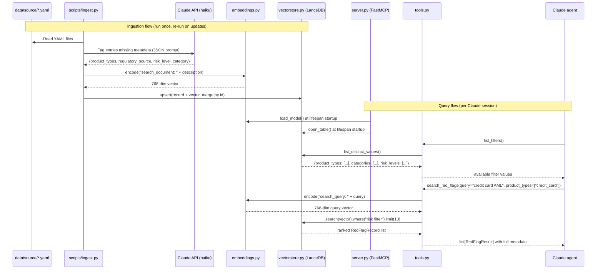

# feat: Build AML Red Flag MCP Server

## Overview

A Python MCP (Model Context Protocol) server that gives any MCP-compatible agent access to a curated, queryable database of AML red flags. BSA/compliance officers can describe their product or institution to an agent and receive a ranked, sourced list of relevant red flags — without knowing the taxonomy in advance. The server supports both stdio and HTTP transports so it can integrate with Claude Desktop, Claude Code, and any other agentic interface. A separate ingestion CLI populates the vector database from YAML source files with OpenAI-assisted tagging.

## Problem Frame

Compliance officers at financial institutions struggle to assemble product-relevant AML red flag lists from scattered regulatory guidance (FinCEN advisories, FATF guidance, OCC bulletins, BSA). A queryable MCP server turns this institutional knowledge into a tool any AI agent can wield on behalf of a practitioner during product design or risk assessment.

(see origin: docs/brainstorms/2026-03-25-aml-redflag-mcp-requirements.md)

## Requirements Trace

- R1. Persistent database of red flags: description, product_types, regulatory_source, risk_level, category/typology
- R2. Semantic search: natural-language query → ranked relevant results, with optional metadata filters
- R3. Read-only MCP tools callable by any MCP-compatible agent (Claude, OpenAI agents, custom agents)
- R4. Results include full metadata for compliance citation (source, risk level, category, product types)
- R5. Ingestion CLI reads structured YAML source files; database updates on re-run
- R6. LLM auto-tags missing metadata at ingestion time
- R7. Data layer scales to 1000+ entries without architectural changes

## Scope Boundaries

- MCP server is read-only — no write tools
- No SAR narrative generation, transaction monitoring rules, or risk ratings
- No integration with external financial systems or TMS platforms
- No auto-crawling of regulatory sites; source data is owner-curated
- Ingestion CLI runs locally; not a background service

## Context & Research

### Relevant Code and Patterns

- `docs/Red_flag_types.md` — domain taxonomy organizing AML red flags by simulation data complexity (Type 1A–8). This can inform an optional `simulation_type` field in the data model, bridging this MCP server with the related simulation project at zero carrying cost.
- No existing implementation code — greenfield project.

### Institutional Learnings

- None — `docs/solutions/` does not exist. This is a greenfield project.

### External References

- [mcp PyPI 1.26.0](https://pypi.org/project/mcp/) — official Python MCP SDK; FastMCP is the recommended high-level interface
- [LanceDB Python SDK](https://lancedb.github.io/lancedb/python/python/) — SQL-style `.where()` filter, Pydantic integration, columnar disk storage
- [nomic-embed-text-v1.5](https://huggingface.co/nomic-ai/nomic-embed-text-v1.5) — MTEB 59.4, 8192-token context, offline, Apache 2.0
- [MCP quickstart (stdio)](https://modelcontextprotocol.io/quickstart/server) — stdio transport, FastMCP tool pattern, lifespan context
- [FFIEC BSA/AML Manual Appendix F](https://bsaaml.ffiec.gov/manual/Appendices/07) — authoritative source of red flag definitions

## Key Technical Decisions

- **LanceDB over ChromaDB**: LanceDB's SQL-style `.where()` clause handles compliance metadata filtering naturally (e.g., `risk_level = 'high'`, array membership on `product_types`). Its columnar Lance disk format has faster cold-start than ChromaDB's SQLite backend — important for a stdio server that may restart per session. LanceDB's Pydantic integration (`lancedb.pydantic.LanceModel`) makes schema definition and type-safe query results cleaner.

- **`nomic-embed-text-v1.5` over alternatives**: MTEB score of 59.4 beats `all-MiniLM-L6-v2` (56.3) and `all-mpnet-base-v2` (~57.8). Critically, the 8192-token context window handles verbose regulatory text without truncation — `all-mpnet-base-v2`'s 384 word-piece limit is a real failure mode for compliance document fragments. Fully offline, Apache 2.0 license. Task prefixes are required by the model: `"search_document: "` at index time, `"search_query: "` at query time.

- **YAML as canonical source format**: YAML supports clean multi-line text for verbose red flag descriptions, is human-readable for manual curation, and is git-trackable. Files live in `data/source/`. The `data/vectors/` LanceDB store is derived and gitignored.

- **Three MCP tools**: `search_red_flags`, `get_red_flag`, `list_filters`. The `list_filters` tool is critical — it lets Claude discover valid values for `product_types`, `categories`, and `risk_levels` before constructing a search, avoiding hallucinated filter values. Tool docstrings should guide Claude to call `list_filters` first.

- **LLM tagging via OpenAI API (gpt-4.1-mini or gpt-4o-mini)**: At ingestion time, entries missing any metadata field are sent to the OpenAI API with a structured JSON prompt. Tags are applied in memory only — YAML source files are not modified. This keeps the source of truth clean and human-editable. The model is configurable via `OPENAI_TAGGING_MODEL` env var, defaulting to `gpt-4o-mini`.

- **Dual transport (stdio + HTTP)**: FastMCP supports both stdio and streamable-HTTP transports via a `MCP_TRANSPORT` environment variable (`stdio` or `http`). stdio for Claude Desktop / Claude Code; HTTP for OpenAI agents and other web-based agentic interfaces. HTTP defaults to `0.0.0.0:8000`; host and port are configurable via env vars.

- **`simulation_type` as optional field**: The existing `docs/Red_flag_types.md` taxonomy (Type 1A–8) classifies red flags by simulation data complexity. Including this as an optional field bridges the MCP server with the related simulation project at no carrying cost and adds a useful analytical dimension (e.g., "what data would be needed to detect this red flag?").

## Open Questions

### Resolved During Planning

- **Which vector store?** LanceDB — see Key Technical Decisions above.
- **Which embedding model?** `nomic-embed-text-v1.5` via `sentence-transformers` — see Key Technical Decisions.
- **Source data format?** YAML files in `data/source/`, versioned in git. LanceDB store in `data/vectors/`, gitignored.
- **MCP tools and signatures?** Three tools: `search_red_flags`, `get_red_flag`, `list_filters` — defined in Unit 4.

### Deferred to Implementation

- **LanceDB array filtering syntax**: LanceDB's SQL dialect for filtering `list[str]` columns (e.g., `ARRAY_HAS(product_types, 'credit_card')`) should be validated against the installed version before finalizing the query builder. Fallback: post-filter in Python after fetching more results.
- **nomic task prefix validation**: Confirm the `"search_query: "`/`"search_document: "` prefix convention with the installed `sentence-transformers` version — behavior changed between nomic v1 and v1.5.
- **CPU-only PyTorch**: `sentence-transformers` pulls in PyTorch. If the target machine has no GPU, configure `[tool.uv.sources]` in `pyproject.toml` to use the CPU-only torch wheel to avoid a 2GB+ download.
- **Incremental vs. full re-index**: The ingestion CLI should upsert by `id`. Whether a `--force-retag` flag is needed (re-run LLM tagging on already-stored entries) is an implementation detail.

## High-Level Technical Design

> *This illustrates the intended approach and is directional guidance for review, not implementation specification. The implementing agent should treat it as context, not code to reproduce.*



## Implementation Units

- [ ] **Unit 1: Project scaffold and shared data model**

**Goal:** Initialize the `uv`-managed Python project, define the shared `RedFlag` Pydantic models used across ingestion, storage, and tools, and establish the directory structure.

**Requirements:** R1, R5 (foundational for all other units)

**Dependencies:** None

**Files:**
- Create: `pyproject.toml`
- Create: `.python-version` (pin to 3.11)
- Create: `.gitignore`
- Create: `src/redflag_mcp/__init__.py`
- Create: `src/redflag_mcp/__main__.py` (calls `server.main()`)
- Create: `src/redflag_mcp/config.py`
- Create: `src/redflag_mcp/models.py`
- Create: `data/source/.gitkeep`
- Create: `tests/__init__.py`
- Create: `tests/conftest.py`
- Test: `tests/test_models.py`

**Approach:**
- `pyproject.toml` uses `hatchling` build backend. Dependencies: `mcp[cli]>=1.26.0`, `lancedb>=0.6.0`, `sentence-transformers>=3.0.0`, `openai>=1.0.0`, `pydantic>=2.0`, `pyyaml>=6.0`. Dev deps: `pytest>=8.0`, `pytest-asyncio>=0.23`, `ruff>=0.4`, `mypy>=1.9`. Defines a `redflag-mcp` script entry point.
- `config.py` exports `DATA_DIR`, `SOURCE_DIR`, `VECTORS_DIR` as `Path` constants anchored to the project root; also exports enum sets for valid `risk_level` values, `simulation_type` codes from `docs/Red_flag_types.md`, and the embedding dimension constant (768).
- `models.py` defines three Pydantic models:
  - `RedFlagSource` — input model parsed from YAML. All metadata fields optional except `description` and `id`. Used by the ingestion CLI.
  - `RedFlagRecord(LanceModel)` — storage model extending `lancedb.pydantic.LanceModel`. Adds a `Vector(768)` field. Used when writing to and reading from LanceDB.
  - `RedFlagResult` — MCP response model. Same fields as `RedFlagRecord` but without the `vector` field. Returned by all three MCP tools.
- `simulation_type` is an `str | None` optional field accepting values from the Type 1A–8 taxonomy.

**Patterns to follow:**
- `lancedb.pydantic.LanceModel` + `Vector(dim)` for the storage model
- `src/` layout with `hatchling` as build backend (matches MCP SDK project structure research)

**Test scenarios:**
- `RedFlagSource` validates with only `id` and `description` populated (all tag fields optional)
- `RedFlagSource` rejects an invalid `risk_level` value that is not in the enum set
- `RedFlagRecord` to `RedFlagResult` conversion drops the `vector` field without error
- Config paths resolve correctly relative to project root regardless of working directory

**Verification:**
- `uv sync` completes without errors
- `uv run python -c "from redflag_mcp.models import RedFlagSource, RedFlagResult"` succeeds
- `uv run pytest tests/test_models.py` passes

---

- [ ] **Unit 2: Embedding layer**

**Goal:** Load `nomic-embed-text-v1.5` once at process startup and expose `encode_query` and `encode_documents` functions that apply the correct task-specific prefix.

**Requirements:** R2, R7

**Dependencies:** Unit 1

**Files:**
- Create: `src/redflag_mcp/embeddings.py`
- Test: `tests/test_embeddings.py`

**Approach:**
- `load_model() -> SentenceTransformer` loads `"nomic-ai/nomic-embed-text-v1.5"` with `trust_remote_code=True`. Called once at server lifespan startup; the loaded model is stored in `server.state`.
- `encode_documents(model, texts: list[str]) -> list[list[float]]` prepends `"search_document: "` to each text before calling `model.encode(..., normalize_embeddings=True)`. Returns plain Python float lists (not numpy arrays) for LanceDB compatibility.
- `encode_query(model, text: str) -> list[float]` prepends `"search_query: "`. Returns a single float list.
- The embedding dimension (768) is exported as a constant and imported by `models.py`.
- The ingestion CLI calls `encode_documents` so the model download is triggered during ingestion, not during the first Claude Desktop connection (avoids startup timeout).

**Test scenarios:**
- `encode_query(model, "structuring deposits")` returns a list of exactly 768 floats
- `encode_documents(model, ["desc1", "desc2"])` returns two vectors of length 768
- Output vectors are L2-normalized: `sum(x**2 for x in vec) ≈ 1.0` within float tolerance
- Encoding an empty string does not raise

**Verification:**
- `uv run pytest tests/test_embeddings.py` passes
- Model download (~275 MB) completes on first run; subsequent runs use the cache

---

- [ ] **Unit 3: Vector store layer**

**Goal:** Provide a clean, testable interface for opening the LanceDB table, upserting records, running semantic + metadata queries, and listing distinct filter values.

**Requirements:** R2, R4, R7

**Dependencies:** Unit 1, Unit 2

**Files:**
- Create: `src/redflag_mcp/vectorstore.py`
- Test: `tests/test_vectorstore.py`

**Approach:**
- `open_store(path: Path) -> lancedb.LanceDBConnection` connects to LanceDB at the given path (usually `config.VECTORS_DIR`).
- `get_or_create_table(db, model_class) -> lancedb.table.Table` opens or creates the `"red_flags"` table using `RedFlagRecord` as the schema. On first run (empty store), creates the table; on subsequent runs, opens it.
- `upsert_records(table, records: list[RedFlagRecord]) -> None` uses LanceDB's merge/upsert API (by `id`) to insert new records or replace existing ones with the same `id`.
- `search(table, query_vector, product_types, categories, risk_levels, limit) -> list[RedFlagResult]` runs a vector search with optional SQL WHERE clause. Builds the filter string only for non-None/non-empty inputs, then calls `.search(query_vector).where(filter_clause).limit(limit).to_pydantic(RedFlagRecord)`. Maps results to `RedFlagResult` (drops vector field).
- `list_distinct_values(table) -> dict[str, list[str]]` returns all unique values for `product_types`, `categories`, and `risk_levels` by scanning the table. Results are sorted for stable output. For `product_types` (a `list[str]` column), the implementation needs to flatten and deduplicate across all rows.
- WHERE clause builder: handles None/empty filters gracefully (omits the clause entirely if no filters provided).

**Technical design:** *(directional — validate LanceDB SQL array syntax during implementation)*
```
# For scalar string fields:
# .where("risk_level = 'high'")

# For list[str] columns (product_types):
# LanceDB may support: array_has_any(product_types, ['credit_card', 'prepaid'])
# Fallback if not supported: fetch without filter, post-filter in Python
```

**Patterns to follow:**
- LanceDB Pydantic integration: `.to_pydantic(RedFlagRecord)` for type-safe results
- `conftest.py` fixture provides a temporary LanceDB path (via `tmp_path`) for test isolation

**Test scenarios:**
- Upsert 5 records, then query by semantic similarity — results returned in ranked order
- Upsert the same `id` twice — total count remains 1 (upsert, not duplicate insert)
- Filter by `risk_level='high'` — only high-risk entries returned
- Filter by `product_types` containing `'credit_card'` — only matching entries returned
- `list_distinct_values` returns all expected values after known records are inserted
- Empty table: `search()` returns an empty list without raising
- `open_store` on a non-existent directory: creates the directory and an empty table

**Verification:**
- `uv run pytest tests/test_vectorstore.py` passes
- No `data/vectors/` directory created during tests (conftest uses `tmp_path`)

---

- [ ] **Unit 4: MCP server and tools**

**Goal:** Implement the FastMCP server with lifespan (load model + open store at startup) and the three read-only tools, ready for Claude Desktop registration.

**Requirements:** R2, R3, R4

**Dependencies:** Unit 1, Unit 2, Unit 3

**Files:**
- Create: `src/redflag_mcp/server.py`
- Create: `src/redflag_mcp/tools.py`
- Test: `tests/test_tools.py`

**Approach:**

*`server.py`*:
- Instantiates `FastMCP("redflag-search", lifespan=lifespan)`
- Lifespan context loads the embedding model and opens the LanceDB table at startup; stores both in `server.state` so tools can access them via `ctx.request_context.lifespan_context`
- Imports `tools` module to trigger `@mcp.tool()` decorator registration
- `main()` reads `MCP_TRANSPORT` env var (`"stdio"` or `"http"`, default `"stdio"`). For stdio: `mcp.run(transport="stdio")`. For HTTP: `mcp.run(transport="streamable-http", host=MCP_HOST, port=MCP_PORT)` where `MCP_HOST` defaults to `"0.0.0.0"` and `MCP_PORT` defaults to `8000`.
- **Critical**: No `print()` calls — all debug/info logging uses `logging` module (goes to stderr, never stdout)

*`tools.py` — three tools*:

**`search_red_flags`**
- Parameters: `query: str`, `product_types: list[str] | None = None`, `categories: list[str] | None = None`, `risk_levels: list[str] | None = None`, `limit: int = 10`
- Clamps `limit` to a maximum of 25
- Encodes query with `encode_query()`, calls `vectorstore.search()` with optional filters
- Returns `list[RedFlagResult]`
- Docstring should guide Claude: "Provide a natural language description of the financial product, institution type, or compliance concern. Use `list_filters()` first to discover valid filter values."

**`get_red_flag`**
- Parameter: `id: str`
- Looks up a specific record via `.where(f"id = '{id}'")`
- Returns `RedFlagResult | None`; returns `None` gracefully if not found (no exception)

**`list_filters`**
- No parameters
- Calls `vectorstore.list_distinct_values()` and returns the result dict
- Docstring: "Call this first to discover valid values for the `product_types`, `categories`, and `risk_levels` parameters of `search_red_flags`."
- Consider caching results in `server.state` at startup to avoid repeated table scans on each call

**Test scenarios:**
- `search_red_flags("structuring deposits", risk_levels=["high"])` with seeded test data — returns only high-risk entries
- `search_red_flags("money transfer", limit=3)` — returns at most 3 results
- `search_red_flags("anything", limit=100)` — clamps to 25 results maximum
- `get_red_flag("valid-id")` — returns expected record
- `get_red_flag("nonexistent-id")` — returns `None` without raising
- `list_filters()` — returns non-empty dict with `product_types`, `categories`, `risk_levels` keys
- All three tools fail gracefully if LanceDB table does not exist yet (pre-ingestion state)
- Tool docstrings are non-empty (validates FastMCP JSON schema generation)

**Verification:**
- `uv run python -m redflag_mcp` starts without error on a fresh empty `data/vectors/` state
- `uv run mcp dev src/redflag_mcp/server.py` opens the MCP inspector with all three tools listed
- `uv run pytest tests/test_tools.py` passes

---

- [ ] **Unit 5: Ingestion CLI**

**Goal:** A runnable script that reads YAML source files, auto-tags missing metadata via Claude API, embeds descriptions, and upserts to LanceDB.

**Requirements:** R5, R6

**Dependencies:** Unit 1, Unit 2, Unit 3

**Files:**
- Create: `scripts/ingest.py`
- Create: `data/source/sample_red_flags.yaml` (10–15 diverse seed entries)
- Test: `tests/test_ingest.py`

**Approach:**

*YAML source format* (directional — field names finalized in implementation):
```yaml
# data/source/sample_red_flags.yaml
- id: "structuring-cash-deposits-01"
  description: "Multiple cash deposits under $10,000 across different branches within 5 days"
  product_types: ["depository", "credit_union"]
  regulatory_source: "FFIEC BSA/AML Manual Appendix F"
  risk_level: "high"
  category: "structuring"
  simulation_type: "1A"

- id: "missing-originator-info-01"
  description: "Wire transfers with minimal content and missing originator information"
  # product_types, regulatory_source, risk_level, category omitted → LLM fills these
```

*`ingest.py` logic*:
1. Reads all `*.yaml` files from `data/source/` (overridable via CLI arg)
2. Parses each file as `list[RedFlagSource]`; validates schema, logs and skips invalid files
3. For entries missing any tag field, calls OpenAI API (`openai.OpenAI().chat.completions.create(model=OPENAI_TAGGING_MODEL, ...)`) with a structured prompt requesting JSON output: `{product_types: list[str], regulatory_source: str, risk_level: str, category: str}`. Uses `response_format={"type": "json_object"}` for reliable JSON extraction. Prompt includes the description, allowed enum values for each field, and example output. `OPENAI_TAGGING_MODEL` env var defaults to `"gpt-4o-mini"`.
4. Applies LLM-generated tags in memory only — YAML source files are not written
5. If `OPENAI_API_KEY` is not set: logs a warning and ingests entries with empty tag fields (graceful degradation, no crash)
6. Calls `encode_documents()` on all descriptions (triggers model download on first run)
7. Upserts to LanceDB via `vectorstore.upsert_records()`
8. Prints summary: `N entries ingested, M tagged by LLM, K already had full metadata`

*Sample data* should cover:
- At least 4 product types: `credit_card`, `money_transmitter`, `prepaid`, `depository`
- All 3 risk levels: `high`, `medium`, `low`
- At least 4 categories: `structuring`, `layering`, `terrorist_financing`, `fraud_nexus`
- At least 3 regulatory sources: one FinCEN, one FFIEC, one FATF
- Mix of fully-tagged and partially-tagged entries (to exercise LLM tagging)

**Patterns to follow:**
- `openai.OpenAI()` sync client; `client.chat.completions.create()` with `response_format={"type": "json_object"}`

**Test scenarios:**
- Entry with all fields populated — passes through without making an LLM API call
- Entry missing `risk_level` and `product_types` — LLM is called; returned values are valid enum members
- Invalid YAML file — error logged with filename; ingestion continues for other files
- Running ingestion twice with the same YAML — no duplicate entries (upsert by `id`)
- `OPENAI_API_KEY` not set — warning logged, entries stored with empty tags, exit code 0
- `uv run python scripts/ingest.py` with sample data — exits 0, summary printed

**Verification:**
- `uv run python scripts/ingest.py` completes with exit code 0
- LanceDB table `"red_flags"` contains > 0 rows after ingestion
- `uv run python -m redflag_mcp` followed by `list_filters()` via MCP inspector returns populated filter values

---

- [ ] **Unit 6: Claude Desktop config and sample data expansion**

**Goal:** Ensure the server integrates cleanly with Claude Desktop and Claude Code, and that the sample data set is diverse enough for a realistic end-to-end test.

**Requirements:** Success criteria (end-to-end usability)

**Dependencies:** Unit 4, Unit 5

**Files:**
- Modify: `data/source/sample_red_flags.yaml` (expand to full 15-entry diverse set)
- Create: `claude_desktop_config_snippet.json` (the `mcpServers` entry to add)

**Approach:**
- `claude_desktop_config_snippet.json` contains the `mcpServers` block with `command: "uv"` and `args: ["--directory", "<absolute-path>", "run", "python", "-m", "redflag_mcp"]`. Use full path to `uv` binary (`which uv`) to handle Claude Desktop's restricted PATH on macOS. Transport defaults to stdio (no env override needed).
- For HTTP-based agents (OpenAI agents, custom clients): run with `MCP_TRANSPORT=http uv run python -m redflag_mcp`. The server listens on `0.0.0.0:8000` by default; override with `MCP_HOST` and `MCP_PORT` env vars. Document the streamable-HTTP endpoint URL for agent registration.
- Final sample data should span all major product types and include at least one entry for each combination of risk level × category to make filter testing meaningful.
- End-to-end smoke test: after running ingestion, start the MCP server via the inspector, call `list_filters()`, then `search_red_flags("what should I watch for in a prepaid card program?")`, and verify results are plausible.

**Verification:**
- Claude Desktop shows three tools (`search_red_flags`, `get_red_flag`, `list_filters`) after config is added and app is restarted
- Query "what AML red flags apply to a money transmitter sending remittances?" returns at least 3 results with metadata
- All returned results include non-empty `regulatory_source` and `risk_level` fields

---

## System-Wide Impact

- **Interaction graph:** stdio MCP server — launched as a subprocess by Claude Desktop or Claude Code. No callbacks, middleware, or shared state between sessions. Clean process boundary.
- **Error propagation:** Tool errors should return descriptive error strings to Claude rather than raising exceptions that crash the server process. FastMCP catches unhandled tool exceptions and converts them to MCP error responses. Tools must handle the pre-ingestion state (empty or missing LanceDB table) gracefully.
- **State lifecycle risks:** Model loading (~275 MB) and LanceDB connection happen at lifespan startup. If `data/vectors/` does not exist (first run before ingestion), tools must return a helpful message ("Database not yet populated — run `scripts/ingest.py` first") rather than crashing. The `get_or_create_table` function in `vectorstore.py` handles this.
- **API surface parity:** One interface only (MCP tools). No REST API or CLI query path needed.
- **Integration coverage:** End-to-end test: run ingestion → start server → call `search_red_flags` with a product-type filter → verify results contain expected records from sample data. Unit tests alone will not prove the full pipeline (YAML → embed → store → query → MCP response).

## Risks & Dependencies

- **Model download at first startup**: `nomic-embed-text-v1.5` downloads ~275 MB on first use. Calling `encode_documents()` during ingestion triggers this download as a side effect, so the model will be cached before the MCP server starts. If ingestion is skipped, the server will attempt the download on first query, which may cause a Claude Desktop connection timeout.
- **LanceDB `list[str]` column filtering**: SQL array operations (filtering `product_types` as a list) need to be validated against the installed LanceDB version. If the SQL syntax is unsupported, fall back to: fetch results without the product-type filter, then post-filter in Python. Document which approach was used.
- **PyTorch dependency size**: On a CPU-only machine, the full PyTorch wheel is ~2 GB. Use `[tool.uv.sources]` in `pyproject.toml` to pin to the CPU-only wheel URL to avoid this. See: `https://download.pytorch.org/whl/cpu`.
- **OpenAI API key for ingestion**: `OPENAI_API_KEY` must be set for LLM tagging. The CLI must degrade gracefully (skip tagging, warn) rather than crashing when the key is absent. The tagging model is configurable via `OPENAI_TAGGING_MODEL` (default: `gpt-4o-mini`).
- **HTTP transport and auth**: When running in HTTP mode (`MCP_TRANSPORT=http`), the server is unauthenticated by default. For production or shared deployments, authentication (e.g., bearer token) should be added — this is deferred to a future iteration. For local development, HTTP mode is safe on localhost.
- **stdio stdout corruption**: Any `print()` call in the server process corrupts the JSON-RPC framing. This is a silent failure — the server appears to start but produces no valid responses. Enforce `logging` (stderr) throughout and add a ruff/mypy rule if possible.

## Sources & References

- **Origin document:** [docs/brainstorms/2026-03-25-aml-redflag-mcp-requirements.md](../brainstorms/2026-03-25-aml-redflag-mcp-requirements.md)
- Domain taxonomy: [docs/Red_flag_types.md](../Red_flag_types.md)
- FFIEC BSA/AML Manual Appendix F (red flag definitions): https://bsaaml.ffiec.gov/manual/Appendices/07
- MCP Python SDK (v1.26.0): https://pypi.org/project/mcp/
- MCP quickstart — stdio server pattern: https://modelcontextprotocol.io/quickstart/server
- LanceDB Python SDK: https://lancedb.github.io/lancedb/python/python/
- nomic-embed-text-v1.5 (HuggingFace): https://huggingface.co/nomic-ai/nomic-embed-text-v1.5
- sentence-transformers task prefix convention: https://sbert.net/docs/usage/semantic_textual_similarity.html
