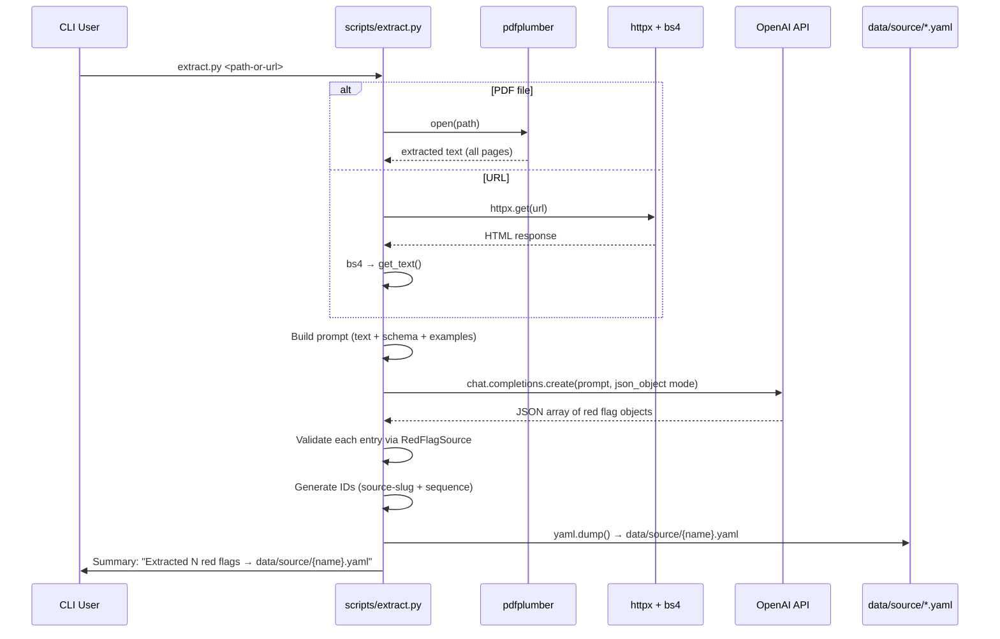

# feat: Red Flag Extraction from PDFs and Web Pages

## Overview

A reusable script (`scripts/extract.py`) that reads a PDF file or web URL containing regulatory guidance, uses an LLM to identify and structure all AML red flags found in the document, and writes the results as a YAML file in `data/source/` — ready for `ingest.py` to embed and store.

## Problem Frame

The redflag-mcp server needs a populated database. Regulatory red flags are published as PDFs (FinCEN alerts, FATF guidance) and web pages (FFIEC manual appendices). Manually translating these into structured YAML is slow and error-prone. This script automates the extraction, sitting upstream of the existing ingestion pipeline.

(see origin: docs/brainstorms/2026-03-26-red-flag-extraction-requirements.md)

## Requirements Trace

- R1. Script accepts a PDF file path or URL and outputs a YAML file in `data/source/`
- R2. PDF text extraction uses `pdfplumber` locally, then sends text to LLM
- R3. URL text extraction fetches and strips HTML to plain text, then same LLM pipeline
- R4. LLM returns structured red flags with: `id`, `description`, `product_types`, `industry_types`, `customer_profiles`, `geographic_footprints`, `regulatory_source`, `risk_level`, `category`
- R5. IDs are auto-generated slugs: `{source-slug}-{sequence-number}` (e.g., `fincen-russian-sanctions-2022-01`)
- R6. Output YAML conforms to `RedFlagSource` schema — compatible with `ingest.py`
- R7. Output file named after source document, written to `data/source/`
- R8. Uses `OPENAI_API_KEY` env var; model configurable via `OPENAI_EXTRACTION_MODEL` (default: `gpt-4o-mini`)

## Scope Boundaries

- Extracts and structures only — does not embed or store (that's `ingest.py`)
- No batch processing of multiple files in a single run
- No OCR for scanned/image-only PDFs
- Web scraping is best-effort; JS-heavy or authenticated pages are out of scope
- No interactive review UI

## Context & Research

### Relevant Code and Patterns

- `docs/plans/2026-03-25-001-feat-aml-redflag-mcp-server-plan.md` Unit 5 — `ingest.py` establishes the OpenAI API pattern: sync `openai.OpenAI()` client, `response_format={"type": "json_object"}`, model configurable via env var
- `docs/plans/2026-03-25-001-feat-aml-redflag-mcp-server-plan.md` Unit 1 — `RedFlagSource` Pydantic model defines the target schema; `config.py` provides path constants and enum sets
- YAML format convention from the plan: list of dicts, kebab-case IDs with numeric suffix, inline list syntax for `product_types`
- `red_flag_sources/pdf/FinCEN Alert Russian Sanctions Evasion FINAL 508.pdf` — primary test document (~10 pages, ~4K tokens extracted text, contains ~10 distinct red flags across 3 sections)

### Institutional Learnings

None — greenfield project, no `docs/solutions/` directory.

### External References

- `pdfplumber` is already installed in the environment (confirmed during brainstorm)
- `httpx` — modern async/sync Python HTTP client, lightweight
- `beautifulsoup4` — standard HTML parser, `get_text()` for content extraction

## Key Technical Decisions

- **`httpx` + `beautifulsoup4` for web extraction**: Standard, well-known libraries with minimal dependency weight. `trafilatura` is more specialized for article extraction but adds a heavier dependency tree. `beautifulsoup4`'s `get_text()` is sufficient for stripping regulatory web pages to plain text. (Resolves deferred question from origin doc.)

- **No document chunking for initial implementation**: The FinCEN PDF extracts to ~4K tokens. Most regulatory guidance documents are under 20 pages. `gpt-4o-mini` has a 128K-token context window. Sending the full document text in one LLM call is simpler and preserves cross-reference context (e.g., section headers that identify the type of red flag). Chunking can be added later if a document exceeds ~100K tokens. (Resolves deferred question from origin doc.)

- **`gpt-4o-mini` as default, validated empirically**: The extraction task is well-structured (identify red flags, fill known fields from a constrained set of values). `gpt-4o-mini` should handle this well. The model is configurable via env var, so upgrading is trivial if quality is insufficient. (Resolves deferred question from origin doc.)

- **Pydantic validation of LLM output before writing YAML**: Parse the LLM's JSON response through `RedFlagSource` to catch invalid field values (e.g., a `risk_level` not in the enum set) before writing the file. Log validation failures per-entry rather than aborting the entire extraction.

- **Script uses `print()` for user-facing output**: Unlike server modules (where stdout is the JSON-RPC channel), `scripts/extract.py` is a standalone CLI tool. `print()` is appropriate for progress and summary output.

## Open Questions

### Resolved During Planning

- **Web scraping library**: `httpx` + `beautifulsoup4` — standard, lightweight, sufficient for regulatory web pages
- **Document chunking**: Not needed initially — most regulatory docs fit well within `gpt-4o-mini`'s 128K context
- **Model quality**: Start with `gpt-4o-mini`, configurable via env var for easy upgrade

### Deferred to Implementation

- **LLM prompt tuning**: The exact prompt wording will need iteration based on output quality from the FinCEN PDF test case. The plan specifies what to include in the prompt; the exact phrasing is an implementation detail.
- **Multi-value dimension coverage**: The LLM may under-populate `industry_types`, `customer_profiles`, and `geographic_footprints` for some entries. Validate against sample output during implementation and refine the prompt if lists are frequently empty.

## High-Level Technical Design

> *This illustrates the intended approach and is directional guidance for review, not implementation specification. The implementing agent should treat it as context, not code to reproduce.*

## Implementation Units

- [ ] **Unit 1: Add extraction dependencies to project**

**Goal:** Add `pdfplumber`, `httpx`, and `beautifulsoup4` to the project's dependencies so `scripts/extract.py` can import them.

**Requirements:** R2, R3 (foundational)

**Dependencies:** Unit 1 of the main server plan (`pyproject.toml` must exist)

**Files:**
- Modify: `pyproject.toml`

**Approach:**
- Add `pdfplumber>=0.11.0`, `httpx>=0.27.0`, and `beautifulsoup4>=4.12.0` to the `[project.dependencies]` list in `pyproject.toml`. These are runtime dependencies of the extraction script, not dev-only.
- Run `uv sync` to install.

**Verification:**
- `uv run python -c "import pdfplumber, httpx, bs4"` succeeds

---

- [ ] **Unit 2: Create `scripts/extract.py` — text extraction and LLM pipeline**

**Goal:** Implement the full extraction script: accept a PDF path or URL, extract text, send to LLM for structured red flag extraction, validate output, and write YAML.

**Requirements:** R1, R2, R3, R4, R5, R6, R7, R8

**Dependencies:** Unit 1 (this plan), Unit 1 of the main server plan (`models.py` with `RedFlagSource`, `config.py` with path constants and enum sets)

**Files:**
- Create: `scripts/extract.py`
- Test: `tests/test_extract.py`

**Approach:**

*Input detection:*
- Accept a single positional argument: a file path or URL
- Detect type by checking if the argument starts with `http://` or `https://` (URL) or is a file path
- For file paths, verify the file exists and has a `.pdf` extension

*PDF text extraction:*
- Open the PDF with `pdfplumber`, iterate all pages, concatenate `page.extract_text()` with page separators
- Handle `pdfplumber` warnings (like the `/'P0'` color warnings seen in the FinCEN PDF) gracefully — these don't affect text extraction

*URL text extraction:*
- Fetch the page with `httpx.get()` with a reasonable timeout (30s) and a browser-like User-Agent header
- Parse the HTML with `BeautifulSoup`, strip `<script>` and `<style>` tags, then call `get_text(separator='\n', strip=True)`

*Source slug generation:*
- Derive a slug from the source: for PDFs, slugify the filename (strip extension, lowercase, replace spaces/special chars with hyphens); for URLs, slugify the last meaningful path segment or page title
- IDs are `{slug}-{NN}` where NN is a zero-padded two-digit sequence number

*LLM extraction:*
- Build a system prompt that instructs the model to identify all distinct AML red flags in the provided text
- Include in the prompt: the `RedFlagSource` field definitions, allowed values for `risk_level` (from config enums), example output entry, and instructions to return a JSON object with a `red_flags` key containing an array of red flag objects
- Include the allowed enum values for `risk_level`, `category`, `industry_types`, `customer_profiles`, and `geographic_footprints` in the prompt so the LLM uses consistent vocabulary
- Use `openai.OpenAI()` sync client, `response_format={"type": "json_object"}`, model from `OPENAI_EXTRACTION_MODEL` env var (default `gpt-4o-mini`)

*Output validation and writing:*
- Parse each entry in the LLM's JSON response through `RedFlagSource` Pydantic model
- Override `id` fields with the generated slug-based IDs (don't trust LLM-generated IDs)
- Log validation errors per-entry; skip invalid entries rather than aborting
- Generate the output filename from the source slug: `{slug}.yaml`
- Write to `data/source/{slug}.yaml` using `yaml.dump()` with `default_flow_style=False`, `allow_unicode=True`, `sort_keys=False`
- If a file with that name already exists, warn and prompt or overwrite (prefer overwrite with a warning for scripting convenience)

*Summary output:*
- Print: `"Extracted {N} red flags from {source} → data/source/{slug}.yaml"`
- If any entries failed validation: `"{M} entries skipped due to validation errors (see log above)"`

**Patterns to follow:**
- OpenAI API usage pattern from `ingest.py` (Unit 5 of main plan): sync client, JSON mode, model via env var
- YAML output format from main plan: list of dicts, inline list syntax for `product_types`, kebab-case IDs

**Test scenarios:**
- PDF extraction: given a small test PDF, extracts non-empty text
- URL extraction: given an HTML string, strips tags and returns clean text
- Source slug generation: `"FinCEN Alert Russian Sanctions Evasion FINAL 508.pdf"` → `"fincen-alert-russian-sanctions-evasion-final-508"`
- ID generation: slug `"fincen-alert"` with 3 entries → `"fincen-alert-01"`, `"fincen-alert-02"`, `"fincen-alert-03"`
- LLM response parsing: valid JSON array → list of `RedFlagSource` objects
- LLM response with one invalid entry (bad `risk_level`): skips that entry, processes the rest
- YAML output: written file can be loaded with `yaml.safe_load()` and each entry passes `RedFlagSource` validation
- Missing `OPENAI_API_KEY`: raises a clear error message (unlike `ingest.py`, extraction cannot proceed without the API key)

**Verification:**
- `uv run python scripts/extract.py "red_flag_sources/pdf/FinCEN Alert Russian Sanctions Evasion FINAL 508.pdf"` produces `data/source/fincen-alert-russian-sanctions-evasion-final-508.yaml` with 10+ valid entries
- `uv run pytest tests/test_extract.py` passes
- The output YAML can be loaded by `yaml.safe_load()` and each entry validates against `RedFlagSource`

---

- [ ] **Unit 3: End-to-end verification with both input types**

**Goal:** Verify the full pipeline works for both PDF and URL inputs, and that output feeds cleanly into `ingest.py`.

**Requirements:** Success criteria validation

**Dependencies:** Unit 2 (this plan), Unit 5 of the main server plan (`ingest.py` must exist for full pipeline test)

**Files:**
- Modify: `red_flag_sources/Weblinks.md` (populate with at least one test URL)

**Approach:**
- Add at least one regulatory URL to `Weblinks.md` (e.g., the FFIEC BSA/AML Manual Appendix F red flags page, or a FinCEN advisory web page)
- Run `scripts/extract.py` on the FinCEN PDF — verify 10+ entries with populated metadata fields
- Run `scripts/extract.py` on the test URL — verify it produces valid YAML output
- Run `scripts/ingest.py` on the resulting YAML files — verify they embed and store without errors
- Spot-check extracted red flags against the source document for accuracy

**Verification:**
- Both PDF and URL extraction produce valid YAML files in `data/source/`
- `scripts/ingest.py` processes the extracted YAML files without errors
- A compliance professional reviewing the output would recognize the red flags as accurate representations of the source documents

## System-Wide Impact

- **Interaction graph:** `scripts/extract.py` is a standalone CLI tool with no callbacks or middleware. It writes files to `data/source/` that are consumed by the separate `scripts/ingest.py` pipeline. No shared state or coordination needed.
- **Error propagation:** LLM API failures should surface as clear error messages to the user. Individual entry validation failures should be logged but not abort the extraction. Network failures (URL fetch) should produce a clear error.
- **State lifecycle risks:** If the script crashes mid-write, a partial YAML file could be left in `data/source/`. This is acceptable — the user can delete and re-run. Writing the full file atomically (write to temp, then rename) would mitigate this but is not critical for a manual-run script.
- **API surface parity:** No other interfaces need this change — it's a new standalone tool.
- **Integration coverage:** The critical integration point is YAML output → `ingest.py` input. Unit 3 validates this end-to-end.

## Risks & Dependencies

- **Dependency on main plan Unit 1**: `scripts/extract.py` imports `RedFlagSource` from `models.py` and path constants from `config.py`. These must be implemented first. If building extract before Unit 1, a minimal inline schema could be used temporarily.
- **LLM extraction quality**: `gpt-4o-mini` may miss red flags embedded in dense prose or misclassify metadata. The configurable model env var provides an escape hatch, and the user can manually review/edit the YAML output.
- **Web page variability**: Regulatory web pages vary in structure. Some may have content in tables, accordions, or expandable sections that `get_text()` may not handle well. Best-effort is the stated scope.
- **`pdfplumber` multi-column layouts**: Some regulatory PDFs use multi-column layouts or sidebars (the FinCEN PDF has a sidebar callout box). `pdfplumber` may interleave text from columns. The LLM should handle this gracefully since it understands document context, but extraction quality may vary.

## Sources & References

- **Origin document:** [docs/brainstorms/2026-03-26-red-flag-extraction-requirements.md](../brainstorms/2026-03-26-red-flag-extraction-requirements.md)
- Related plan: [docs/plans/2026-03-25-001-feat-aml-redflag-mcp-server-plan.md](2026-03-25-001-feat-aml-redflag-mcp-server-plan.md) (Units 1 and 5)
- Domain taxonomy: [docs/Red_flag_types.md](../Red_flag_types.md)
- Test PDF: `red_flag_sources/pdf/FinCEN Alert Russian Sanctions Evasion FINAL 508.pdf`
