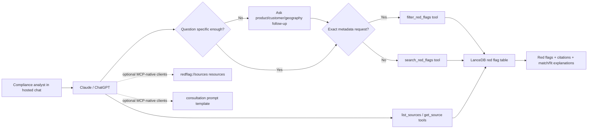

# feat: Improve hosted AML red flag retrieval

## Overview

Improve `redflag-mcp` for compliance analysts using hosted Claude or ChatGPT connectors. The core workflow remains tool-first for broad compatibility, while optional MCP resources and prompts improve source discovery and guided usage in clients that expose them. The first implementation should make vague-query consultation clearer, route exact metadata requests to direct filtering instead of embedding search, return ranked sourced semantic results with bounded fit explanations, and let users inspect which source documents are represented in the ingested corpus.

## Problem Frame

The origin document defines the first-class user as a compliance analyst or BSA officer in a hosted chat client, not a local coding-agent user (see origin: `docs/brainstorms/2026-04-23-general-chat-aml-redflag-retrieval-requirements.md`). The product value is not just semantic search; it is helping vague users narrow their question before retrieval, then returning sourced red flags with enough explanation for the analyst to judge relevance quickly.

Hosted-client compatibility materially shapes the plan. Claude's Messages API MCP connector currently supports MCP tool calls only and requires a publicly exposed HTTP server. ChatGPT full MCP apps are available in beta for Business and Enterprise/Edu web workspaces, but functionality and permissions may change. Therefore, the durable baseline must be implemented through tools. Resources and prompts should be additive, not required for the primary user flow.

## Requirements Trace

- R1. Analysts can ask broad AML questions in a hosted chat client without knowing the corpus taxonomy.
- R2. Vague or underspecified questions trigger follow-up guidance before retrieval.
- R3. Specific questions retrieve directly without unnecessary follow-up friction.
- R4. Retrieved results include red flags with source citations and source links; semantic search results are ranked, while exact metadata results use deterministic filtered ordering.
- R5. Each result includes a short, bounded explanation of why it fits the analyst's context.
- R6. Analysts can inspect source coverage and navigate from results to source-level context.
- R7. Exact metadata requests can return matching red flags through direct filtering without invoking semantic embedding search.
- R8. The baseline workflow depends only on broadly dependable hosted-client MCP behavior, with tool calling as the floor.
- R9. Resources, prompts, elicitation, or sampling remain additive; the workflow stays useful when those features are unavailable.
- R10. Client-specific enhancements improve discoverability, trust, or speed without creating a separate primary workflow.

## Scope Boundaries

- Do not require MCP elicitation for consultation in the first version.
- Do not use MCP sampling or server-side LLM calls to generate explanations during query handling.
- Do not add write actions, corpus editing, ingestion orchestration, policy drafting, transaction monitoring rule generation, or analyst memo generation.
- Do not depend on local-only stdio behavior for the hosted connector workflow.
- Do not change the canonical YAML source schema unless implementation discovers that derived source summaries cannot be generated reliably from existing fields.

### Deferred to Separate Tasks

- Hosted deployment and OAuth hardening: plan separately once the read-only tool/resource surface is stable.
- Evaluation benchmark for retrieval precision and consultation quality: plan separately after the API surface is settled.
- Rich ChatGPT Apps SDK UI: defer until the tool-first hosted connector has proven value.

## Context & Research

### Relevant Code and Patterns

- `src/redflag_mcp/server.py` creates a `FastMCP` app, wires lifespan state, and calls registration helpers. New tool/resource/prompt registration should follow this pattern.
- `src/redflag_mcp/tools.py` owns the service wrapper and current tool registration. It already carries consultation guidance in `SEARCH_DESCRIPTION` and exposes `search_red_flags`, `get_red_flag`, and `list_filters`.
- `src/redflag_mcp/vectorstore.py` centralizes LanceDB table access, row conversion, filter matching, and distinct-value listing. Source catalog aggregation should live here or in a sibling service helper rather than in MCP decorators.
- `src/redflag_mcp/models.py` defines Pydantic response models that omit vectors. Any new source or fit-explanation response shape should be modeled here.
- `tests/test_tools.py` uses a fake embedding model and `create_server()` to verify tool metadata and service behavior without network calls. New tests should extend that style.
- `tests/test_vectorstore.py` and `tests/test_models.py` are the right places for source aggregation and response-model coverage.

### Institutional Learnings

- No `docs/solutions/` learnings were present in this repo at planning time.

### External References

- Anthropic MCP connector docs state that Claude's Messages API connector supports tool calling and currently only tool calls from the MCP specification; servers must be public HTTP endpoints for that integration.
- OpenAI ChatGPT developer-mode docs state that full MCP apps are beta for Business and Enterprise/Edu web workspaces, custom apps require admin publication, app action changes are reviewed, and local MCP servers are not currently supported.
- MCP resources expose server-managed context by URI, but host applications decide how to present or include resources.
- MCP prompts expose reusable prompt templates, but prompt discovery and invocation are user-interface decisions made by the client.
- MCP elicitation can collect structured user input through supporting clients, but clients must declare the capability and servers must not rely on unsupported elicitation modes.

## Key Technical Decisions

- **Tools remain the compatibility contract:** Add source browsing and explanation support as tools first, because hosted Claude and ChatGPT support for richer MCP features is uneven.
- **Mirror source browsing through resources:** Add resources for MCP-native clients only after equivalent tools exist. This satisfies R8 and avoids making resource discoverability part of the baseline workflow.
- **Keep consultation agent-orchestrated:** Strengthen tool descriptions and add an optional prompt template, but do not implement server-side elicitation in this iteration. The hosted-client baseline should work through normal conversation plus tool calls.
- **Add direct metadata filtering for exact requests:** When the user asks for records matching known metadata such as product type, category, risk level, customer profile, geography, industry, or source, use a metadata-only tool instead of embedding the query. Embedding search remains for open-ended relevance questions.
- **Use bounded fit explanations:** Generate explanations from observable tool inputs and stored result metadata, such as matching filters, source/category alignment, and quoted description snippets. Avoid claiming causal relevance that the server cannot prove.
- **Derive source coverage from ingested records:** The source catalog should reflect what is searchable in the current vector store, not every YAML file on disk. This prevents source inspection from implying coverage that retrieval cannot return.

## Open Questions

### Resolved During Planning

- **Should resources be primary or mirrored?** Mirrored. Source resources are useful, but `list_sources` and `get_source` tools must ship first for hosted compatibility.
- **Should prompts replace tool descriptions for consultation?** No. Tool descriptions remain the baseline; prompts are optional discovery aids for clients that surface them.
- **Should explanations require sampling or an LLM call?** No. Use deterministic, bounded explanation fields and let the client model phrase them for users.
- **Should source coverage include un-ingested YAML files?** No. Source coverage means the ingested/searchable corpus.
- **When should direct metadata filtering be used instead of embedding search?** Use direct filtering when the request maps exactly to supplied or discovered metadata filters and does not require semantic relevance ranking.

### Deferred to Implementation

- **Exact source identifier format:** Choose the simplest stable slug or hash once the implementer sees all `regulatory_source` and `source_url` values. It must be deterministic and not require a migration.
- **Exact explanation wording:** Tune wording in tests and manual smoke checks so explanations are useful but not overstated.
- **Exact deterministic ordering for metadata-only results:** Choose a simple stable order during implementation, such as severity then source then ID, and document it in tests.
- **Whether resource templates or static resources are cleaner in FastMCP:** Decide while implementing against the installed `mcp[cli]>=1.26.0` API.

## High-Level Technical Design

> *This illustrates the intended approach and is directional guidance for review, not implementation specification. The implementing agent should treat it as context, not code to reproduce.*

## Implementation Units

- [x] **Unit 1: Add source catalog domain models and aggregation**

**Goal:** Represent source-level coverage derived from ingested red flag records.

**Requirements:** R4, R6, R7

**Dependencies:** None

**Files:**
- Modify: `src/redflag_mcp/models.py`
- Modify: `src/redflag_mcp/vectorstore.py`
- Test: `tests/test_models.py`
- Test: `tests/test_vectorstore.py`

**Approach:**
- Add response models for source summaries and source details. Include a deterministic source identifier, regulatory source name, source URL when present, red flag count, categories, risk levels, product types, and red flag IDs.
- Add vectorstore helpers that aggregate over `_all_rows(table)` and return source summaries/details without embedding vectors.
- Derive source identity from `source_url` when present and fall back to `regulatory_source` when necessary. Keep the identifier stable across runs for the same stored data.
- Treat rows with neither `source_url` nor `regulatory_source` as an explicit unknown source bucket rather than dropping them.
- Keep source detail bounded: include source metadata, aggregate facets, red flag IDs, and concise red flag snippets rather than duplicating every full red flag body when a source has many entries.

**Patterns to follow:**
- `RedFlagResult` and `RedFlagRecord.to_result()` in `src/redflag_mcp/models.py`.
- `list_distinct_values()` and `_all_rows()` in `src/redflag_mcp/vectorstore.py`.

**Test scenarios:**
- Happy path: two records with the same `source_url` aggregate into one source summary with count `2`, sorted red flag IDs, and combined categories.
- Happy path: `get_source`-style helper returns source details including the red flags from that source and no vector field.
- Edge case: a source with many red flags returns bounded snippets/IDs suitable for chat context rather than an unbounded full-source dump.
- Edge case: records with the same regulatory source but missing URLs aggregate deterministically.
- Edge case: records with missing source metadata appear under an unknown source entry rather than being omitted.
- Edge case: empty table returns an empty source list and no source detail.

**Verification:**
- Source aggregation returns deterministic, vector-free data from seeded test records.

- [x] **Unit 2: Add source browsing tools**

**Goal:** Expose source coverage through tools so hosted clients can inspect the corpus without relying on MCP resources.

**Requirements:** R4, R6, R7, R8

**Dependencies:** Unit 1

**Files:**
- Modify: `src/redflag_mcp/tools.py`
- Test: `tests/test_tools.py`

**Approach:**
- Add service methods and MCP tools for `list_sources` and `get_source`.
- `list_sources` should return a concise catalog of ingested source summaries and preserve the existing pre-ingestion message behavior when the table is empty.
- `get_source` should accept the deterministic source identifier and return source detail or a not-found message.
- Tool descriptions should explicitly tell agents to use these tools when users ask where red flags came from, what the corpus covers, or why a cited source matters.
- Tool descriptions should point agents to `get_red_flag` when they need the full text for one red flag from a source detail response.

**Patterns to follow:**
- Existing `list_filters`, `get_red_flag`, and pre-ingestion response handling in `src/redflag_mcp/tools.py`.
- Tool metadata assertions in `tests/test_tools.py`.

**Test scenarios:**
- Happy path: `list_sources` returns source summaries with citation URLs and source counts from seeded records.
- Happy path: `get_source` returns one source detail by identifier and includes related red flag IDs.
- Error path: `get_source` with an unknown identifier returns a clear not-found message and `source: None`.
- Edge case: empty store returns the pre-ingestion message and an empty source list.
- Integration: `create_server().list_tools()` includes the two new source tools with descriptions that mention source coverage and citations.

**Verification:**
- Hosted-compatible tool surface can answer source-coverage questions without resources.

- [x] **Unit 3: Add direct metadata red flag filtering**

**Goal:** Return deterministic red flag matches when the request maps exactly to stored metadata.

**Requirements:** R1, R3, R4, R7, R8

**Dependencies:** None

**Files:**
- Modify: `src/redflag_mcp/vectorstore.py`
- Modify: `src/redflag_mcp/tools.py`
- Test: `tests/test_vectorstore.py`
- Test: `tests/test_tools.py`

**Approach:**
- Add a direct metadata filtering helper that scans/filter rows without calling `encode_query` or `table.search`.
- Expose it as a hosted-compatible tool, tentatively named `filter_red_flags`, with optional filters matching the searchable metadata: `product_types`, `industry_types`, `customer_profiles`, `geographic_footprints`, `category`, `risk_level`, and source-level filters when available.
- Require at least one metadata filter, or return a clear message asking the agent to provide filters. This avoids accidental full-corpus dumps in hosted chat.
- Return deterministic, vector-free results with no semantic score. Include matched filter values or a concise direct-match explanation so the client can distinguish direct filtering from semantic ranking.
- Tool description should instruct agents to use this tool for exact metadata requests such as "show all high-risk depository structuring red flags" and use `search_red_flags` for open-ended relevance questions.

**Patterns to follow:**
- `_matches_filters()` and `list_distinct_values()` in `src/redflag_mcp/vectorstore.py`.
- Existing tool/service method structure in `src/redflag_mcp/tools.py`.

**Test scenarios:**
- Happy path: filtering by `product_types=["depository"]`, `category="structuring"`, and `risk_level="high"` returns only matching records without requiring a fake embedding model call.
- Happy path: filtering by multiple list dimensions uses intersection semantics consistent with semantic search filters.
- Edge case: calling `filter_red_flags` with no filters returns a clear message and an empty result set.
- Edge case: no matching records returns an empty result set without falling back to embedding search.
- Regression: serialized filtered results omit vectors and do not include semantic scores.
- Integration: `create_server().list_tools()` includes `filter_red_flags` and its description explains when to prefer it over `search_red_flags`.

**Verification:**
- Exact metadata questions can be answered deterministically without embedding search.

- [x] **Unit 4: Add bounded fit explanations to search results**

**Goal:** Make search output explain why each result fits the analyst's context without server-side LLM calls.

**Requirements:** R1, R3, R4, R5, R8

**Dependencies:** None

**Files:**
- Modify: `src/redflag_mcp/models.py`
- Modify: `src/redflag_mcp/tools.py`
- Test: `tests/test_models.py`
- Test: `tests/test_tools.py`

**Approach:**
- Extend `RedFlagResult` with explanation-oriented fields such as `fit_explanation` and/or `fit_signals`.
- Build explanations in the service layer after retrieval, using only the query, explicit filters, score, and stored metadata/description.
- Favor specific, auditable statements: matching product type, industry, geography, category, risk level, source, and a short description-derived signal. Avoid saying a result is definitely applicable or regulatory-required.
- Keep explanations optional or empty when there is too little context, but still return the red flag.

**Patterns to follow:**
- Existing result serialization in `RedFlagService.search_red_flags`.
- Pydantic defaults in `RedFlagResult`.

**Test scenarios:**
- Happy path: a filtered search for `product_types=["depository"]` returns a result whose explanation mentions the matching product type.
- Happy path: a result with category and risk metadata includes bounded signals for category/risk without overstating certainty.
- Edge case: no explicit filters still returns a conservative explanation based on semantic match and source metadata.
- Edge case: missing metadata does not produce awkward blank phrases or false claims.
- Regression: the vector field remains absent from serialized search results.

**Verification:**
- Search responses contain concise, deterministic fit context suitable for client models to present to users.

- [x] **Unit 5: Strengthen consultation guidance for hosted chat clients**

**Goal:** Improve vague-query behavior through tool metadata while keeping specific queries fast.

**Requirements:** R1, R2, R3, R7, R8

**Dependencies:** Unit 3 and Unit 4 are helpful but not required.

**Files:**
- Modify: `src/redflag_mcp/tools.py`
- Modify: `README.md`
- Test: `tests/test_tools.py`

**Approach:**
- Expand `SEARCH_DESCRIPTION` enough to describe the consultation protocol concretely, while keeping it short enough for hosted tool descriptions.
- Make the trigger explicit: ask follow-up questions when the query lacks product subtype, customer profile, geography, or transaction channel/volume; search directly when those are already present.
- Instruct agents to call `list_filters` before or during consultation when they need valid filter values.
- Instruct agents to use `filter_red_flags` when the final user context maps exactly to metadata filters, and `search_red_flags` when semantic matching is still needed.
- Update README smoke checks to include one vague-query example and one specific-query example that should bypass consultation.

**Patterns to follow:**
- Existing `SEARCH_DESCRIPTION` and `test_fastmcp_tool_metadata_includes_consultation_guidance`.
- README "Local smoke checks" section.

**Test scenarios:**
- Metadata: `search_red_flags` tool description includes the vague-query trigger, follow-up dimensions, and direct-search behavior for specific queries.
- Metadata: description references `list_filters` as the way to discover valid filter values.
- Metadata: direct-filter guidance distinguishes exact metadata retrieval from semantic search.
- Regression: tool input schema remains backward compatible for existing search arguments.

**Verification:**
- Tool metadata gives mainstream chat models enough instruction to ask follow-ups before broad searches.

- [x] **Unit 6: Add optional MCP resources for source inspection**

**Goal:** Let MCP-native clients browse source coverage through resources while preserving tool parity.

**Requirements:** R6, R9, R10

**Dependencies:** Unit 1 and Unit 2

**Files:**
- Create: `src/redflag_mcp/resources.py`
- Modify: `src/redflag_mcp/server.py`
- Test: `tests/test_tools.py` or create `tests/test_resources.py`

**Approach:**
- Register a source catalog resource such as `redflag://sources` that returns the same source summary data as `list_sources`.
- Register a source detail resource template such as `redflag://sources/{source_id}` if FastMCP's resource template behavior fits cleanly.
- Return JSON-compatible text or structured data with a clear MIME type. Do not expose local file paths or vector internals.
- Keep resources read-only and derived from the same service layer as tools to avoid behavior drift.
- Keep resource payloads bounded for the same reason as source tools; source resources should orient the model/user, not replace targeted `get_red_flag` retrieval.

**Patterns to follow:**
- `register_tools(mcp)` in `src/redflag_mcp/tools.py`; create an analogous `register_resources(mcp)`.
- FastMCP `@mcp.resource(...)` decorator support verified from the installed package.

**Test scenarios:**
- Happy path: `create_server().list_resources()` includes the source catalog resource.
- Happy path: reading the catalog resource returns source summaries matching the tool-layer source aggregation.
- Happy path or deferred implementation: if a resource template is used, `list_resource_templates()` exposes the source detail template.
- Edge case: empty store resource returns an empty catalog plus the pre-ingestion message, consistent with tools.
- Regression: resource output does not include vectors or local filesystem-only paths.

**Verification:**
- MCP clients that expose resources can inspect source coverage, while hosted tool-only clients retain equivalent functionality through tools.

- [x] **Unit 7: Add optional MCP prompt templates for analyst workflows**

**Goal:** Improve discovery in clients that expose MCP prompts without relying on prompts for the main workflow.

**Requirements:** R2, R3, R5, R7, R9, R10

**Dependencies:** Unit 5

**Files:**
- Create: `src/redflag_mcp/prompts.py`
- Modify: `src/redflag_mcp/server.py`
- Test: create `tests/test_prompts.py` or extend `tests/test_tools.py`

**Approach:**
- Register a prompt such as `consult_aml_red_flags` that tells the client model how to conduct the follow-up-first workflow and use `list_filters`, `search_red_flags`, and source tools.
- Prompt guidance should describe the routing rule: use `filter_red_flags` for exact metadata criteria and `search_red_flags` for semantic relevance questions.
- Register a second prompt only if it is clearly distinct, such as `explain_red_flag_fit`, for presenting search results with concise "why this fits" explanations.
- Keep prompt content aligned with tool descriptions so behavior does not diverge by client.
- Treat prompts as user-discoverable shortcuts, not required instructions.

**Patterns to follow:**
- FastMCP `@mcp.prompt()` decorator support verified from the installed package.
- Existing server registration pattern in `src/redflag_mcp/server.py`.

**Test scenarios:**
- Happy path: `create_server().list_prompts()` includes the consultation prompt with a clear description.
- Happy path: `get_prompt` returns messages that mention follow-up dimensions and the correct tool names.
- Regression: server creation still works in MCP dev import mode.
- Compatibility: prompt registration does not change or remove existing tools.

**Verification:**
- MCP-native clients can discover guided AML workflows, while hosted clients can still rely on tool descriptions.

## System-Wide Impact

- **Interaction graph:** `server.py` will register tools, resources, and prompts. `tools.py`, `resources.py`, and `prompts.py` should share service-layer behavior rather than each reading LanceDB differently. Query routing becomes a client/agent decision based on tool descriptions: exact metadata criteria go to `filter_red_flags`; open-ended relevance questions go to `search_red_flags`.
- **Error propagation:** Empty stores and missing IDs should keep the current explicit message-plus-empty-shape style. Source tools/resources should not raise for normal not-found cases.
- **State lifecycle risks:** All new outputs are derived from the current LanceDB table at request time. There are no writes, migrations, or cache invalidation concerns in this iteration.
- **API surface parity:** Direct metadata filtering, source inspection, and consultation must exist as tools/tool descriptions before optional resources or prompt templates. Any optional MCP feature should mirror, not replace, a hosted-compatible tool behavior.
- **Integration coverage:** Tests should verify server metadata for tools, resources, and prompts because hosted clients depend on discoverable names/descriptions.
- **Unchanged invariants:** Existing `search_red_flags`, `get_red_flag`, and `list_filters` tool names and arguments remain backward compatible. The MCP server stays read-only at query time. Embedding generation and ingestion remain unchanged.

## Risks & Dependencies

| Risk | Mitigation |
|------|------------|
| Hosted clients ignore resources or prompts | Ship equivalent source and consultation behavior through tools and tool descriptions first. |
| Fit explanations sound more certain than retrieval warrants | Generate bounded explanations from metadata and explicit filters; avoid legal/compliance conclusions. |
| Source IDs are unstable across ingestion runs | Derive IDs deterministically from source URL or regulatory source and cover this in tests. |
| Tool descriptions become too long for model/tool-selection quality | Keep descriptions concise and move detailed examples to README or optional prompts. |
| ChatGPT app action snapshots can lag server changes | Preserve backward compatibility for existing tools and add new tools without changing existing required inputs. |
| Source catalog reflects stale or partial ingestion | Define source coverage as the ingested vector-store corpus and make that explicit in tool/resource descriptions. |
| Source detail responses become too large for hosted chat context | Return bounded source metadata, snippets, and red flag IDs; use `get_red_flag` for full individual records. |
| Agents use semantic search for exact metadata questions and return approximate results | Add `filter_red_flags` with explicit tool descriptions and prompt guidance that route exact metadata criteria away from embedding search. |

## Documentation / Operational Notes

- Update `README.md` to document the new source tools, optional resources/prompts, and hosted-client compatibility posture.
- Add manual smoke prompts for: vague AML product question, exact metadata filter question, specific semantic search, "what sources are in your corpus?", and "show me the source behind this red flag."
- Do not document resources/prompts as required for hosted ChatGPT or Claude until client support is validated in the target deployment.

## Sources & References

- **Origin document:** [docs/brainstorms/2026-04-23-general-chat-aml-redflag-retrieval-requirements.md](../brainstorms/2026-04-23-general-chat-aml-redflag-retrieval-requirements.md)
- Related code: `src/redflag_mcp/server.py`
- Related code: `src/redflag_mcp/tools.py`
- Related code: `src/redflag_mcp/vectorstore.py`
- Related tests: `tests/test_tools.py`
- External docs: [Anthropic MCP connector](https://docs.anthropic.com/en/docs/agents-and-tools/mcp-connector)
- External docs: [OpenAI developer mode and MCP apps in ChatGPT](https://help.openai.com/en/articles/12584461-developer-mode-apps-and-full-mcp-connectors-in-chatgpt-beta.svgz)
- External docs: [MCP resources](https://modelcontextprotocol.io/docs/concepts/resources)
- External docs: [MCP prompts](https://modelcontextprotocol.io/docs/concepts/prompts)
- External docs: [MCP elicitation](https://modelcontextprotocol.io/specification/2025-11-25/client/elicitation)
