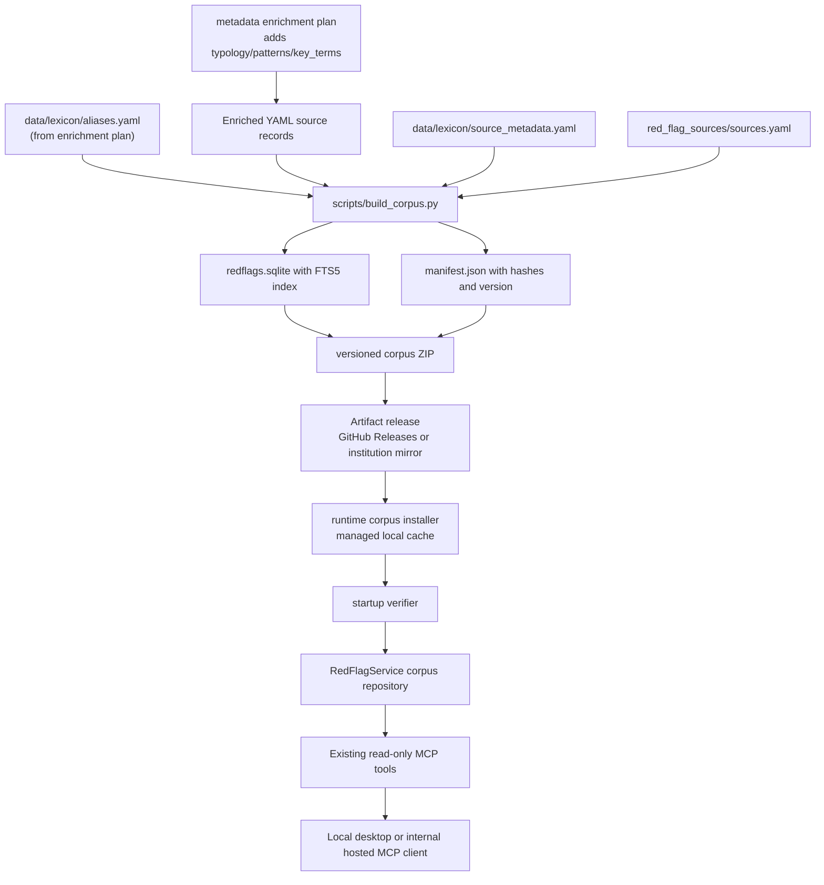
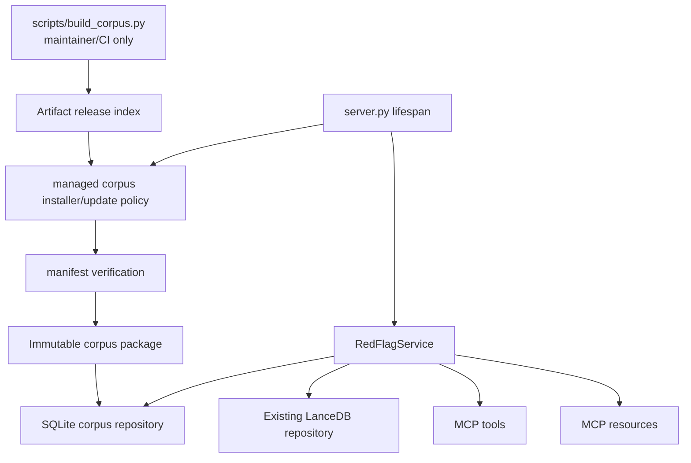

# feat: Add downloadable local red flag corpus

## Overview

Add a downloadable, versioned AML red flag corpus package that can power the existing read-only MCP tools without runtime embeddings, OpenAI calls, LanceDB, or any hosted vector database. The first implementation should build a deterministic SQLite FTS5 package from enriched YAML source records produced by `docs/plans/2026-04-29-002-feat-redflag-metadata-enrichment-plan.md`, verify package integrity at install/runtime, and let both local desktop users and institution-hosted internal deployments run the same MCP behavior against the same artifact.

The end-user experience should be simple: a user adds the Red Flag MCP server to Claude, ChatGPT developer mode, or another MCP client, and the server manages corpus installation and updates locally. End users should not need to clone this repository, run Python scripts, build SQLite files, verify hashes manually, or understand the corpus package internals.

This is an alternative deployment model, not a replacement for the hosted/vector-search direction (see origin: `docs/brainstorms/2026-04-29-downloadable-local-redflag-corpus-requirements.md`). The stable product contract remains the analyst-facing MCP tool surface: search, exact filtering, lookup, source browsing, and filter discovery.

## Problem Frame

Financial institutions may not be able to send analyst queries, institution context, or corpus content to external embedding APIs or hosted vector stores. The current local repository already runs offline after ingestion, but query-time search still depends on a LanceDB vector store and imports embedding behavior through `search_red_flags`. The origin document requires a downloadable corpus package that can be installed and run without live repository access, an OpenAI key, a vector database account, or a local embedding model (see origin: `docs/brainstorms/2026-04-29-downloadable-local-redflag-corpus-requirements.md`).

The central planning choice is to make the package itself the runtime data product. Query-time code should open a verified, immutable corpus package and search it lexically with deterministic ranking, while build-time scripts remain maintainer/CI release tooling. Normal users should interact only with the installed MCP server command and its managed local corpus cache.

## Requirements Trace

- R1. Distribute a complete, versioned corpus package usable without live access to the source repository, external vector database, or embedding API.
- R2. Ensure query runtime performs search, ranking, filtering, citation lookup, and source browsing without external API calls.
- R3. Support local desktop MCP and institution-hosted internal MCP deployment from the same package.
- R4. Include corpus version/package metadata in every tool response, or enough metadata for audit traceability.
- R5. Include integrity metadata so installed packages can be verified against released artifacts.
- R6. Use lexical retrieval at runtime rather than query embeddings.
- R7. Improve recall with metadata filters and curated synonym/query-expansion support.
- R8. Support broad keyword search and exact filtering by product, industry, customer profile, geography, typology/category, risk level, source, and curated facets.
- R9. Return deterministic, source-cited results with fit signals that explain why a record matched.
- R10. Enrich metadata during corpus build to compensate for loss of semantic recall.
- R11. Model curated aliases and synonyms for AML terms, abbreviations, typologies, products, geographies, and transaction patterns.
- R12. Preserve inspectable source coverage and red-flag-to-source traceability.
- R13. Release corpus updates as immutable versions with clear update and rollback paths.
- R14. Make corpus build reproducible from approved source records.
- R15. Keep the MCP server read-only with a small retrieval-focused tool surface.
- R16. Keep local and institution-hosted tool behavior the same.
- R17. Preserve stdio MCP safety by avoiding stdout output outside the protocol.
- R18. Keep query logging absent by default and configurable only when explicitly requested.
- R19. Keep end-user setup simple: users should only configure/connect the MCP server in Claude, ChatGPT developer mode, or another MCP client; package download, verification, install, and update should be handled by the server or institution-managed distribution.

## Scope Boundaries

- Do not add write actions, corpus editing tools, alert decisioning, SAR conclusions, or automated compliance determinations.
- Do not require runtime embeddings, query-time OpenAI calls, Qdrant Cloud, LanceDB, or another hosted/vector database for the offline package path.
- Do not make Google Drive, Dropbox, or mutable shared storage the runtime source of truth.
- Do not require a rich UI; MCP tools remain the baseline interface.
- Do not remove the current extraction and vector-ingestion workflows in this plan; treat them as adjacent build/development workflows unless a later plan deprecates them.
- Do not redistribute original source PDFs or full extracted source text until each source is explicitly cleared for redistribution.

### Deferred to Separate Tasks

- Remote-hosted MCP architecture: remains covered by `docs/plans/2026-04-24-001-feat-hosted-redflag-retrieval-plan.md`.
- Retrieval evaluation benchmark for lexical search quality: create after the lexical package format and response contract are stable.
- Release publishing to GitHub Releases or another artifact registry: required before the end-user auto-install path is production-ready, because users should consume released artifacts rather than run local build commands.
- Fully internal institution rebuild path with no external build-time enrichment: future hardening once the package manifest and build inputs are stable.

## Context & Research

### Relevant Code and Patterns

- `src/redflag_mcp/server.py` creates the FastMCP app, stores `RedFlagService` in lifespan state, and selects stdio/HTTP transport through environment variables. Corpus mode should plug into this startup path without changing tool names.
- `src/redflag_mcp/tools.py` owns `RedFlagService`, tool registration, pre-ingestion messages, result shaping, request routing, and fit explanations. Preserve this service boundary and adapt it to a corpus-backed repository rather than adding MCP logic directly to storage code.
- `src/redflag_mcp/vectorstore.py` centralizes current LanceDB access, metadata filtering, deterministic source grouping, and vector-free conversion. The SQLite corpus repository should mirror these semantics where possible, especially list-filter intersection, deterministic source IDs, and metadata-only ordering.
- `src/redflag_mcp/models.py` contains Pydantic models for source YAML, stored records, tool results, and source browsing. The metadata enrichment plan owns the new red-flag fields (`typology_family`, `transaction_patterns`, `key_terms`); this plan should add only package/corpus metadata and source-release metadata needed for corpus packaging.
- `scripts/ingest.py` already separates YAML loading, optional OpenAI enrichment, record construction, and storage writes. The metadata enrichment plan extends that machinery and writes enriched YAML back to source files; this corpus plan should consume those enriched YAML records and write an immutable lexical corpus artifact instead of a LanceDB table.
- `tests/test_tools.py` uses fake models and service-level tests to prove query behavior without network calls. Corpus-mode tests should follow this pattern and assert that lexical search never calls embedding code.
- `tests/test_vectorstore.py` and existing source aggregation tests provide patterns for deterministic filtering, source browsing, and vector-free result assertions.
- `AGENTS.md` requires red-green TDD for implementation and warns that stdout corrupts stdio MCP transport. Build scripts may log to stderr through `logging`; server/runtime code must not use `print()`.

### Institutional Learnings

- No `docs/solutions/` directory or critical-patterns file was present in this repo at planning time.
- `docs/plans/2026-04-24-001-feat-hosted-redflag-retrieval-plan.md` established that tools are the compatibility contract and optional resources/prompts should mirror tool behavior, not replace it.
- `docs/plans/2026-04-28-001-feat-red-flag-request-routing-plan.md` established deterministic routing, metadata-only filtering for exact requests, and metadata eligibility before relevance ranking. Corpus mode should preserve those invariants with lexical ranking.
- `docs/plans/2026-04-29-002-feat-redflag-metadata-enrichment-plan.md` owns red flag metadata enrichment: `typology_family`, `transaction_patterns`, `key_terms`, `data/lexicon/aliases.yaml`, tagger prompt changes, and optional YAML write-back. This corpus plan depends on that output instead of duplicating it.

### External References

- SQLite FTS5 supports full-text indexes and the built-in `bm25()` auxiliary ranking function, making it suitable for deterministic local lexical retrieval in a single-file database: `https://sqlite.org/fts5.html`
- Python's standard `sqlite3` module exposes the bundled SQLite library, which keeps the runtime dependency small; implementation should include a startup/build preflight for FTS5 support because availability follows the Python/SQLite build: `https://docs.python.org/3/library/sqlite3.html`
- Python's `zipfile` and `hashlib` modules are sufficient for a portable package archive plus SHA-256 integrity manifest without adding runtime package dependencies: `https://docs.python.org/3/library/zipfile.html`, `https://docs.python.org/3/library/hashlib.html`

## Key Technical Decisions

- **Use SQLite FTS5 as the first lexical engine:** It gives a single local file, no server process, no hosted service, deterministic BM25-style ranking, and broad Python compatibility. This is a better first offline fit than adding Whoosh, Tantivy bindings, or a separate search daemon.
- **Package as a versioned ZIP archive containing a SQLite corpus and manifest:** ZIP is easy for the server, CI, and institution-managed deployment tooling to download, inspect, verify, and unpack on analyst desktops and internal servers. The manifest should contain corpus version, build timestamp, source record hashes, file hashes, schema version, and release notes or changelog pointer.
- **Make corpus acquisition automatic for default local users:** The MCP server should be able to discover the latest approved corpus release, download it into an application data directory, verify it, and open it without user-run scripts. This is still a local/offline query runtime after installation; network access is used only for explicit or startup corpus acquisition/update unless disabled.
- **Support pinned and mirrored corpus channels for institutions:** Institution-hosted deployments should be able to disable automatic public release checks, pin an exact corpus version, or point the server at an internal artifact URL/directory while preserving the same verification and runtime behavior.
- **Keep the MCP tool names stable:** Existing clients should still call `search_red_flags`, `filter_red_flags`, `get_red_flag`, `list_filters`, `list_sources`, and `get_source`. Corpus mode changes storage and ranking, not the analyst-facing contract.
- **Return corpus metadata from a shared response wrapper:** Tool responses should include a small `corpus` object with version, package ID, integrity status, schema version, and build timestamp. This satisfies audit traceability without making every red flag duplicate the full manifest.
- **Treat aliases and enriched fields as curated build inputs, not runtime inference:** The metadata enrichment plan creates `data/lexicon/aliases.yaml` and enriches YAML with `typology_family`, `transaction_patterns`, and `key_terms`. Corpus build and runtime query expansion should consume those inputs deterministically and surface expansions in fit signals.
- **Separate build-time enrichment from query-time privacy:** The corpus builder may support optional enrichment when credentials are available, but the packaged query runtime must not import OpenAI clients, load embedding models, or call external services.
- **Default to URL-only source references until redistribution is cleared:** Package source summaries and extracted red flag records by default. Include original documents or source text only when source-level license/audit metadata explicitly allows redistribution.
- **Disable query logging by default:** Local and internal HTTP deployments should not log analyst prompts unless an explicit opt-in environment variable is set and documented.

## Open Questions

### Resolved During Planning

- **What package format best balances portability and integrity?** Use a versioned ZIP archive with `manifest.json`, `redflags.sqlite`, and optional cleared source assets. Integrity is verified through SHA-256 hashes recorded in the manifest and, later, release-level checksums.
- **Which lexical engine should the first implementation use?** SQLite FTS5. It is local, deterministic, dependency-light, and strong enough for the small-to-moderate corpus assumed by the origin document.
- **How should synonym governance work in the first implementation?** Use `data/lexicon/aliases.yaml` from the metadata enrichment plan as the reviewed source-controlled alias input and embed its hash/content into each package at build time. Do not generate or infer new synonyms at query time.
- **Which metadata fields are needed beyond the current model?** The metadata enrichment plan owns red-flag fields (`typology_family`, `transaction_patterns`, `key_terms`). This plan owns package/build metadata plus source metadata for title, authority, jurisdiction, publication date when known, source redistribution status, and source document hash when bundled.
- **How should local and institution-hosted setup differ?** Only startup/configuration and artifact policy differ. Default local mode may use the public managed release channel; institution-hosted mode may pin a version, use an explicit corpus path, or use an internal mirror. Both modes activate a verified corpus package and expose the same tools and responses.

### Deferred to Implementation

- **Exact SQLite schema and FTS tokenizer settings:** Settle while implementing against test fixtures and the available bundled SQLite version; keep schema versioned and covered by tests.
- **Exact package version string format:** Use a simple immutable identifier first, then align with release automation once artifact publishing exists.
- **Exact FTS field weights:** Start with deterministic expansion and simple fit signals; tune weights for description, `typology_family`, `transaction_patterns`, `key_terms`, source title, and metadata labels after lexical evaluation exists.
- **Exact install location defaults:** Choose conservative per-user application data defaults during implementation, such as a `~/.redflag-mcp/corpora/<version>/` style directory, but always support explicit corpus path/version/artifact configuration for desktop and hosted deployments.
- **Exact update policy default:** Decide during implementation whether startup checks should run every launch, on a TTL, or only when no corpus is installed. The user-facing principle is stable: default local setup should work without scripts, while institutions can pin or disable updates.
- **Exact release signing mechanism:** SHA-256 manifest verification lands first; artifact signing can be added when release publishing is planned.

## Output Structure

The expected new structure is:

```text
data/lexicon/
  source_metadata.yaml
scripts/
  build_corpus.py
  verify_corpus.py
src/redflag_mcp/
  corpus.py
  corpus_install.py
  lexicalstore.py
tests/
  test_corpus.py
  test_corpus_install.py
  test_lexicalstore.py
```

This tree is a scope declaration, not a constraint. The implementing agent may adjust names if the existing module boundaries make a different split clearer.

## High-Level Technical Design

> *This illustrates the intended approach and is directional guidance for review, not implementation specification. The implementing agent should treat it as context, not code to reproduce.*



## Implementation Units

- [ ] **Unit 1: Add Corpus Package and Source Metadata Inputs**

**Goal:** Define the package and source-release metadata needed for corpus traceability, package auditability, and source redistribution decisions.

**Requirements:** R4, R5, R12, R14

**Dependencies:** `docs/plans/2026-04-29-002-feat-redflag-metadata-enrichment-plan.md` Unit 1 for enriched red-flag model fields

**Files:**
- Create: `data/lexicon/source_metadata.yaml`
- Modify: `src/redflag_mcp/models.py`
- Test: `tests/test_models.py`

**Approach:**
- Add typed models or validation helpers for corpus/package metadata and source redistribution metadata.
- Do not add or rename red-flag enrichment fields here. `typology_family`, `transaction_patterns`, `key_terms`, and `data/lexicon/aliases.yaml` are owned by `docs/plans/2026-04-29-002-feat-redflag-metadata-enrichment-plan.md`.
- Keep current and enriched YAML compatibility: current source files should remain valid before enrichment, and enriched files should carry through the fields from the metadata enrichment plan without this unit redefining them.
- Define `data/lexicon/source_metadata.yaml` as reviewed source-level release metadata layered on top of `red_flag_sources/sources.yaml`. It should track title, authority, jurisdiction, publication date when known, redistribution status, and optional local source asset hash without being overwritten by the generated URL registry.
- Track source redistribution status separately from source URL so package building can include citations safely while deferring full-source bundling decisions.

**Execution note:** Implement package/source metadata behavior test-first; use enriched YAML fixtures from the metadata enrichment plan when they are available, and current YAML fixtures for backward compatibility.

**Patterns to follow:**
- Existing response-model style in `src/redflag_mcp/models.py`.
- Existing validation style in `tests/test_models.py`.

**Test scenarios:**
- Happy path: corpus package metadata with version, schema version, build timestamp, package ID, file hashes, and integrity status validates and serializes.
- Happy path: current YAML records from `data/source/001_federal_child_nutrition_fraud.yaml`, `data/source/002_oil_smuggling_cartels.yaml`, and `data/source/003_bulk_cash_smuggling_repatriation.yaml` still validate before enrichment.
- Happy path: enriched YAML records containing `typology_family`, `transaction_patterns`, and `key_terms` from the metadata enrichment plan validate without this plan adding alternate field names.
- Happy path: source metadata entries merge with source URLs from `red_flag_sources/sources.yaml` and preserve redistribution status in the corpus manifest.
- Edge case: missing source redistribution metadata defaults to URL-only source packaging, not bundled source assets.
- Error path: source metadata that references an unknown source key fails package validation before release.

**Verification:**
- Models can represent package/source metadata plus both current and enriched source records, and no response model exposes embedding vectors in corpus mode.

- [ ] **Unit 2: Add SQLite FTS5 Lexical Store**

**Goal:** Provide deterministic local search, exact filtering, red flag lookup, source browsing, and filter discovery against a SQLite corpus database.

**Requirements:** R2, R6, R7, R8, R9, R12, R15

**Dependencies:** Unit 1 and `docs/plans/2026-04-29-002-feat-redflag-metadata-enrichment-plan.md` Units 1-2

**Files:**
- Create: `src/redflag_mcp/lexicalstore.py`
- Test: `tests/test_lexicalstore.py`

**Approach:**
- Introduce a SQLite-backed repository that mirrors the current `vectorstore.py` behavior but does not accept vectors or call embedding code.
- Store normalized metadata in queryable tables and store full-text searchable text in an FTS5 virtual table. Searchable text should be synthesized from `description`, `category`, `typology_family`, `transaction_patterns`, `key_terms`, source title, and relevant metadata labels.
- Implement query expansion by normalizing the user query, looking up curated aliases from `data/lexicon/aliases.yaml`, and searching the expanded lexical expression deterministically.
- Preserve exact metadata filtering semantics: list fields use intersection matching, scalar fields require equality, and source filters can identify source coverage.
- Return deterministic ranking for broad search. Use FTS ranking first, then stable tie-breakers such as risk order, source label, and red flag ID.
- Generate fit signals from observable matches: expanded terms used, matching metadata filters, category/risk/source matches, and source citation.
- Include package metadata in every public repository response so tool methods can surface corpus version and integrity status.

**Execution note:** Start with failing tests that prove lexical search returns `TBML` and `CVC` alias matches from `data/lexicon/aliases.yaml` without invoking embeddings.

**Technical design:** Directional guidance only: the store should expose the same conceptual operations as `vectorstore.py` (`search`, `filter`, `get_by_id`, `list_distinct_values`, `list_sources`, `get_source`) while hiding SQLite details from MCP tool registration.

**Patterns to follow:**
- `RedFlagFilters`, `_matches_filters`, `_metadata_result_sort_key`, `_source_id`, and source grouping behavior in `src/redflag_mcp/vectorstore.py`.
- Fit signal style in `_add_fit_explanations` in `src/redflag_mcp/tools.py`.

**Test scenarios:**
- Happy path: `search("TBML invoices")` expands `TBML` from `data/lexicon/aliases.yaml` and returns a trade-based money laundering or import/export record with fit signals naming the expanded alias.
- Happy path: `search("CVC mixer")` expands `CVC` and can match crypto/virtual-asset records when present in a seeded corpus.
- Happy path: broad keyword search returns records ordered deterministically for repeated identical queries.
- Happy path: `filter_red_flags` equivalent with `product_types=["depository"]`, `category="structuring"`, and `risk_level="high"` returns only exact metadata matches and no score.
- Edge case: empty query with filters behaves as metadata filtering rather than an unbounded full-text search.
- Edge case: no lexical matches returns an empty result set with corpus metadata and no semantic fallback.
- Error path: opening a SQLite file without the expected schema version fails with a clear package/schema error.
- Integration: `list_sources` and `get_source` return the same source IDs for the same records as the current vectorstore-derived behavior where URLs/regulatory source values match.

**Verification:**
- The lexical store can satisfy every existing read-only tool behavior without importing `redflag_mcp.embeddings` or LanceDB.

- [ ] **Unit 3: Build Versioned Corpus Packages from Enriched YAML**

**Goal:** Create maintainer/CI release tooling that transforms approved source records and curated lexicon data into an immutable, verifiable corpus ZIP.

**Requirements:** R1, R5, R10, R11, R13, R14

**Dependencies:** Unit 1, Unit 2, and `docs/plans/2026-04-29-002-feat-redflag-metadata-enrichment-plan.md` Units 1-3

**Files:**
- Create: `scripts/build_corpus.py`
- Create: `scripts/verify_corpus.py`
- Create: `tests/test_corpus.py`
- Modify: `README.md`

**Approach:**
- Build `redflags.sqlite` from selected YAML files using the same source loading concepts as `scripts/ingest.py`, expecting the metadata enrichment workflow to have already populated `typology_family`, `transaction_patterns`, and `key_terms` where available. The builder should also read `data/lexicon/aliases.yaml`, `data/lexicon/source_metadata.yaml`, and `red_flag_sources/sources.yaml`, but write a fresh SQLite database instead of mutating a live store.
- Write `manifest.json` with corpus version, schema version, build timestamp, build inputs, source record hashes, lexicon hash, SQLite hash, optional source asset hashes, and package integrity status.
- Package files into a versioned ZIP artifact such as `redflag-corpus-<version>.zip`.
- Include a verification path that recalculates hashes and confirms that package contents match the manifest before runtime use.
- Make source inclusion policy explicit: source URLs and source summaries are included by default; source documents/text are included only when redistribution metadata allows it.
- Preserve reproducibility by sorting records, normalizing JSON/YAML serialization for hashed inputs, and avoiding mutable build timestamps in content hashes.
- Treat ZIP archives as distribution artifacts. Runtime may open an already extracted verified directory, or the verifier may extract the ZIP into an immutable versioned install directory before server startup; the SQLite file should not be mutated in place after verification.
- Treat these scripts as release-author tooling, not end-user setup steps. Documentation should be explicit that normal Claude/ChatGPT MCP users consume published artifacts through the server's managed installer/update path.
- Emit a small release index or metadata file that a runtime installer can consume to discover available corpus versions, artifact URLs, checksums, schema compatibility, and release notes. This can initially be local test data, then map cleanly to GitHub Releases or an institution mirror.

**Execution note:** Add failing tests for manifest verification and hash mismatch before implementing the builder/verifier.

**Patterns to follow:**
- Source discovery and validation in `scripts/ingest.py`.
- Existing tests that create temporary YAML source files and temporary stores in `tests/test_ingest.py`.
- Logging style in `scripts/ingest.py`; do not use `print()` in server/runtime code.

**Test scenarios:**
- Happy path: building from a temporary enriched YAML source and alias lexicon creates a ZIP containing `manifest.json` and `redflags.sqlite`.
- Happy path: verifying the freshly built package reports the expected corpus version, schema version, file hashes, and record count.
- Happy path: build inputs are sorted deterministically so rebuilding from the same records produces the same database content hash, aside from explicitly excluded release metadata.
- Happy path: release metadata identifies the latest compatible corpus version and includes enough checksum information for the runtime installer to verify the download before activation.
- Happy path: source metadata controls whether a source asset is bundled or represented as URL-only in the manifest.
- Edge case: building with no valid source records fails clearly rather than producing an empty release artifact by accident.
- Error path: modifying `redflags.sqlite` after package creation causes verification to fail with a hash mismatch.
- Error path: malformed or missing `manifest.json` fails verification before any MCP service opens the corpus.
- Integration: package build can target the three local corpus files named in `AGENTS.md` and reports their expected record count.

**Verification:**
- A package can be built and verified by maintainers/CI from approved YAML without requiring OpenAI, embedding models, LanceDB, or network access during package verification.

- [ ] **Unit 4: Add Managed Corpus Install/Update and Wire Corpus Mode into MCP Runtime**

**Goal:** Let the MCP server acquire, verify, install, update, and run against a local corpus package while keeping the existing tool surface stable across stdio and HTTP transports.

**Requirements:** R2, R3, R4, R6, R13, R15, R16, R17, R18, R19

**Dependencies:** Unit 2, Unit 3

**Files:**
- Create: `src/redflag_mcp/corpus.py`
- Create: `src/redflag_mcp/corpus_install.py`
- Modify: `src/redflag_mcp/server.py`
- Modify: `src/redflag_mcp/tools.py`
- Modify: `src/redflag_mcp/resources.py`
- Modify: `src/redflag_mcp/prompts.py`
- Test: `tests/test_corpus_install.py`
- Test: `tests/test_tools.py`
- Test: `tests/test_resources.py`
- Test: `tests/test_prompts.py`

**Approach:**
- Add startup configuration for corpus acquisition and selection. Support at least: explicit corpus path, exact corpus version pin, artifact index URL/path, auto-update disabled, and a per-user install/cache directory. Exact environment variable names can be settled during implementation, but they must be documented and consistent across stdio/HTTP modes.
- In default local mode, when no verified corpus is installed, the server should fetch the latest compatible released corpus package from the configured/default release index, verify it, extract it into an immutable versioned install directory, and activate it automatically. This keeps Claude/ChatGPT setup to "connect the MCP server" rather than "run build/verify scripts."
- In default local mode with an installed corpus, the server may check for newer compatible releases according to a documented policy. If an update is available and allowed, download and verify the new package before switching the active pointer/path. Never mutate the active SQLite database in place.
- In institution mode, allow automatic public release checks to be disabled and allow a pinned version, explicit package path, or internal artifact mirror. The runtime behavior after activation should remain identical to local desktop mode.
- Verify the corpus manifest at startup before serving requests. If an explicit corpus path/version/package is configured and verification fails, fail closed rather than serving unverified results or silently falling back to vectors. If no corpus can be acquired in default mode, return a structured setup/update error without stdout output.
- Refactor `RedFlagService` enough to delegate storage operations to either the existing vector repository or the new corpus repository. Keep MCP decorators and response shapes in `tools.py`.
- In corpus mode, ensure `search_red_flags` does lexical search and never calls `encode_query`.
- Add `corpus` metadata to every tool/resource response, including empty-result, not-found, and pre-install shapes where package metadata is available.
- Add an activation metadata file or symlink-like pointer in the managed cache so rollback can switch back to a previously verified package without rebuilding or redownloading when the old package remains installed.
- Keep request logging absent by default. If an explicit query logging flag is later added, document that it may capture sensitive analyst context and keep it off by default.

**Execution note:** Start with tests for the installer state machine: no installed corpus downloads/verifies/activates; corrupt download fails closed; pinned version selects the requested package; disabled auto-update does not call the release index. Then add service tests that inject a corpus repository and a failing embedding model, proving all query paths return without encoding.

**Patterns to follow:**
- `ServerState` lifespan wiring in `src/redflag_mcp/server.py`.
- `PRE_INGESTION_MESSAGE` response-shape consistency in `src/redflag_mcp/tools.py`.
- Existing resource registration fallback behavior in `src/redflag_mcp/resources.py`.
- Delayed optional network/file acquisition: the installer should be the only runtime component allowed to fetch a corpus artifact, and only when update policy permits it.

**Test scenarios:**
- Happy path: first startup with no installed corpus downloads a release artifact from a mocked release index, verifies it, activates it, exposes the existing tool names, and returns lexical results through `search_red_flags`.
- Happy path: startup with an existing verified current corpus serves it without requiring the user to run any script.
- Happy path: pinned corpus version starts that exact version and does not upgrade to a newer available version.
- Happy path: institution mirror configuration downloads from the configured internal artifact location rather than the default public release index.
- Happy path: `filter_red_flags`, `get_red_flag`, `list_filters`, `list_sources`, and `get_source` include corpus version/package metadata.
- Happy path: stdio and HTTP server creation use the same corpus-backed service when the corpus path is configured.
- Edge case: no corpus path, no installed corpus, and no reachable/allowed release index returns a clear structured setup/update message without writing to stdout.
- Edge case: auto-update disabled uses the installed current corpus even when a newer compatible release exists.
- Error path: corrupt or hash-mismatched corpus package fails verification and does not serve results.
- Error path: failed update leaves the previously active verified corpus in place when one exists.
- Regression: corpus mode does not instantiate the embedding model or call `encode_query`.
- Integration: tool metadata and prompt guidance still describe exact filtering versus search correctly, replacing semantic wording with lexical wording where corpus mode is the documented path.

**Verification:**
- Local desktop users can connect the MCP server from Claude/ChatGPT without running Python scripts, and institution-hosted server startup can pin or mirror the same verified corpus while exposing identical MCP tool behavior.

- [ ] **Unit 5: Preserve Source Browsing and Filter Discovery Parity**

**Goal:** Ensure corpus-backed source coverage, citation lookup, and filter discovery match the existing analyst workflow and include package traceability.

**Requirements:** R4, R8, R9, R12, R15, R16

**Dependencies:** Unit 2, Unit 4

**Files:**
- Modify: `src/redflag_mcp/lexicalstore.py`
- Modify: `src/redflag_mcp/tools.py`
- Modify: `src/redflag_mcp/resources.py`
- Test: `tests/test_lexicalstore.py`
- Test: `tests/test_tools.py`
- Test: `tests/test_resources.py`

**Approach:**
- Align corpus-backed `list_filters` output with existing filter dimensions and add new curated facets only when they are actually populated.
- Keep source IDs deterministic using the same URL-first fallback as current source grouping.
- Ensure source summaries include source title, authority/regulatory source, URL, jurisdiction when known, redistribution status, red flag count, categories, risk levels, product types, and red flag IDs.
- Keep source detail bounded for chat context. Use red flag IDs and snippets for source browsing, and route full red flag text through `get_red_flag`.
- Include corpus metadata and integrity status in source and filter responses so auditors can trace source coverage to package version.

**Execution note:** Add parity tests before changing response shapes so existing vector-backed expectations remain intentionally compatible.

**Patterns to follow:**
- Source summary/detail models in `src/redflag_mcp/models.py`.
- `list_sources`/`get_source` behavior in `src/redflag_mcp/tools.py` and `src/redflag_mcp/resources.py`.

**Test scenarios:**
- Happy path: `list_filters` returns product, industry, customer profile, geography, category, risk level, source, typology family, and transaction pattern values from a seeded corpus.
- Happy path: `list_sources` returns source coverage with corpus metadata and deterministic source IDs.
- Happy path: `get_source` returns bounded snippets and red flag IDs without embedding vectors or raw SQLite internals.
- Edge case: records with missing source URL but present regulatory source still group deterministically.
- Edge case: source records not cleared for redistribution still expose citation URL and metadata but no bundled source text.
- Error path: unknown source ID returns `source: None`, a clear message, and corpus metadata.

**Verification:**
- Analysts can inspect which sources a local package contains and trace returned red flags back to those sources without depending on repository files.

- [ ] **Unit 6: Document End-User Connection, Managed Updates, Rollback, and Maintainer Rebuild Flows**

**Goal:** Make Claude/ChatGPT MCP connection simple for end users while keeping local desktop and institution-hosted operation understandable and auditable without introducing a UI.

**Requirements:** R1, R3, R5, R13, R14, R16, R18, R19

**Dependencies:** Unit 3, Unit 4

**Files:**
- Modify: `README.md`
- Create: `docs/corpus-packages.md`
- Test: `tests/test_corpus.py`

**Approach:**
- Lead with the end-user MCP setup: how to add/connect the Red Flag MCP server from Claude, ChatGPT developer mode, or another MCP client. This section should not ask normal users to run `scripts/build_corpus.py`, `scripts/verify_corpus.py`, `scripts/ingest.py`, or any local Python corpus build commands.
- Document that first-run corpus download, verification, install, and activation are managed by the MCP server in default local mode.
- Document update and rollback as switching between immutable verified package versions in the managed cache. Default local users should normally receive updates through the server's managed installer/update policy; institution deployments should pin or mirror approved versions and restart/redeploy the server when changing pins.
- Describe local desktop and institution-hosted setup as the same runtime behavior with different artifact policy: default public release channel for individual/local users, pinned or internally mirrored release channel for governed deployments.
- Document maintainer-only build, verify, and publish workflows separately from user setup.
- Document that query logging is off by default and should remain off for sensitive analyst prompts unless an institution explicitly configures it.
- Document source redistribution policy and explain how the manifest identifies whether bundled source assets are included or URL-only.
- Include a package manifest example with version, schema version, build timestamp, source hashes, file hashes, integrity status, and record/source counts.

**Execution note:** Write documentation tests or manifest-shape tests first for examples that could drift from implementation.

**Patterns to follow:**
- Current `README.md` sections for extraction, ingestion, and MCP server setup.
- Existing command documentation style in `AGENTS.md`.

**Test scenarios:**
- Happy path: documented manifest example matches the manifest fields produced by `scripts/build_corpus.py`.
- Happy path: documented verification status names match actual verifier output statuses.
- Happy path: documented Claude/ChatGPT MCP configuration works without requiring local corpus build/verify commands.
- Happy path: documented institution pin/mirror settings map to the runtime configuration names used by Unit 4.
- Edge case: documentation clearly distinguishes URL-only citation packaging from bundled source-document packaging.
- Regression: README still documents the existing extraction/ingestion path as a build/development workflow and does not imply runtime embeddings are required for corpus mode.

**Verification:**
- A user can connect the MCP server and identify the active package version from tool responses without understanding package internals. An institution operator can verify integrity, configure pinned or mirrored corpus mode, update by switching approved versions, and roll back to a previous package.

- [ ] **Unit 7: Add Offline Runtime Guardrails and Dependency Cleanup**

**Goal:** Prevent accidental query-time dependency on embeddings, OpenAI, LanceDB, or network services in corpus mode, while keeping corpus acquisition isolated and policy-controlled.

**Requirements:** R2, R6, R17, R18

**Dependencies:** Unit 4

**Files:**
- Modify: `pyproject.toml`
- Modify: `src/redflag_mcp/server.py`
- Modify: `src/redflag_mcp/tools.py`
- Test: `tests/test_tools.py`
- Test: `tests/test_corpus.py`

**Approach:**
- Keep build/extraction dependencies available for development, but make the corpus query runtime path avoid importing optional heavy dependencies unless vector/ingestion behavior is explicitly used.
- Consider moving LanceDB, sentence-transformers, OpenAI, extraction, and ingestion dependencies behind optional extras in a follow-up-compatible way. If that is too broad for this PR, at least isolate imports so corpus mode does not load them at startup.
- Add tests that simulate missing embedding/vector dependencies in corpus mode where practical.
- Ensure all runtime diagnostics use `logging` or structured MCP responses, never `print()`.
- Keep network calls out of corpus-mode query paths. Startup network access is allowed only inside the managed corpus installer/update component, only when policy permits release-index/artifact checks, and never as part of answering an analyst query.

**Execution note:** Add a failing regression test that would catch `encode_query` or embedding-model construction in corpus mode before refactoring imports.

**Patterns to follow:**
- Delayed OpenAI import inside `build_openai_tagger` in `scripts/ingest.py`.
- Server startup environment handling in `src/redflag_mcp/server.py`.

**Test scenarios:**
- Happy path: corpus mode starts and serves seeded package data with no embedding model object supplied.
- Happy path: metadata-only filtering and source browsing work when a fake embedding model would raise if called.
- Error path: verifier/update network failures do not trigger outbound calls during query handling and do not corrupt or mutate the active verified corpus.
- Regression: no `print(` usage is introduced in `src/` or package runtime modules.
- Regression: importing `redflag_mcp.server` in corpus mode does not require LanceDB table initialization before a corpus path is opened.

**Verification:**
- The offline package query runtime remains genuinely offline and stdio-safe; any optional startup update behavior is isolated, configurable, and disabled/pinned for governed deployments.

## System-Wide Impact

- **Interaction graph:** `server.py` startup invokes managed corpus acquisition/selection when configured, chooses a verified corpus-backed repository or existing vector-backed repository, and keeps `tools.py`, `resources.py`, and `prompts.py` on the same read-only MCP surface. `scripts/build_corpus.py` becomes a maintainer/CI release entry point alongside extraction and ingestion, not an end-user setup step.
- **Error propagation:** Package corruption or schema mismatch should fail closed with explicit verification errors. Failed first-run acquisition should return structured setup/update messages; failed updates should keep serving the previously active verified package when one exists.
- **State lifecycle risks:** Corpus packages are immutable after build. Updates and rollback happen by activating different verified package versions in the managed cache, not by mutating a live SQLite database in place.
- **API surface parity:** Tool names and primary arguments stay stable. Response payloads gain `corpus` metadata and search fit signals may mention lexical/synonym matches instead of semantic match claims.
- **Integration coverage:** Tests must cover package build/verify, lexical store behavior, service/tool integration, server startup configuration, resources, and prompt/tool guidance.
- **Unchanged invariants:** The MCP server remains read-only at query time; responses remain vector-free; source-cited retrieval remains advisory and does not make compliance determinations.



## Risks & Dependencies

| Risk | Mitigation |
|------|------------|
| Lexical search recall is weaker than embeddings | Use curated aliases, expanded searchable fields, exact filters, visible fit signals, and later retrieval evaluation. |
| FTS5 is unavailable in a user's Python/SQLite build | Add build/startup preflight and clear error messaging; document supported Python/SQLite expectations. |
| Synonyms create misleading matches | Keep aliases curated in source-controlled data, include expanded terms in fit signals, and avoid runtime LLM expansion. |
| Enrichment and corpus plans drift on field names | Treat the metadata enrichment plan as the source of truth for red-flag enrichment fields and add corpus-builder tests with enriched YAML fixtures. |
| Source redistribution rights are unclear | Default to URL-only citations and require explicit redistribution metadata before bundling original documents or full source text. |
| Package integrity checks are bypassed | Verify manifest before opening the corpus in runtime mode and expose integrity status in responses. |
| Automatic updates conflict with institutional approval workflows | Allow update checks to be disabled, versions to be pinned, and artifact sources to point at institution mirrors. |
| First-run auto-download fails in a locked-down desktop environment | Return a clear structured setup message and document offline/manual package placement for IT-managed installs, without requiring analysts to run build scripts. |
| Response payload changes break clients | Preserve existing tool names and result fields; add corpus metadata as an additive field. |
| Query logging leaks sensitive analyst context | Keep logging absent by default and document any future opt-in flag as sensitive. |
| Dependency refactor becomes too broad | First isolate corpus-mode imports; move dependencies into extras only if implementation can do so without destabilizing packaging. |

## Documentation / Operational Notes

- Update `README.md` with a new corpus-package workflow, while preserving extraction and ingestion docs for corpus authors and development workflows.
- Add `docs/corpus-packages.md` with package contents, manifest fields, verification behavior, managed install/update configuration, Claude/ChatGPT MCP setup, internal HTTP setup, update/rollback, and source redistribution policy.
- Document end-user setup first: configure/connect the MCP server. Move build, verify, and publish commands into a maintainer/release section.
- Document the prerequisite flow: run metadata enrichment/write-back from `docs/plans/2026-04-29-002-feat-redflag-metadata-enrichment-plan.md` before building a release corpus package.
- Document that local and institution-hosted modes use the same package and tools; institutions provide network/auth controls outside this server unless a future deployment plan adds auth.
- Document that corpus build/release may use enrichment tools, but installed package query runtime is offline after acquisition and never makes network calls while answering analyst queries.

## Alternative Approaches Considered

- **Continue packaged LanceDB vectors with runtime query embeddings:** Rejected for this deployment path because it still requires a local embedding model or external embedding API at query time.
- **Pure in-memory keyword scan over JSON/YAML:** Rejected as the primary store because ranking, filtering, source grouping, and deterministic performance will get brittle as the corpus grows.
- **Whoosh or another Python search library:** Deferred because SQLite FTS5 avoids a new runtime dependency and stores package data in one auditable file.
- **Startup download from mutable shared storage:** Rejected per the origin document because governed AML deployments need versioned, verifiable, rollback-friendly artifacts. Startup acquisition is acceptable only from immutable/versioned release artifacts with manifest verification and institutional pin/mirror controls.
- **Bundling all source PDFs immediately:** Deferred until redistribution status is tracked source-by-source.

## Success Metrics

- A verified corpus ZIP can be built from approved YAML records and opened by the MCP server without OpenAI, sentence-transformers, LanceDB, or network access in the query path.
- A first-time Claude/ChatGPT MCP user can connect the server and receive usable red flag results without cloning the repository or running corpus build/verify/ingest scripts.
- `search_red_flags("TBML invoices")` or another alias-bearing query retrieves relevant records through deterministic synonym expansion.
- Exact metadata requests return deterministic filtered results with no semantic/vector fallback.
- Every tool response includes corpus version or package metadata sufficient to identify the installed artifact.
- Tampering with package contents causes verification failure before serving results.
- Switching between two package versions is an activation/restart operation with a clear rollback path, and default local users can receive updates through the managed installer/update flow.

## Phased Delivery

### Phase 1: Package, Managed Install, and Lexical Runtime

- After the metadata enrichment plan has landed, land Units 1-4 to establish package/source metadata, SQLite FTS5 search over enriched YAML, package build/verify, managed corpus install/update, and server runtime wiring.

### Phase 2: Parity and Operations

- Land Units 5-6 to harden source/filter parity, documentation, end-user MCP setup, institutional pin/mirror configuration, update/rollback, and package auditability.

### Phase 3: Offline Hardening

- Land Unit 7 to isolate optional heavy dependencies and protect the offline runtime from accidental embedding/vector/network behavior.

## Sources & References

- Origin document: [docs/brainstorms/2026-04-29-downloadable-local-redflag-corpus-requirements.md](../brainstorms/2026-04-29-downloadable-local-redflag-corpus-requirements.md)
- Related code: `src/redflag_mcp/server.py`
- Related code: `src/redflag_mcp/tools.py`
- Related code: `src/redflag_mcp/vectorstore.py`
- Related code: `src/redflag_mcp/models.py`
- Related build script: `scripts/ingest.py`
- Related tests: `tests/test_tools.py`
- Related tests: `tests/test_vectorstore.py`
- Related plan: [docs/plans/2026-04-24-001-feat-hosted-redflag-retrieval-plan.md](2026-04-24-001-feat-hosted-redflag-retrieval-plan.md)
- Related plan: [docs/plans/2026-04-28-001-feat-red-flag-request-routing-plan.md](2026-04-28-001-feat-red-flag-request-routing-plan.md)
- Related plan: [docs/plans/2026-04-29-002-feat-redflag-metadata-enrichment-plan.md](2026-04-29-002-feat-redflag-metadata-enrichment-plan.md)
- External docs: [SQLite FTS5](https://sqlite.org/fts5.html)
- External docs: [Python sqlite3](https://docs.python.org/3/library/sqlite3.html)
- External docs: [Python zipfile](https://docs.python.org/3/library/zipfile.html)
- External docs: [Python hashlib](https://docs.python.org/3/library/hashlib.html)
