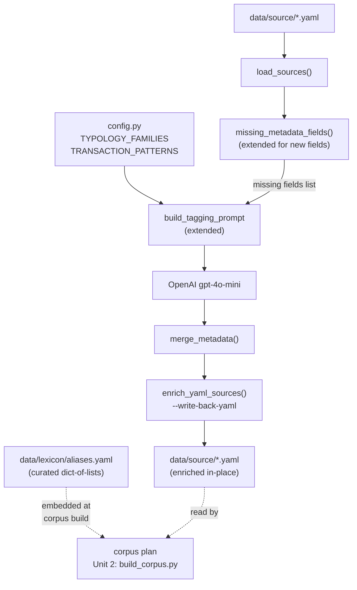

# feat: Enrich red flag metadata for offline lexical search

## Overview

Add three new structured fields (`typology_family`, `transaction_patterns`, `key_terms`) to all red
flag data models, create a curated AML alias lexicon at `data/lexicon/aliases.yaml`, and extend the
build-time LLM tagger to extract and write the new fields back to the YAML source files. The
enriched YAML records become the authoritative input for the offline SQLite FTS5 corpus build
(see `docs/plans/2026-04-29-001-feat-downloadable-local-corpus-plan.md` Unit 1–2).

## Problem Frame

SQLite FTS5 lexical search can only match text that is indexed. The current source YAML records
contain a prose `description`, a `category` tag, and a handful of structured list fields. BSA
analysts commonly search using AML acronyms (`TBML`, `CVC`, `MSB`), typology family names
(`trade-based money laundering`, `sanctions evasion`), and behavioral shorthand (`smurfing`,
`structuring`, `round-tripping`) that are absent from most descriptions and unrepresented in any
structured field. Without enrichment, these common analyst queries return zero results even when
clearly relevant records exist (see origin: `docs/brainstorms/2026-04-29-redflag-metadata-enrichment-requirements.md`).

## Requirements Trace

- R1–R2. Create `data/lexicon/aliases.yaml` mapping AML abbreviations/acronyms to one or more
  canonical expansion strings, covering at minimum: TBML, CVC, MSB, CTR, SAR, BSA, NPO, PEP,
  SFPF, KYC, CDD, EDD, FATF, DNFBP, hawala, smurfing.
- R5. Add `typology_family` (list[str], optional, hybrid vocab) to all data models.
- R6. Add `transaction_patterns` (list[str], optional, hybrid vocab) to all data models.
- R7. Add `key_terms` (list[str], optional, free-form) to all data models.
- R8–R9. Extend `build_tagging_prompt` in `scripts/ingest.py` to extract the three new fields;
  include controlled vocabulary lists in the prompt for `typology_family` and
  `transaction_patterns`.
- R10. Write enriched records back to the YAML source files as the authoritative enriched record.
- R11. All new fields must be optional with empty-list defaults; existing source YAML files must
  validate without modification.
- R12. Free-form values for `typology_family` and `transaction_patterns` that do not appear in
  the controlled vocabulary must produce a logged warning at build time, not a validation failure.
- R13. `key_terms` entries must be non-empty strings; no further structural constraint.
- R14. The `search_text` synthesis for FTS5 indexing is addressed downstream by corpus plan Unit 2,
  which reads these enriched YAML files.
- R15. Existing filterable fields (`product_types`, `industry_types`, `customer_profiles`,
  `geographic_footprints`, `category`, `risk_level`) remain queryable without change.

## Scope Boundaries

- Do not implement FTS5 search, the corpus build script, or search_text synthesis — those belong
  to `docs/plans/2026-04-29-001-feat-downloadable-local-corpus-plan.md` Units 2–3.
- Do not add query-time alias expansion logic; that belongs to the corpus plan's lexical store.
- Do not add `source_metadata.yaml` — it is a corpus plan Unit 1 artifact, not an enrichment
  tagger concern.
- Do not modify the existing ingestion default behavior; write-back is an explicit opt-in flag.
- Do not make `typology_family` or `transaction_patterns` strict validators; the vocabulary can
  grow with the corpus (see the advisory pattern already established for `INDUSTRY_TYPES`).

## Context & Research

### Relevant Code and Patterns

- `src/redflag_mcp/models.py`: `RedFlagSource`, `RedFlagRecord`, `RedFlagResult` follow the
  exact pattern for new list fields — add `Optional[list[str]] = None` to `RedFlagSource`,
  `list[str] = Field(default_factory=list)` to `RedFlagRecord` and `RedFlagResult`, and wire
  `_list_or_empty(source.typology_family)` into `from_source`. See the existing `industry_types`
  and `customer_profiles` fields for the complete pattern.
- `src/redflag_mcp/config.py`: `INDUSTRY_TYPES`, `CUSTOMER_PROFILES`, `GEOGRAPHIC_FOOTPRINTS`
  are advisory `set[str]` constants imported by `scripts/ingest.py` and embedded in the tagger
  prompt with `sorted(...)`. New constants `TYPOLOGY_FAMILIES` and `TRANSACTION_PATTERNS` should
  follow this exact pattern. The module comment: *"These guide extraction and tagging but are
  intentionally not strict validators; the taxonomy can grow with the corpus."*
- `scripts/ingest.py`: `LIST_METADATA_FIELDS`, `missing_metadata_fields`, `build_tagging_prompt`,
  `merge_metadata`, and `build_openai_tagger` contain all the tagger machinery. The new fields
  need to be added to `LIST_METADATA_FIELDS` (or a parallel tuple) and referenced in
  `build_tagging_prompt`. The `merge_metadata` function requires no changes — it operates on
  whatever fields are in `missing_fields`.
- `scripts/extract.py` — `write_yaml(entries, output_path)`: The established pattern for writing
  a list of `model_dump(exclude_none=True)` dicts to YAML: `yaml.dump(entries, f,
  default_flow_style=False, allow_unicode=True, sort_keys=False)`. The YAML write-back for source
  files should follow this exactly, replacing the entire file with the enriched record list.
- `src/redflag_mcp/vectorstore.py`: `red_flag_schema()` (the PyArrow schema), `LIST_FILTER_FIELDS`
  tuple, and `RedFlagFilters` dataclass must all receive the two new filterable list fields
  (`typology_family`, `transaction_patterns`). `_row_to_record` requires no change — it passes
  all schema columns through automatically. `key_terms` is not a filter field and needs only the
  schema column.
- `tests/test_ingest.py`: `FakeModel` and inline tagger closures are the fixture pattern. Tagger
  tests use a closure that either raises (to prove non-invocation) or returns a synthetic patch
  dict. `tmp_path` and `yaml.safe_dump` write temporary YAML fixtures.
- `tests/test_models.py`: backward-compatibility test reads real YAML file from disk and asserts
  `parsed[0].industry_types is None` (new fields absent → `None` on `RedFlagSource`). New tests
  must follow this pattern for all three new fields.

### Institutional Learnings

- No `docs/solutions/` directory exists in this repo. All institutional patterns are in the
  completed plan docs.
- The advisory-vocab, non-strict-validator pattern for list taxonomy fields is established and
  intentional — do not deviate.
- The tagger pattern (detect-missing → request-only-missing → merge → skip-fully-enriched) is
  proven; the new write-back step is the only new behavior.
- LanceDB writes use `record.model_dump()` via `upsert_records`; new fields in `RedFlagRecord`
  automatically flow into the row dict. Schema must be updated in `vectorstore.py` or the write
  will fail for records containing new non-None fields.

### External References

- SQLite FTS5 (for downstream context): `https://sqlite.org/fts5.html`

## Key Technical Decisions

- **aliases.yaml dict-of-lists schema**: Each entry is `term: [expansion1, expansion2, ...]`
  where `term` is lowercase normalized (no spaces, no special chars) and expansions are the full
  canonical phrases. Simple to load with `yaml.safe_load` as a plain Python dict.
- **Advisory vocabulary for typology_family and transaction_patterns**: Follows `INDUSTRY_TYPES`
  precedent. Constants live in `config.py`, embedded in the tagger prompt. No validator in
  `RedFlagSource` — free-form values pass through with a build-time warning only.
- **Canonical PyYAML write-back**: `yaml.dump(list_of_dicts, f, default_flow_style=False,
  allow_unicode=True, sort_keys=False)` rewrites the full YAML file. Field order follows Pydantic
  model field definition order via `model_dump(exclude_none=True)`. Comments are not preserved
  (existing source files have none), and this is acceptable.
- **Write-back as explicit opt-in flag**: Adding `--write-back-yaml` to `scripts/ingest.py` keeps
  the default ingestion path unchanged and makes the enrichment write-back intentional and auditable.
- **vectorstore.py updated alongside models**: Adding new fields to `RedFlagRecord` without
  updating `red_flag_schema()` would cause `upsert_records` to fail for enriched records. Both
  must be updated in Unit 1.

## Open Questions

### Resolved During Planning

- **aliases.yaml schema (one-to-many)**: dict-of-lists — `{tbml: ["trade based money
  laundering", ...]}`. Resolved: simple, no extra library needed.
- **Write-back approach**: Canonical PyYAML full-file rewrite. Resolved: no ruamel.yaml
  dependency; field order is deterministic via Pydantic model order; no comments to preserve.
- **Where write-back logic lives**: Extended `scripts/ingest.py` with `--write-back-yaml` flag.
  Resolved: minimizes new scripts; aligns with existing tagger machinery.
- **R14 (search_text synthesis) scope**: This plan provides enriched YAML as input; synthesis
  itself belongs to corpus plan Unit 2. Resolved: out of scope here.

### Deferred to Implementation

- **Exact FTS5 tokenizer settings**: How `search_text` concatenation separates field values for
  optimal BM25 scoring — belongs to corpus plan Unit 2 implementation.
- **Prompt tuning for controlled-vs-free-form balance**: The exact prompt wording to encourage
  core vocabulary selection and limit free-form overflow — settle while running against the three
  existing source files and observing output.
- **Free-form overflow surfacing mechanism**: Whether to log per-record warnings or produce a
  summary report at the end of the enrichment pass — settle during implementation; at minimum a
  `LOGGER.warning` per occurrence is required.

## High-Level Technical Design

> *This illustrates the intended approach and is directional guidance for review, not
> implementation specification. The implementing agent should treat it as context, not code to
> reproduce.*



## Implementation Units

- [ ] **Unit 1: Extend Models, Controlled Vocabulary, and Vector Store Schema**

**Goal:** Add `typology_family`, `transaction_patterns`, and `key_terms` to all data models and
the LanceDB schema so both the vector-store path and the corpus path can carry the new fields.

**Requirements:** R5, R6, R7, R11, R13, R15

**Dependencies:** None

**Files:**
- Modify: `src/redflag_mcp/config.py`
- Modify: `src/redflag_mcp/models.py`
- Modify: `src/redflag_mcp/vectorstore.py`
- Test: `tests/test_models.py`

**Approach:**
- Add `TYPOLOGY_FAMILIES` and `TRANSACTION_PATTERNS` as `set[str]` advisory constants to
  `config.py` using the initial controlled vocabulary values from the requirements doc.
- Add all three fields to `RedFlagSource` as `list[str] | None = None`.
- Add all three fields to `RedFlagRecord` as `list[str] = Field(default_factory=list)` and wire
  `_list_or_empty()` for each in `from_source`.
- Add all three fields to `RedFlagResult` as `list[str] = Field(default_factory=list)` and
  propagate them through `to_result()`.
- Add `pa.field("typology_family", pa.list_(pa.string()))`, `pa.field("transaction_patterns",
  pa.list_(pa.string()))`, and `pa.field("key_terms", pa.list_(pa.string()))` to `red_flag_schema()`
  in `vectorstore.py`.
- Add `typology_family` and `transaction_patterns` to `LIST_FILTER_FIELDS` and `RedFlagFilters`
  in `vectorstore.py`. `key_terms` is not a filter dimension.
- Do not add validators for the new fields — advisory only, per `config.py` convention.

**Execution note:** Implement test-first: write failing model tests before adding any fields.

**Patterns to follow:**
- `industry_types` and `customer_profiles` in `models.py` for the complete field-extension
  template.
- `INDUSTRY_TYPES` in `config.py` for the advisory constant pattern.
- `product_types` entry in `red_flag_schema()` and `LIST_FILTER_FIELDS` for vectorstore extension.

**Test scenarios:**
- Happy path: `RedFlagSource` with all three new fields populated validates and serializes
  correctly.
- Happy path: `RedFlagRecord.from_source()` coerces `None` `typology_family` to `[]`
  (mirrors existing `industry_types` backward-compat test).
- Happy path: `RedFlagResult` carries all three fields through `to_result()` without dropping
  values.
- Happy path: existing YAML records from `data/source/001_federal_child_nutrition_fraud.yaml`
  parse successfully with all three new fields absent and defaulting to `None` on `RedFlagSource`.
- Edge case: empty list values for all three fields serialize without error via `model_dump()`.
- Edge case: free-form strings in `typology_family` and `transaction_patterns` are accepted
  without raising `ValidationError` (confirm no strict validator).

**Verification:**
- `uv run pytest tests/test_models.py` passes with all new scenarios green.
- `uv run mypy src/` reports no new type errors.

---

- [ ] **Unit 2: Create Curated aliases.yaml Lexicon**

**Goal:** Establish the source-controlled AML alias lexicon as a loadable, testable artifact that
downstream corpus build tooling can embed.

**Requirements:** R1, R2

**Dependencies:** None (can be developed in parallel with Unit 1)

**Files:**
- Create: `data/lexicon/aliases.yaml`
- Create: `data/lexicon/` directory
- Test: `tests/test_lexicon.py`

**Approach:**
- Use a dict-of-lists YAML format where keys are lowercase normalized lookup terms and values are
  lists of canonical expansion strings:
  ```yaml
  tbml:
    - trade based money laundering
    - trade-based money laundering
  cvc:
    - convertible virtual currency
    - cryptocurrency
  ```
- Populate the minimum required set: TBML, CVC, MSB, CTR, SAR, BSA, NPO, PEP, SFPF, KYC, CDD,
  EDD, FATF, DNFBP, hawala, smurfing. Add additional high-value aliases that cover AML terms
  already appearing in the three existing source files (e.g., `structuring`, `layering`,
  `ctr` → currency transaction report).
- Keep expansion strings lowercase to enable case-insensitive matching at search time.
- Create `tests/test_lexicon.py` to validate the lexicon structure.

**Execution note:** Write failing tests for lexicon structure before populating the file.

**Patterns to follow:**
- `data/source/*.yaml` for YAML file conventions (block style, no special formatting needed).
- `yaml.safe_load` (not `yaml.load`) for any loading logic.

**Test scenarios:**
- Happy path: `yaml.safe_load` on `aliases.yaml` returns a dict where all values are lists of
  strings.
- Happy path: the dict contains at minimum all 16 required terms from R1.
- Happy path: expansion lists are all non-empty.
- Edge case: all keys are lowercase (assert `key == key.lower()` for each entry).
- Edge case: no expansion string is an empty string.

**Verification:**
- `uv run pytest tests/test_lexicon.py` passes.
- `aliases.yaml` loads without error and all required terms are present.

---

- [ ] **Unit 3: Extend Tagger and Add YAML Write-Back**

**Goal:** Extend the build-time LLM tagger to extract the three new fields, surface free-form
overflow values as logged warnings, and write enriched records back to the YAML source files via
an explicit opt-in flag.

**Requirements:** R8, R9, R10, R12

**Dependencies:** Unit 1 (new model fields must exist before tagger can produce them)

**Files:**
- Modify: `scripts/ingest.py`
- Test: `tests/test_ingest.py`

**Approach:**
- Import `TYPOLOGY_FAMILIES` and `TRANSACTION_PATTERNS` from `config.py` in `ingest.py`.
- Add `typology_family`, `transaction_patterns`, and `key_terms` to `LIST_METADATA_FIELDS` (or a
  parallel constant) so `missing_metadata_fields` detects their absence.
- Extend `build_tagging_prompt`'s system message to:
  - Add a section for `typology_family` with instruction to prefer values from
    `sorted(TYPOLOGY_FAMILIES)` and use free-form only when none apply.
  - Add a section for `transaction_patterns` with instruction to prefer values from
    `sorted(TRANSACTION_PATTERNS)` and use free-form only when none apply.
  - Add a section for `key_terms` describing it as a free-form list of short, searchable phrases
    (instrument names, dollar thresholds, regulatory references, entity types — not sentences).
- Add a `warn_free_form_values(source_id, field, values, vocabulary)` helper that logs a
  `LOGGER.warning` for any value in `values` not present in `vocabulary`. Call it after
  `merge_metadata` for `typology_family` and `transaction_patterns`.
- Add `write_back_yaml_sources(sources, source_path)` function: serializes a list of enriched
  `RedFlagSource` objects as `[source.model_dump(exclude_none=True) for source in sources]` and
  writes via `yaml.dump(entries, f, default_flow_style=False, allow_unicode=True, sort_keys=False)`.
- Add `--write-back-yaml` boolean flag to `main()`. When set, group enriched sources by their
  originating file path and call `write_back_yaml_sources` for each file.
- Ensure `load_sources` returns enough information to reconstruct per-file groupings (track which
  path each source came from).

**Execution note:** Start with a failing test that calls the extended tagger with a record missing
all three new fields and asserts the returned patch dict contains all three keys.

**Patterns to follow:**
- `build_tagging_prompt` system message structure and `sorted(INDUSTRY_TYPES)` embedding pattern.
- `merge_metadata` for the field-by-field merge logic (no changes needed here).
- `write_yaml` in `scripts/extract.py` for the `yaml.dump` serialization idiom.
- Inline tagger closure pattern in `tests/test_ingest.py` for tagger tests.
- `caplog` fixture for warning assertion tests.

**Test scenarios:**
- Happy path: tagger called with a record missing all three new fields returns a patch dict with
  `typology_family`, `transaction_patterns`, and `key_terms` keys.
- Happy path: after `merge_metadata`, a record with free-form `typology_family` value not in
  `TYPOLOGY_FAMILIES` triggers a `LOGGER.warning` and is included in the result (not rejected).
- Happy path: a record that already has all three new fields populated is recognized as
  fully-enriched and the tagger is not called for those fields.
- Happy path: `write_back_yaml_sources` writes enriched records to a temporary file that can be
  re-loaded by `load_sources` and yields identical field values.
- Edge case: a record with some new fields present and some absent causes the tagger to request
  only the absent fields.
- Edge case: the `--write-back-yaml` flag with no OPENAI_API_KEY logs the existing warning and
  writes back any fields that were already present (no new enrichment, no failure).
- Regression: tagger without `--write-back-yaml` does not touch source YAML files on disk.

**Verification:**
- `uv run pytest tests/test_ingest.py` passes.
- Running `uv run python scripts/ingest.py data/source/001_federal_child_nutrition_fraud.yaml
  --write-back-yaml --no-auto-tag` (dry-run with no new enrichment) rewrites the file without
  data loss.
- `uv run mypy src/ scripts/ingest.py` reports no new type errors.

## System-Wide Impact

- **Interaction graph:** `RedFlagRecord.model_dump()` is called by `upsert_records` in
  `vectorstore.py`. New fields in the record flow automatically into the LanceDB row dict; the
  PyArrow schema must match or `merge_insert` will fail. Unit 1 addresses this.
- **Error propagation:** Free-form vocabulary overflow produces a `LOGGER.warning`, not an
  exception. Build scripts may log to stderr via `logging`; server/runtime code must not use
  `print()`.
- **State lifecycle risks:** Write-back rewrites the entire YAML file atomically (open → write →
  close). If the process is interrupted mid-write, the file may be partially written. Acceptable
  for a build-time script; note in implementation.
- **API surface parity:** `RedFlagResult` gains three new fields. Tool responses will include them
  as empty lists by default for records not yet enriched — additive, not breaking.
- **Integration coverage:** After write-back, a second ingest pass (with no tagger) must
  recognize all three new fields as present and skip enrichment. Test this round-trip.

## Risks & Dependencies

- **LanceDB schema migration:** Existing `data/vectors/` tables created before this change will
  not auto-migrate. Running `scripts/ingest.py` against an existing store will fail if the schema
  no longer matches. Document that the vector store should be recreated after this change
  (delete `data/vectors/` and re-ingest). The corpus SQLite path is unaffected.
- **PyYAML field order change:** Writing back to YAML files changes the field order from whatever
  it was (hand-edited) to Pydantic model field order. This is a one-time diff noise event; after
  the first write-back the order is stable. Alert team if source files are manually edited after
  write-back.
- **LLM output quality:** `gpt-4o-mini` may assign free-form values or produce inconsistent
  `key_terms` granularity. Mitigated by curated prompt vocabulary and post-merge warning. Prompt
  tuning is deferred to implementation with the three existing source files as the test corpus.
- **Corpus plan dependency:** This plan's output (enriched YAML) is the direct input for corpus
  plan Unit 1 (`data/lexicon/aliases.yaml`) and Unit 2 (`build_corpus.py`). If enriched field
  naming or schema diverges from corpus plan Unit 1 expectations, both plans must stay in sync.

## Documentation / Operational Notes

- Add a note to `README.md` (or `AGENTS.md`) documenting the `--write-back-yaml` flag and the
  enrichment workflow: run enrichment once before building a corpus package.
- Document that existing `data/vectors/` must be recreated after deploying this change.

## Sources & References

- **Origin document:** [docs/brainstorms/2026-04-29-redflag-metadata-enrichment-requirements.md](../brainstorms/2026-04-29-redflag-metadata-enrichment-requirements.md)
- Related plan: [docs/plans/2026-04-29-001-feat-downloadable-local-corpus-plan.md](2026-04-29-001-feat-downloadable-local-corpus-plan.md)
- Related code: `src/redflag_mcp/models.py`
- Related code: `src/redflag_mcp/config.py`
- Related code: `src/redflag_mcp/vectorstore.py`
- Related code: `scripts/ingest.py`
- Related code: `scripts/extract.py` (`write_yaml` pattern)
- Related tests: `tests/test_models.py`
- Related tests: `tests/test_ingest.py`
