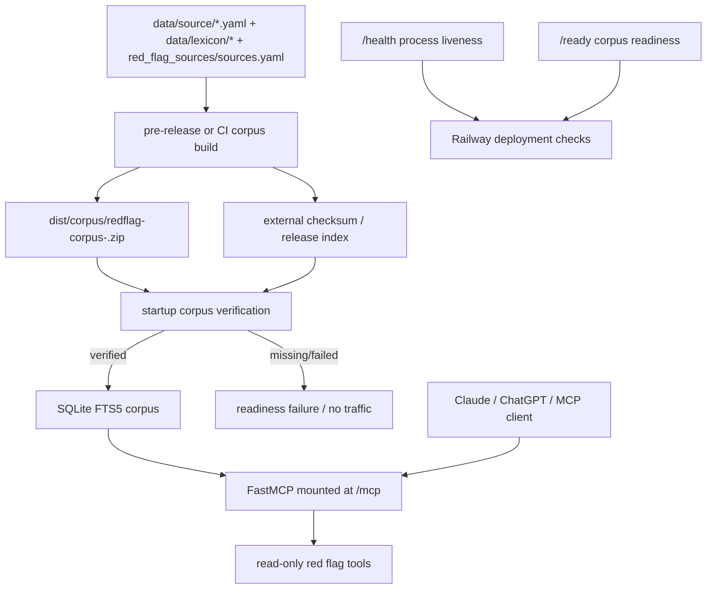

# feat: Add hosted URL corpus deployment

## Overview

Make `redflag-mcp` deploy like the referenced `lenny-mcp` project: a hosted MCP service exposes one public Streamable HTTP URL, users add that URL in a hosted MCP client, and the server answers from a verified packaged corpus without user-side Python, ingestion, or corpus setup. The first milestone keeps the existing Python FastMCP implementation and SQLite FTS5 corpus path, adds a hosted HTTP application wrapper with health/readiness checks, tightens corpus-mode startup defaults, and documents a short URL-first setup path.

## Problem Frame

The origin document makes the hosted URL connector the first shippable milestone while preserving the packaged corpus as the shared data artifact (see origin: `docs/brainstorms/2026-04-29-downloadable-local-redflag-corpus-requirements.md`). Public users should see the simple flow: add `https://<deployment>/mcp`, enable the connector, and ask AML red flag questions. Maintainers and operators own the corpus build, verification, runtime mode, logging posture, request limits, and deployment configuration.

## Requirements Trace

- R1. Distribute a complete, versioned corpus package independent of the live repository, vector database, or embedding API.
- R2. Query runtime must not make external calls for search, ranking, filtering, citation lookup, or source browsing.
- R4-R5. Tool responses and package metadata must expose enough version and integrity context to identify the corpus artifact.
- R6-R9. Runtime retrieval uses lexical search, metadata filters, curated aliases, deterministic sourced results, and fit signals.
- R12-R14. Source coverage, immutable corpus updates, rollback, and reproducible build inputs must be inspectable.
- R15-R18. Keep the read-only MCP tool surface, stdio safety, source browsing, and no query logging by default.
- R19-R24. Provide one hosted Streamable HTTP URL, no user-side install/config, a health/readiness endpoint, simple docs, and no TypeScript rewrite.
- R25-R28. Treat original PDFs and source text as build inputs, not hosted runtime dependencies; preserve URL-only citation metadata unless redistribution is cleared.
- R29-R33. Distinguish public hosted privacy from local/institution privacy, define public access posture, avoid request-body logging, and bound public HTTP inputs.
- R34-R37. Hosted runtime defaults to verified corpus mode, release builds include provenance, verification has a trust model, and rollback is version/path activation plus redeploy.
- R38-R39. Validate lexical retrieval against a small benchmark and keep first synonym scope bounded.

## Scope Boundaries

- Do not rewrite the server in TypeScript. The deployment shape should match `lenny-mcp`; the implementation language can remain Python.
- Do not add corpus editing, SAR drafting, alert decisioning, policy generation, or write tools.
- Do not expose raw original PDFs or full source text through the public connector unless source metadata explicitly clears redistribution.
- Do not make the public hosted connector the privacy-preserving mode for confidential customer, transaction, or investigation details.
- Do not introduce query-time OpenAI calls, Qdrant, LanceDB, or embedding-model loading for the hosted corpus runtime.
- Do not solve enterprise OAuth in this first milestone. The first public access posture is anonymous with strict bounds and documentation; invite-only or OAuth can follow.

### Deferred to Separate Tasks

- Institution-hosted/private deployment hardening: pinning, internal mirrors, private ingress, and enterprise auth after the public hosted path works.
- Registry publication and richer release distribution channels: useful after the first hosted deployment proves the package/runtime contract. The first deployment still consumes a prebuilt immutable corpus artifact with an external checksum or release index.
- Cryptographic signing and multi-party release governance: start with externally pinned checksums, then add signatures if the artifact moves beyond the first hosted deployment channel.
- Multi-instance abuse controls: the first public endpoint is explicitly single-instance with bounded concurrency; shared rate limiting follows before horizontal scaling.
- Broad synonym governance and large retrieval evaluation: expand after the initial benchmark shows concrete gaps.
- Rich ChatGPT Apps SDK UI: keep this plan tool-first and connector-compatible.

## Context & Research

### Relevant Code and Patterns

- `src/redflag_mcp/server.py` already selects stdio, SSE, or Streamable HTTP via `MCP_TRANSPORT`, and its lifespan chooses corpus mode when `REDFLAG_CORPUS_PATH`, `REDFLAG_CORPUS_PACKAGE`, or `REDFLAG_CORPUS_RELEASE_INDEX` is configured.
- `src/redflag_mcp/corpus_install.py` verifies a ZIP package, installs `manifest.json` and `redflags.sqlite` into a cache, opens the SQLite corpus, and writes one active pointer.
- `scripts/build_corpus.py` builds the current corpus ZIP from approved YAML, `data/lexicon/aliases.yaml`, `data/lexicon/source_metadata.yaml`, and `red_flag_sources/sources.yaml`. It already fixes ZIP timestamps but its CLI does not yet expose deterministic build timestamp/provenance controls.
- `src/redflag_mcp/lexicalstore.py` implements SQLite FTS5 search, metadata filtering, alias expansion, source listing, and corpus metadata loading without embedding calls.
- `src/redflag_mcp/tools.py` wraps both vector and corpus stores behind the same read-only tools. Corpus-mode tests already assert that search does not call the embedding model.
- `tests/test_tools.py`, `tests/test_corpus.py`, `tests/test_corpus_install.py`, and `tests/test_lexicalstore.py` are the key patterns for test-first coverage.
- `README.md` already documents corpus packaging and HTTP startup, but not one-URL hosted connector setup or public hosted privacy boundaries.
- `AGENTS.md` requires red-green TDD and forbids stdout writes in stdio mode.

### Institutional Learnings

- No `docs/solutions/` entries were present in this repo.
- `docs/plans/2026-04-24-001-feat-hosted-redflag-retrieval-plan.md` established that tools are the hosted-client compatibility contract.
- `docs/plans/2026-04-29-001-feat-downloadable-local-corpus-plan.md` established SQLite FTS5, versioned ZIP packages, source redistribution metadata, and corpus metadata in responses.

### External References

- MCP transport spec: Streamable HTTP servers expose a single MCP endpoint such as `https://example.com/mcp`; servers must validate `Origin` where present and should implement authentication for HTTP connections. `https://modelcontextprotocol.io/specification/2025-11-25/basic/transports`
- MCP Python SDK: FastMCP can run with `transport="streamable-http"`; the SDK recommends `stateless_http=True` and `json_response=True` for production scalability and supports mounting FastMCP inside Starlette. `https://github.com/modelcontextprotocol/python-sdk`
- Railway config-as-code: Railway reads `railway.toml` or `railway.json`, and build/start/deploy settings in code override dashboard values for the current deployment. `https://docs.railway.com/config-as-code/reference`
- Railway health checks: Railway waits for the configured healthcheck endpoint to return HTTP `200` before making a deployment active; Railway injects `PORT`, and healthcheck requests use hostname `healthcheck.railway.app`. `https://docs.railway.com/deployments/healthchecks`
- Railway deployments: Railway builds the service into a container, starts it with the configured start command, supports rollback/redeploy within retention limits, provides ephemeral storage, and has free-tier deployment restrictions during regional peak hours. `https://docs.railway.com/deployments/reference`

## Key Technical Decisions

- **Keep Python FastMCP:** The existing server already supports Streamable HTTP and corpus mode. Matching `lenny-mcp` requires a public URL and deployment packaging, not TypeScript.
- **Railway as first hosted target:** Railway is the chosen first deployment platform because its usage-based pricing is more cost-effective for low-traffic testing, and its `railway.toml` config maps cleanly to this repo's build/start commands and readiness check needs.
- **Consume a prebuilt immutable corpus artifact for milestone one:** Build the corpus in a pre-release or CI step, publish or commit an external checksum/release index, and configure the hosted service to activate that exact ZIP. Railway may package the ZIP with the service image/artifact, but it should not generate the authoritative corpus from mutable inputs during web-service startup.
- **Use a Starlette/ASGI wrapper for hosted HTTP:** FastMCP's direct `run(transport="streamable-http")` is enough for local HTTP, but a hosted service needs `/health` and `/ready` alongside `/mcp`. Mounting FastMCP in Starlette is the cleanest way to add those routes and middleware.
- **Public endpoint is anonymous, single-instance, and bounded for the first milestone:** This preserves one-URL setup. It requires clear privacy documentation, rate/request limits, Origin and Host handling, request-size limits, a hard concurrency cap, and no request-body logging. Horizontal scaling requires a shared abuse-control design first.
- **Hosted runtime fails closed without a verified corpus:** In hosted mode, falling back to LanceDB/vector mode would violate the product promise. Vector mode remains an explicit development path.
- **Readiness failure starts HTTP but serves no MCP traffic:** The hosted ASGI process may start so `/health` and `/ready` can explain the failure, but `/ready` must fail and `/mcp` must reject requests until a verified corpus is active.
- **Original source files stay in build storage:** Keep PDFs under `red_flag_sources/` and approved YAML under `data/source/`; runtime serves `redflags.sqlite` plus manifest/source metadata, not raw source files.
- **Benchmark before public launch:** A small checked-in query benchmark is enough to guard the first lexical release without turning this milestone into a full evaluation program.
- **Validate anonymous connector compatibility before launch:** Anonymous Streamable HTTP is the desired first posture, but implementation must test it against the target hosted clients. If a target client rejects anonymous MCP URLs or requires auth/session behavior, define the smallest acceptable auth fallback before public launch.

## Open Questions

### Resolved During Planning

- **Which hosted platform first?** Railway, because the operator prefers its usage-based cost model and it supports config-as-code, injected `$PORT`, and deployment health checks suitable for this service.
- **Should the first endpoint be anonymous, invite-only, or OAuth-protected?** Anonymous with strict limits and explicit privacy warnings for the first milestone; stronger auth is deferred.
- **Should the corpus be baked, fetched, or mounted?** Use a prebuilt ZIP plus external checksum or release index. The ZIP may be included in the service artifact or fetched from a pinned immutable artifact location, but the web service must not build from mutable source folders at startup.
- **Does source browsing serve raw sources?** No. It serves source metadata and bounded red flag snippets. Raw source documents remain build inputs unless redistribution is cleared.
- **Does vector mode remain default?** For hosted mode, no. Hosted mode should require verified corpus activation. Vector mode remains explicit development behavior.

### Deferred to Implementation

- **Exact ASGI composition details:** Choose the least invasive wrapper while implementing against the installed MCP SDK APIs, but explicitly avoid accidentally serving the connector at `/mcp/mcp`.
- **Exact hosted-client compatibility:** Test the deployed or local tunneled `/mcp` endpoint against the target clients during implementation and document whether anonymous mode is accepted.
- **Exact benchmark thresholds:** Start with a small smoke/launch query set and explicit expected IDs/categories; tune pass criteria while building fixtures.
- **Exact release signing mechanism:** Add externally published checksums/provenance in this milestone; cryptographic signing can be added if release distribution moves beyond the deployed artifact.

## Output Structure

```text
src/redflag_mcp/
  http_app.py
tests/
  test_http_app.py
  test_runtime_config.py
data/eval/
  hosted_retrieval_queries.yaml
scripts/
  evaluate_retrieval.py
railway.toml
docs/
  hosted-deployment.md
```

This tree shows the expected new shape. Existing files such as `src/redflag_mcp/server.py`, `src/redflag_mcp/tools.py`, `scripts/build_corpus.py`, `README.md`, and existing corpus tests remain part of the work.

## High-Level Technical Design

> *This illustrates the intended approach and is directional guidance for review, not implementation specification. The implementing agent should treat it as context, not code to reproduce.*



## Implementation Units

- [x] **Unit 1: Prepare Minimum Hosted Corpus Artifact Verification**

**Goal:** Make the hosted corpus artifact independently pinnable, inspectable, and verifiable without turning the first milestone into a full release-governance system.

**Requirements:** R1, R4, R5, R13, R14, R21, R25-R28, R35-R37

**Dependencies:** None

**Files:**
- Modify: `scripts/build_corpus.py`
- Modify: `scripts/verify_corpus.py`
- Modify: `src/redflag_mcp/models.py`
- Test: `tests/test_corpus.py`
- Test: `tests/test_models.py`

**Approach:**
- Add the minimum release/provenance fields needed for hosted verification and operator inspection without changing the runtime tool response shape more than necessary: package version, dependency lock identity, source record hashes, aliases hash, source metadata hash, source registry hash, build timestamp, schema version, and enrichment provenance or approval status.
- Expose a deterministic build timestamp input through the corpus builder CLI so pre-release or CI builds can reproduce package hashes when source inputs are unchanged.
- Extend source manifest metadata to carry retrieval date and durable citation fields where available. Keep URL-only as the default redistribution behavior.
- Generate or verify an external checksum record or release index for the package artifact so hosted deployment is not relying only on hashes inside the ZIP.
- Preserve the current ZIP-plus-SQLite package format; do not invent a new package format in this milestone.

**Execution note:** Implement new metadata and verification behavior test-first, following the existing corpus tests.

**Patterns to follow:**
- `CorpusMetadata`, `SourceReleaseMetadata`, and `build_source_manifest()` in `src/redflag_mcp/models.py`.
- `build_corpus_package()` and `build_release_index()` in `scripts/build_corpus.py`.
- Verification style in `scripts/verify_corpus.py` and `tests/test_corpus.py`.

**Test scenarios:**
- Happy path: building with an explicit timestamp and unchanged inputs produces stable package and SQLite hashes.
- Happy path: manifest includes source IDs, source record hashes, alias/source metadata/source registry hashes, build timestamp, schema version, and enrichment provenance or approval status.
- Happy path: source manifest includes URL-only citation fields and does not bundle source assets unless redistribution status allows it.
- Error path: verification fails when an expected external checksum does not match the package.
- Error path: source metadata referencing an unknown source key still fails before release.

**Verification:**
- A maintainer can build and verify a corpus ZIP with deterministic metadata suitable for the hosted deployment artifact.

- [x] **Unit 2: Add Hosted Runtime Configuration and Fail-Closed Corpus Startup**

**Goal:** Make hosted mode activate only from a verified corpus and avoid accidental fallback to vector/embedding behavior.

**Requirements:** R2, R6, R17, R20, R21, R29-R30, R34, R37

**Dependencies:** Unit 1 for final manifest fields, but runtime fail-closed behavior can begin with the current package verifier.

**Files:**
- Modify: `src/redflag_mcp/server.py`
- Create: `tests/test_runtime_config.py`
- Modify: `tests/test_tools.py`
- Test: `tests/test_corpus_install.py`

**Approach:**
- Introduce a small runtime configuration boundary for selecting `hosted-corpus`, `local-corpus`, or `vector-dev` behavior from environment variables.
- In hosted-corpus mode, require `REDFLAG_CORPUS_RELEASE_INDEX` plus `REDFLAG_CORPUS_VERSION`, or an equivalent direct package path plus externally supplied expected checksum. If no verified corpus can be activated, fail closed by starting the HTTP app in a not-ready state: `/health` may respond, `/ready` must fail, and `/mcp` must reject requests rather than creating a vector-backed service.
- Keep `uv run python -m redflag_mcp` stdio behavior compatible for existing local development unless hosted mode is explicitly selected.
- Make vector mode an explicit development path for hosted HTTP deployments, not an accidental fallback.
- Make corpus activation state available to all public surfaces. Existing MCP resources must either use the same activated corpus-backed state as tools, or be disabled in hosted mode until they can be served from the verified corpus package. Do not let resource handlers fall back to vector storage when hosted package activation succeeds or fails.
- Ensure corpus activation errors are logged to stderr/logging only; never use stdout in runtime code.

**Execution note:** Add failing tests around mode selection before changing startup behavior.

**Patterns to follow:**
- Environment parsing in `main()` and `create_server()` in `src/redflag_mcp/server.py`.
- `CorpusInstaller.activate()` behavior in `src/redflag_mcp/corpus_install.py`.
- Existing `FailingModel` corpus-mode tests in `tests/test_tools.py`.

**Test scenarios:**
- Happy path: hosted-corpus mode with a valid package activates corpus mode and search does not call embeddings.
- Error path: hosted-corpus mode with no configured package/path/index reports not-ready/fails closed and does not instantiate the vector store.
- Error path: corrupt corpus package leaves readiness failed and does not serve search results.
- Error path: MCP requests made while hosted mode is not-ready are rejected with a safe service-unavailable response.
- Regression: local stdio default remains usable for development unless hosted mode is explicitly selected.
- Regression: `redflag://sources` and `redflag://sources/{source_id}` do not fall back to vector data under hosted package or release-index activation.
- Regression: no `print()` usage is introduced in runtime modules.

**Verification:**
- Hosted runtime cannot silently serve from LanceDB or query embeddings when corpus activation is missing or invalid.

- [x] **Unit 3: Mount FastMCP in a Hosted ASGI App With Health and Readiness**

**Goal:** Expose `/mcp` for hosted clients and operational health/readiness endpoints for Railway-style deployment.

**Requirements:** R19, R20, R22, R24, R31-R34

**Dependencies:** Unit 2

**Files:**
- Create: `src/redflag_mcp/http_app.py`
- Modify: `src/redflag_mcp/server.py`
- Modify: `pyproject.toml`
- Create: `tests/test_http_app.py`

**Approach:**
- Create an ASGI application that exposes FastMCP Streamable HTTP at exactly `/mcp` and exposes `/health` for process liveness and `/ready` for corpus readiness.
- Account for the MCP SDK's own `streamable_http_path` behavior when composing the ASGI app: either compose the returned app at its built-in `/mcp` route, or configure the FastMCP streamable path to `/` before mounting at `/mcp`. Add tests that prove `POST /mcp` is the connector endpoint and `/mcp/mcp` is not required.
- Prefer FastMCP production settings recommended by the Python SDK where compatible, such as stateless HTTP and JSON responses.
- Add explicit dependencies only if they are not already direct dependencies. Do not rely on transitive Starlette/Uvicorn availability in deployment.
- `/health` should be lightweight and return success when the process can serve HTTP. `/ready` should verify that a corpus has been activated and expose safe metadata such as corpus version, schema version, package ID, and readiness status without dumping full manifests or user data. Railway should use `/ready` as the configured healthcheck path so the platform does not activate an unverified corpus deployment.
- Keep MCP tool registration in the existing server module; the ASGI wrapper should compose the app, not duplicate tool logic.
- Add a manual smoke-test checklist or script note for target hosted clients: anonymous `/mcp` accepted, tool list visible, first query succeeds, and no auth/session workaround is required. If a client requires auth, capture the smallest fallback as a follow-up or launch blocker.

**Execution note:** Add ASGI route tests before implementing the wrapper.

**Patterns to follow:**
- `create_server()` registration flow in `src/redflag_mcp/server.py`.
- MCP Python SDK Starlette mounting pattern for `streamable_http_app()`.
- Existing `create_server().list_tools()` metadata tests in `tests/test_tools.py`.

**Test scenarios:**
- Happy path: `GET /health` returns a 2xx response without requiring a tool call.
- Happy path: `GET /ready` returns corpus readiness and safe corpus metadata after valid activation.
- Error path: `GET /ready` returns non-2xx or explicit not-ready payload when corpus activation fails.
- Integration: `/mcp` remains mounted at the expected path and exposes the existing tool list.
- Regression: `/mcp/mcp` is not the documented or required endpoint.
- Regression: hosted resource access is corpus-backed or intentionally unavailable; it does not silently use vector mode.
- Manual compatibility gate: target hosted clients can add the anonymous `/mcp` URL and list/call tools, or the plan records an auth fallback before launch.
- Regression: stdio server creation still works without importing deployment-only app state unexpectedly.

**Verification:**
- The app can be hosted as an HTTP service with separate MCP and health/readiness endpoints.

- [x] **Unit 4: Add Public HTTP Guardrails**

**Goal:** Bound the anonymous public connector so the first hosted endpoint is simple but not unbounded.

**Requirements:** R18, R29-R33

**Dependencies:** Unit 3

**Files:**
- Modify: `src/redflag_mcp/http_app.py`
- Modify: `src/redflag_mcp/tools.py`
- Modify: `tests/test_http_app.py`
- Test: `tests/test_tools.py`

**Approach:**
- Add HTTP middleware or route-layer checks for maximum request body size, allowed methods, timeout-aware error responses where practical, Host validation, and Origin handling. If an Origin header is present, validate it against a configured allowlist or documented default; document how omitted Origin, CORS, and trusted proxy headers are handled.
- Add a simple in-memory rate limiter and hard concurrency cap suitable only for one Railway service instance. Keep the implementation direct and minimal; shared-store abstractions are deferred until horizontal scaling is required.
- Bound tool inputs that can amplify public load: query length, limit, filter cardinality, and source/result pagination where applicable.
- Avoid request-body logging in application code. Keep logging to operational events, readiness failures, and aggregate safety counters without prompts or MCP payloads.
- Return consistent, structured error messages for malformed or oversized requests.

**Execution note:** Write failure-path tests first: oversized request, too many filters, overlong query, invalid Origin, and rate-limit exceeded.

**Patterns to follow:**
- Existing `MAX_SEARCH_LIMIT` clamping in `src/redflag_mcp/tools.py`.
- FastMCP/Starlette middleware composition in the new hosted app.
- `AGENTS.md` stdout safety constraint.

**Test scenarios:**
- Happy path: normal MCP requests under configured bounds proceed to the MCP app.
- Edge case: `search_red_flags` with an excessive limit is still clamped to `MAX_SEARCH_LIMIT`.
- Error path: overlong query returns a clear validation message without calling the store.
- Error path: too many filter values returns a clear validation message without querying.
- Error path: oversized HTTP body receives a rejection before MCP handling.
- Error path: invalid Origin receives a forbidden response.
- Error path: invalid Host receives a forbidden response or equivalent safe rejection.
- Error path: requests beyond the anonymous rate limit receive a bounded failure response.
- Regression: logs and error strings do not include request bodies or query text in failure cases where redaction is required.

**Verification:**
- The public hosted surface has documented, tested input and request bounds while retaining one-URL setup.

- [x] **Unit 5: Add Railway Deployment Configuration**

**Goal:** Make the repository deployable on Railway as a managed web service with build/start commands and a readiness healthcheck path.

**Requirements:** R19-R24, R31-R34, R37

**Dependencies:** Units 1-4

**Files:**
- Create: `railway.toml`
- Modify: `pyproject.toml`
- Modify: `README.md`
- Create or Modify: `docs/hosted-deployment.md`

**Approach:**
- Add Railway config-as-code that installs dependencies, consumes a prebuilt pinned corpus package plus checksum/release index, starts the ASGI hosted app, and sets the healthcheck path to `/ready`.
- For the first milestone, produce the corpus ZIP before web-service deployment in a pre-release or CI step. The Railway service may package that ZIP with the deployed image or fetch it from an immutable pinned artifact location, but it must verify it against `REDFLAG_CORPUS_RELEASE_INDEX` plus `REDFLAG_CORPUS_VERSION`, or an equivalent direct checksum setting.
- Set hosted runtime environment variables so the app runs in hosted-corpus mode, binds to Railway's injected `$PORT`, and disables request-body logging.
- Include `healthcheck.railway.app` in the allowed Host handling for Railway's deployment healthcheck requests, along with the Railway-provided public domain and any configured custom domain.
- Keep the initial deployment to one service instance, because the first rate limiter and concurrency cap are process-local.
- Document rollback as pinning a previous corpus version/package path and redeploying. Railway rollback/redeploy can be used when the target deployment remains within Railway retention, but the corpus version/checksum remains the real rollback anchor.
- Document that Railway's deployment healthcheck is an activation gate, not continuous uptime monitoring. Add optional external uptime monitoring if public availability becomes important.
- Keep local development instructions separate from hosted connector instructions.

**Execution note:** Add deployment config validation tests or static checks before relying on Railway config manually.

**Patterns to follow:**
- Railway `railway.toml` config-as-code shape: build command, start command, deploy healthcheck path, and healthcheck timeout.
- Existing README corpus build and HTTP startup sections.
- Railway injected `PORT` environment variable and healthcheck hostname behavior.

**Test scenarios:**
- Static config: `railway.toml` defines build/start commands, hosted corpus env vars or documented required Railway variables, a checksum or release-index activation path, one-instance scaling posture, and deployment healthcheck path `/ready`.
- Static config: start command launches the hosted ASGI app rather than stdio mode.
- Static config: start command binds to `$PORT`.
- Static config: allowed Host defaults account for `healthcheck.railway.app` and the public Railway/custom domain.
- Static config: build/deploy configuration references a prebuilt corpus package and its external checksum/release index before startup.
- Documentation check: README and hosted deployment docs mention the public privacy boundary and do not instruct end users to run build or ingestion scripts for hosted setup.

**Verification:**
- An operator can deploy the repo to Railway and obtain a public `/mcp` URL backed by a packaged corpus.

- [x] **Unit 6: Add Hosted Retrieval Benchmark**

**Goal:** Provide a small smoke/launch gate proving lexical corpus search is not obviously broken for representative public hosted queries.

**Requirements:** R7-R9, R38-R39

**Dependencies:** Unit 1 for stable corpus build inputs

**Files:**
- Create: `data/eval/hosted_retrieval_queries.yaml`
- Create: `scripts/evaluate_retrieval.py`
- Test: `tests/test_retrieval_eval.py`
- Modify: `README.md`
- Modify: `docs/hosted-deployment.md`

**Approach:**
- Define a compact benchmark with a documented sampling basis and representative queries covering aliases such as `TBML` and `CVC`, paraphrases, product/channel terms, geography, typologies, and source-specific wording from the initial corpus.
- Use the packaged corpus path as the evaluation input and run through `RedFlagService.from_corpus_path()` so evaluation matches hosted runtime behavior.
- Keep pass criteria simple for the first milestone: expected red flag IDs, expected source/category, or analyst-reviewed relevant result in top N. Label this as a smoke/launch gate, not proof of broad AML retrieval quality, and avoid introducing a full metrics framework.
- Document benchmark results as a pre-launch and release-validation step for maintainers.

**Execution note:** Create the benchmark runner test-first using a tiny seeded corpus fixture before pointing it at the real corpus.

**Patterns to follow:**
- Seeded lexical/corpus tests in `tests/test_lexicalstore.py` and `tests/test_tools.py`.
- Corpus build fixtures in `tests/test_corpus.py`.

**Test scenarios:**
- Happy path: a benchmark query for an alias retrieves the expected red flag ID in the configured top N.
- Happy path: a metadata-heavy query retrieves a result matching expected product/category/source metadata.
- Error path: benchmark file with missing expected fields fails validation clearly.
- Error path: benchmark run against a missing corpus path exits with a clear failure status.
- Regression: benchmark runner uses corpus lexical search and does not instantiate an embedding model.

**Verification:**
- Maintainers have a repeatable pre-launch signal that the hosted lexical search is not obviously broken.

- [x] **Unit 7: Rewrite Public Setup and Operator Documentation**

**Goal:** Put the one-URL connector setup first while clearly separating public hosted privacy from local/institution-hosted modes.

**Requirements:** R19-R24, R29-R33, R37

**Dependencies:** Units 3-6

**Files:**
- Modify: `README.md`
- Create or Modify: `docs/hosted-deployment.md`
- Modify: `docs/brainstorms/2026-04-29-downloadable-local-redflag-corpus-requirements.md` only if implementation discovers a product-scope correction

**Approach:**
- Lead README with the hosted connector flow: add the `/mcp` URL in the client, enable it, then ask representative AML red flag questions.
- Put privacy guidance near setup: public hosted mode is for public-source AML red flag research and should not receive confidential institution-specific details.
- Keep maintainer/operator documentation separate: corpus build, deploy, health/readiness, log redaction expectations, rollback, benchmark, and source redistribution policy.
- Document where original text files live: original PDFs/source documents remain under `red_flag_sources/` or controlled build storage; approved extracted YAML lives under `data/source/`; runtime uses packaged `redflags.sqlite` and manifest metadata.
- Define data handling for the public service: which fields may appear in application logs, platform access logs, error reports, and metrics; expected retention; who can access operator logs; and how accidental sensitive submissions are handled.
- Define source redistribution status separately for raw originals, extracted text, snippets, citation metadata, and generated/enriched summaries. Public runtime should serve only citation metadata and bounded red flag snippets unless the source status explicitly allows more.
- Preserve existing local development and stdio instructions, but do not make them the first public setup path.

**Execution note:** Treat docs as part of the product surface; update them after the route names, env vars, and deployment commands are settled.

**Patterns to follow:**
- Current README corpus packaging and MCP server sections.
- `lenny-mcp` style of short setup instructions before implementation details.

**Test scenarios:**
- Test expectation: none for prose docs, but review manually against the implemented route names and environment variables.

**Verification:**
- A first-time user can find the hosted URL setup without reading corpus build instructions, and an operator can find deployment/rollback/privacy details separately.

## System-Wide Impact

- **Interaction graph:** Hosted clients call `/mcp`; the ASGI wrapper routes MCP traffic to FastMCP and operational probes to `/health` or `/ready`; runtime startup activates a verified corpus before serving ready. The documented connector endpoint must be exactly `/mcp`, not an accidental nested route.
- **Error propagation:** Corpus activation failures should surface through readiness and startup logs, not as vector fallback or partial search responses. Tool-level validation failures should return structured, user-safe messages.
- **State lifecycle risks:** Corpus package activation writes cache state and an active pointer. Hosted mode should treat activation as startup state and avoid mutating package contents after readiness.
- **API surface parity:** Existing tool names and argument names should remain stable. Hosted mode changes deployment and storage default, not the read-only MCP tool contract. Existing MCP resources must be corpus-backed in hosted mode or explicitly disabled.
- **Integration coverage:** Unit tests should cover config parsing and tool behavior; ASGI tests should cover health/readiness/middleware; a manual or scripted smoke check should connect to `/mcp` through an MCP client or Inspector before public launch.
- **Unchanged invariants:** No stdout output in stdio runtime; no query-time external API calls in corpus mode; no write actions exposed through MCP; no raw source document serving unless source metadata explicitly allows redistribution.

## Risks & Dependencies

| Risk | Mitigation |
|------|------------|
| Public hosted mode is mistaken for a private institution deployment | Document privacy modes in README and deployment docs; make public setup warnings visible near the connector URL. |
| Hosted runtime silently falls back to vector/embedding mode | Add hosted-corpus fail-closed startup behavior and tests. |
| Railway health checks pass before corpus readiness | Split `/health` from `/ready`; configure Railway to use `/ready` for the first public deployment. |
| Anonymous endpoint is abused | Add request size, input, hard concurrency, rate, Host, and Origin bounds; keep the first deployment single-instance until shared abuse controls exist. |
| Railway healthcheck Host is rejected by HTTP guardrails | Include `healthcheck.railway.app` in allowed Host handling and test the healthcheck path. |
| Railway free-tier deployment restrictions delay updates | Document Railway trial/free-tier deployment restrictions and use Hobby or later plan if launch updates need predictable timing. |
| Anonymous endpoint is not accepted by target hosted clients | Add a compatibility gate against target clients and define the smallest auth fallback if anonymous Streamable HTTP is rejected. |
| Corpus artifact is not independently pinned | Build the corpus before web-service deployment and require an external checksum or release index during hosted activation. |
| MCP endpoint path is misconfigured as `/mcp/mcp` | Add ASGI composition tests that prove `POST /mcp` works and the nested path is not required. |
| Hosted resources bypass verified corpus activation | Share activated corpus state with resources or disable resources in hosted mode until corpus-backed tests pass. |
| URL-only source citations decay over time | Preserve durable citation metadata, retrieval date, and content hashes where lawful and available. |
| Lexical search underperforms public expectations | Add a small smoke/launch benchmark and bound initial synonym scope; expand aliases only based on measured gaps. |
| Deployment dependencies are only transitive | Add direct runtime dependencies for ASGI hosting where needed instead of relying on MCP SDK internals. |

## Documentation / Operational Notes

- Update README so public connector setup is the first path a user sees.
- Add `docs/hosted-deployment.md` for Railway deployment, env vars, health/readiness semantics, logging posture, retention/operator access, rollback, benchmark, and source-file placement.
- Document Railway Trial/Hobby cost behavior and free-tier deployment restrictions so the operator understands when to move beyond trial/free usage.
- Mention that public hosted mode is not for confidential customer, transaction, or investigation details.
- Document that local and institution-hosted modes remain available for stronger privacy boundaries.
- Document release validation: build corpus before deployment, verify package/checksum or release index, run benchmark, confirm readiness, smoke-test `/mcp`.

## Sources & References

- **Origin document:** [docs/brainstorms/2026-04-29-downloadable-local-redflag-corpus-requirements.md](../brainstorms/2026-04-29-downloadable-local-redflag-corpus-requirements.md)
- **Related plan:** [docs/plans/2026-04-24-001-feat-hosted-redflag-retrieval-plan.md](2026-04-24-001-feat-hosted-redflag-retrieval-plan.md)
- **Related plan:** [docs/plans/2026-04-29-001-feat-downloadable-local-corpus-plan.md](2026-04-29-001-feat-downloadable-local-corpus-plan.md)
- **Related code:** `src/redflag_mcp/server.py`
- **Related code:** `src/redflag_mcp/corpus_install.py`
- **Related code:** `src/redflag_mcp/lexicalstore.py`
- **Related code:** `scripts/build_corpus.py`
- **MCP transport spec:** `https://modelcontextprotocol.io/specification/2025-11-25/basic/transports`
- **MCP Python SDK:** `https://github.com/modelcontextprotocol/python-sdk`
- **Railway config as code:** `https://docs.railway.com/config-as-code/reference`
- **Railway healthchecks:** `https://docs.railway.com/deployments/healthchecks`
- **Railway deployments:** `https://docs.railway.com/deployments/reference`
- **Railway pricing:** `https://railway.com/pricing`
