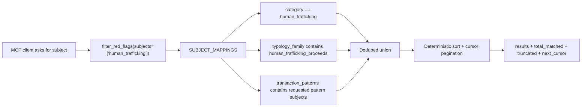

# fix: Add Subject Facet for AML Retrieval

## Overview

Add an analyst-facing `subjects` filter that resolves one concept such as `human_trafficking`, `structuring`, or `pass_through_account_activity` across the corpus's lower-level metadata split. The goal is to make "FINTRAC human trafficking red flags" return records whose primary `category` or broader `typology_family` makes them trafficking-relevant, and to make transaction-pattern subjects discoverable through the same interface, without requiring the MCP client to discover and union raw fields itself.

This plan complements the retrieval-contract hardening in `docs/plans/2026-06-01-001-fix-mcp-retrieval-tool-contract-plan.md`. The subject facet becomes the primary fix for the category-vs-typology failure mode; completeness metadata, schema guidance, route wording, and source-filter cleanup remain necessary supporting work.

## Problem Frame

Client feedback showed that `category="human_trafficking"` returned only 11 FINTRAC records, while `typology_family=["human_trafficking_proceeds"]` returned at least 20 and was itself capped. The overlap was only 2 records. Attempts to partition around the cap exposed a harder defect: even `regulator × category × typology_family` and then `regulator × category × typology_family × risk_level` cells can still hit the 20-result ceiling, so there is no API path to a provably complete exact set when any atomic filter cell exceeds the cap. The missed OA001 records were operationally important: funnel-account patterns, pass-through patterns, nominee/collector EMT typologies, gift-card and prepaid structuring, premium escort advertising payments, recruitment-from-abroad, and VC-exchanger funneling.

The product failure is not that the corpus has several metadata fields. The fields disagree by design: `category` is the record's primary label, `typology_family` captures broader investigative relevance, and `transaction_patterns` captures observable behavior that may be strongly subject-linked even when the primary category is different. The failure is exposing that internal modeling split as a required client decision. Hosted LLM clients should be able to ask for a subject once and let the server own the union.

## Requirements Trace

- R1. Add a public `subjects` filter for analyst-facing investigative subjects such as `human_trafficking`.
- R2. A subject match must union configured exact field predicates across `category`, `typology_family`, and `transaction_patterns`; no mass edit to `data/source/*.yaml` is required for v1.
- R3. `subjects=["human_trafficking"]` must match both `category="human_trafficking"` and `typology_family` containing `human_trafficking_proceeds`.
- R3a. Subject tokens that correspond to controlled transaction patterns, such as `structuring`, `funnel_account_activity`, or `pass_through_account_activity`, must match records whose `transaction_patterns` contain that value.
- R4. Raw `category` and `typology_family` filters remain available as advanced exact filters and keep their current meanings.
- R5. Subject filtering must work in both hosted lexical corpus mode and local LanceDB/vector mode.
- R6. Every exact metadata filtering path, including subject filtering, must return completeness metadata and cursor pagination through `filter_red_flags` so audit/enumeration calls can provably enumerate all matches.
- R7. Tool schemas/descriptions and prompt guidance must steer topic requests such as "human trafficking red flags" to `subjects`, not raw category filtering.
- R8. Ranked relevance search may accept `subjects` as an eligibility filter, but exact subject enumeration belongs on `filter_red_flags`.
- R9. The subject vocabulary must be discoverable through `list_filters` and tool metadata.
- R10. Corpus trust metadata must not report a verified SQLite hash as all zeros; the response should expose the real packaged hash or avoid presenting a placeholder as verified.
- R11. Query-time behavior remains offline and read-only; no server-side LLM, embeddings in hosted corpus mode, source YAML migration, or corpus rebuild requirement is introduced by the subject facet itself.
- R12. Add a public `industry_groups` filter that expands broad industry concepts into configured `industry_types` values without collapsing or renaming the underlying exact industry taxonomy.
- R13. The industry-group vocabulary must be discoverable through `list_filters` and tool metadata.
- R14. Tool input schemas must expose JSON Schema enum values, including list item enums where applicable, for bounded stable facets: `category`, `risk_level`, `regulator`, `regulator_jurisdiction`, `typology_family`, `transaction_patterns`, `customer_profiles`, `product_types`, `industry_types`, `subjects`, and `industry_groups`.

## Scope Boundaries

- Do not add a general OR-query DSL in this iteration. `subjects` handles the common analyst concept union; broader boolean query language is deferred.
- Do not remove or rename `category`, `typology_family`, or existing source filters.
- Do not merge existing `industry_types` values such as `maritime_shipping`, `import_export`, `transportation`, and `logistics`; preserve them as precise exact filters.
- Do not write `subject` into every source YAML record. Subject is derived from existing metadata plus a curated mapping.
- Do not use `key_terms` for subject matching in v1 unless a mapping is explicitly curated and tested; uncontrolled key-term matching risks false positives. `key_terms` remain lexical recall text, not an exact subject facet.
- Do not make ingestion models reject records whose typology values are outside the current advisory vocabulary. The enum requirement is for public query-tool arguments, not for source YAML ingestion.

### Deferred to Separate Tasks

- General OR/combinator filtering: future work if power users need arbitrary `(category OR typology_family OR key_terms)` expressions.
- Subject coverage expansion beyond the initial curated mappings: add incrementally as corpus review identifies clear concept mappings.
- Full retrieval-contract cleanup from the earlier plan can land in the same implementation wave, but the subject facet should be independently testable.

## Context & Research

### Relevant Code and Patterns

- `src/redflag_mcp/config.py` already contains `CATEGORIES`, `TYPOLOGY_FAMILIES`, `TRANSACTION_PATTERNS`, `INDUSTRY_TYPES`, and other advisory vocabularies. Subject and industry-group mappings should live here or in a small adjacent config module so they are code-reviewed and do not require source YAML migration.
- `src/redflag_mcp/tools.py` owns public tool signatures, response envelopes, route guidance, and validation before store access.
- `src/redflag_mcp/lexicalstore.py` implements hosted corpus `search()` and `filter_red_flags()` over SQLite/FTS. It already has row decoding, list-field matching, deterministic metadata sorting, and source grouping. Its FTS `searchable` text includes `key_terms`, so those terms are already lexical recall aids even though they are not exposed as exact filters.
- `src/redflag_mcp/vectorstore.py` mirrors filter behavior for LanceDB/local vector mode and must receive equivalent subject filter semantics.
- `src/redflag_mcp/models.py` contains response models and corpus metadata surfaced to clients.
- `src/redflag_mcp/prompts.py` and `README.md` contain hosted-client retrieval guidance that currently teaches category/typology as separate concepts without a subject abstraction.
- `tests/test_tools.py`, `tests/test_lexicalstore.py`, `tests/test_vectorstore.py`, `tests/test_models.py`, and `tests/test_prompts.py` are the primary coverage targets.
- `AGENTS.md` requires red-green TDD for implementation and forbids `print()` because stdout is the stdio JSON-RPC channel.

### Institutional Learnings

- `docs/plans/2026-04-24-001-feat-hosted-redflag-retrieval-plan.md` established exact metadata filtering as the deterministic path for structured requests.
- `docs/plans/2026-04-28-001-feat-red-flag-request-routing-plan.md` added classification, but it still assumes clients can select raw metadata dimensions reliably.
- `docs/plans/2026-06-01-001-fix-mcp-retrieval-tool-contract-plan.md` identified silent truncation, route wording, schema enum guidance, and source-filter ambiguity; this plan elevates the subject facet as the missing product abstraction.
- `docs/brainstorms/2026-04-29-redflag-metadata-enrichment-requirements.md` intentionally treats `typology_family` as broader relevance rather than a replacement for `category`.

## Key Technical Decisions

- **Add `subjects`, not `subject`:** Use `subjects: list[str] | None` to match existing list-filter conventions. Multiple requested subjects use OR semantics across requested subject tokens, while each subject token expands to its configured union of field predicates.
- **Initial mapping is curated and explicit:** Start with a small `SUBJECT_MAPPINGS` vocabulary. Each subject maps to exact `category`, `typology_family`, and `transaction_patterns` values. For v1, do not infer mappings from string similarity at query time.
- **Human trafficking is the launch regression:** `human_trafficking` maps to `category=["human_trafficking"]` and `typology_family=["human_trafficking_proceeds"]`. Do not blindly map it to generic patterns like `third_party_payments` or `rapid_fund_movement`; those are better exposed as transaction-pattern subject tokens unless a narrower, tested predicate is added later.
- **Transaction-pattern subjects are first-class:** A token such as `structuring`, `funnel_account_activity`, or `pass_through_account_activity` can be used through `subjects` and should match the corresponding `transaction_patterns` value, even when no category or typology mapping exists.
- **Raw filters stay strict:** `category="human_trafficking"` remains category-only. `typology_family=["human_trafficking_proceeds"]` remains typology-only. `subjects=["human_trafficking"]` is the union.
- **Subject filtering applies before ranking:** In `search_red_flags`, `subjects` constrains eligibility before lexical or vector ranking. In `filter_red_flags`, `subjects` returns deterministic subject matches.
- **Add `industry_groups` as a separate facet:** Industry grouping is useful for broad industry language such as "trade logistics" or "DNFBP", but it should not be part of `subjects`, which stays crime/behavior focused.
- **Industry groups preserve precision:** Raw `industry_types=["maritime_shipping"]` remains vessel/port/shipping-specific. `industry_groups=["trade_logistics"]` expands to multiple exact industry values.
- **Enums are part of the tool contract:** Query-time tool schemas should expose bounded stable values as JSON Schema enums, including item enums for list-valued facets. Descriptions and `list_filters` remain useful, but they are not sufficient as the only discoverability mechanism for these fields.
- **Schema enums do not make ingestion strict:** Source YAML can remain extensible where existing tests require it; query tools should validate user-supplied exact filters against the bounded vocabulary or active mapping before store access.
- **Completeness is part of exact filtering correctness:** Any exact filter can exceed the cap even after several facets are applied. `filter_red_flags` must expose `total_matched`, `returned`, `truncated`, and `next_cursor` for all exact filters, not only `subjects`.
- **Corpus integrity response must be truthful:** If the packaged manifest has the real SQLite hash but the embedded SQLite metadata still has zeros, client-visible corpus metadata should not present the zero hash as a verified file hash.

## Public Interface Changes

- `filter_red_flags` gains `subjects: list[str] | None` and `cursor: str | None`.
- `search_red_flags` gains `subjects: list[str] | None` as an eligibility filter.
- `filter_red_flags` gains `industry_groups: list[str] | None`.
- `search_red_flags` gains `industry_groups: list[str] | None` as an eligibility filter.
- `list_filters` response gains `subjects` and `industry_groups`, listing supported tokens from the active code/config vocabulary.
- `filter_red_flags` responses gain `requested_limit`, `applied_limit`, `returned`, `total_matched`, `truncated`, and `next_cursor` for every exact-filter request.
- `search_red_flags` responses gain `requested_limit`, `applied_limit`, `returned`, and `truncated`; ranked search does not gain cursor pagination in this iteration.
- Tool descriptions and prompt guidance describe `subjects` as the default for broad investigative topic requests and `industry_groups` as the default for broad sector requests, with `category`, `typology_family`, and `industry_types` documented as advanced exact fields.
- Tool schemas expose enums for stable scalar facets and item enums for stable list-valued facets, including `product_types`, `customer_profiles`, `industry_types`, `typology_family`, `transaction_patterns`, `subjects`, and `industry_groups`.

## Subject Mapping

> *This illustrates the intended approach and is directional guidance for review, not implementation code.*

| Subject token | Category matches | Typology family matches | Transaction pattern matches | Notes |
| --- | --- | --- | --- | --- |
| `corruption` | `corruption` | `corruption_and_bribery` | None | Bridges category shorthand to typology family. |
| `cyber_enabled` | `cyber_enabled` | `cybercrime_proceeds` | None | Bridges category shorthand to typology family. |
| `fraud_nexus` | `fraud_nexus` | `fraud_proceeds`, `scam_proceeds`, `elder_financial_exploitation` | None | Groups fraud/scam/elder exploitation families under the fraud category subject. |
| `human_smuggling` | `human_smuggling` | `human_smuggling_proceeds` | None | Same concept split as trafficking. |
| `human_trafficking` | `human_trafficking` | `human_trafficking_proceeds` | None | Required regression target from FINTRAC OA001/Project Shadow feedback. Generic patterns seen in trafficking records remain separate pattern subjects. |
| `narcotics_trafficking` | `narcotics_trafficking` | `narcotics_proceeds` | None | Uses proceeds typology naming. |
| `proliferation_financing` | `proliferation_financing` | `proliferation_financing` | None | Same token exists in both fields. |
| `sanctions_evasion` | `sanctions_evasion` | `sanctions_evasion` | None | Same token exists in both fields. |
| `tax_evasion` | `tax_evasion` | `tax_evasion` | None | Same token exists in both fields. |
| `terrorist_financing` | `terrorist_financing` | `terrorist_financing` | None | Same token exists in both fields. |
| `trade_based_money_laundering` | `trade_based_money_laundering` | `trade_based_money_laundering` | `invoice_mismatch`, `trade_document_manipulation` | TBML has specific transaction-pattern bridges. |
| `virtual_currency` | `virtual_currency` | `crypto_asset_money_laundering` | `cryptocurrency_mixing` | Treats crypto/VC as a subject bridge where the pattern is specific enough. |
| `shell_company` | `shell_company` | None | `shell_company_usage` | Bridges category and controlled behavior. |
| `structuring` | `structuring` | None | `structuring`, `cash_deposits_below_threshold` | Bridges category and controlled behavior. |
| `layering` | `layering` | None | `funnel_account_activity`, `pass_through_account_activity`, `rapid_fund_movement`, `round_tripping`, `wire_transfer_chains`, `nested_account_activity` | Captures common layering movement patterns. |
| `real_estate_money_laundering` | None | `real_estate_money_laundering` | `real_estate_transactions` | Typology/pattern subject with no category equivalent. |
| `ransomware` | `ransomware` | None | None | Category-only subject. |
| `organized_crime` | None | `organized_crime_proceeds` | None | Typology-only subject. |
| `environmental_crime` | None | `environmental_crime_proceeds` | None | Typology-only subject. |

Every remaining controlled transaction pattern should also be exposed as a pattern-only subject token, including `account_takeover`, `bulk_cash_smuggling`, `cash_intensive_behavior`, `identity_misrepresentation`, `informal_value_transfer`, `loan_back_scheme`, `monetary_instrument_purchases`, `money_mule_activity`, `third_party_payments`, and `unusual_international_wires`.

Additional category-only subjects may be exposed when no safe typology or transaction-pattern mapping exists, but they should be explicit in `SUBJECT_MAPPINGS` rather than inferred dynamically.

## Industry Group Mapping

Industry groups are broad aliases over exact `industry_types`. They should be exposed as `industry_groups`, not folded into `subjects`, because they answer "which sector?" rather than "which crime, typology, or transaction behavior?"

| Industry group token | Industry type matches | Notes |
| --- | --- | --- |
| `trade_logistics` | `import_export`, `logistics`, `maritime_shipping`, `transportation` | Broad trade and movement-of-goods sector grouping. |
| `cross_border_trade` | `import_export`, `logistics`, `maritime_shipping` | Trade-focused group excluding general domestic transportation. |
| `dnfbp` | `art_antiquities`, `casinos`, `legal_accounting`, `precious_metals_jewelry`, `professional_services`, `real_estate` | FATF-style designated non-financial businesses and professions. |
| `professional_gatekeepers` | `legal_accounting`, `professional_services`, `real_estate` | Gatekeeper professions that can form, move, or conceal assets. |
| `high_value_assets` | `art_antiquities`, `auto_sales`, `luxury_goods`, `precious_metals_jewelry`, `real_estate` | High-value asset channels commonly used for placement, layering, or value storage. |
| `cash_intensive_businesses` | `adult_entertainment`, `auto_sales`, `casinos`, `food_service`, `retail` | Cash-heavy sectors where cash placement and commingling are common. |
| `nonbank_financial_services` | `crypto`, `money_services_business`, `casinos` | Non-bank financial or financial-adjacent intermediaries. |
| `government_programs` | `government_benefits`, `healthcare`, `charity_or_nonprofit`, `food_service`, `payroll` | Public benefits, reimbursements, grants, payroll, and program-payment exposure. |
| `sanctions_trade_exposure` | `arms_dual_use_goods`, `import_export`, `logistics`, `manufacturing`, `maritime_shipping`, `oil_and_gas` | Trade and goods sectors commonly implicated in sanctions/proliferation/export-control typologies. |
| `online_commerce` | `online_marketplace`, `crypto`, `retail` | Online platform and digital commerce exposure. |

These groups can overlap by design. For example, `real_estate` appears in both `dnfbp` and `high_value_assets`, and `maritime_shipping` appears in both `trade_logistics` and `sanctions_trade_exposure`.

## Open Questions

### Resolved During Planning

- **Does adding `subjects` require updating source YAML files such as `data/source/001_federal_child_nutrition_fraud.yaml`?** No. V1 derives subject matches at query time from existing `category`, `typology_family`, and `transaction_patterns` fields plus a curated mapping.
- **Should `subjects` include key terms?** Not by default. Key terms can be added later for curated subjects, but v1 should avoid uncontrolled broadening.
- **Should clients still use `category` directly?** Yes, but only when they explicitly want the primary category. For investigative subjects, clients should use `subjects`.
- **Should overlapping industries such as `maritime_shipping`, `import_export`, `transportation`, and `logistics` be unified?** No. Keep them distinct exact values and add `industry_groups` for broad queries.
- **Should `search_red_flags` be disabled because hosted mode has no embeddings?** No. It remains ranked relevance search; exact subject enumeration goes through `filter_red_flags`.

### Deferred to Implementation

- **Exact cursor encoding:** Choose an opaque deterministic cursor during implementation and test it through service responses, not only store helpers.
- **FastMCP schema support for enums:** Verify whether the installed FastMCP version emits scalar enums and list item enums from the chosen type annotations. If not, add the smallest schema-construction or registration adjustment needed so the exported tool schemas still contain enum values. Descriptions and `list_filters` are supporting discovery, not a substitute for schema enums.
- **Exact handling of unknown subject tokens:** Prefer a clear validation message before store access, but settle wording while implementing alongside existing validation helpers.

## High-Level Technical Design

> *This illustrates the intended approach and is directional guidance for review, not implementation specification. The implementing agent should treat it as context, not code to reproduce.*

## Implementation Units

- [x] **Unit 1: Add Subject Vocabulary and Matching Semantics**

**Goal:** Define the public subject vocabulary and the deterministic mapping from subject tokens to existing metadata fields.

**Requirements:** R1, R2, R3, R4, R9, R11

**Dependencies:** None

**Files:**
- Modify: `src/redflag_mcp/config.py`
- Modify: `src/redflag_mcp/lexicalstore.py`
- Modify: `src/redflag_mcp/vectorstore.py`
- Test: `tests/test_lexicalstore.py`
- Test: `tests/test_vectorstore.py`

**Approach:**
- Add a curated subject mapping in config, with `human_trafficking` mapping to category `human_trafficking` and typology family `human_trafficking_proceeds`, and transaction-pattern subject tokens mapping to their controlled `transaction_patterns` values.
- Extend lexical and vector filter structures to accept `subjects`.
- Match a record when any requested subject maps to at least one matching configured field predicate. Within one subject, use OR across mapped fields; across multiple requested subjects, use OR across subjects.
- Keep existing `category`, `typology_family`, and `transaction_patterns` filters as AND constraints when callers provide them alongside `subjects`.
- Validate subject tokens before store access where practical so misspellings produce a clear message rather than a misleading empty audit result.

**Execution note:** Implement test-first with a seeded FINTRAC-like fixture containing category-only, typology-only, and overlap records.

**Patterns to follow:**
- Existing list-field matching in `src/redflag_mcp/lexicalstore.py` and `src/redflag_mcp/vectorstore.py`.
- Existing advisory vocabulary constants in `src/redflag_mcp/config.py`.

**Test scenarios:**
- Happy path: `subjects=["human_trafficking"]` returns a record with `category="human_trafficking"` even when typology is empty.
- Happy path: `subjects=["human_trafficking"]` returns a record with `typology_family=["human_trafficking_proceeds"]` even when category is `layering`, `fraud_nexus`, `virtual_currency`, or `human_smuggling`.
- Happy path: `subjects=["pass_through_account_activity"]` returns records with `transaction_patterns=["pass_through_account_activity"]`.
- Happy path: `subjects=["structuring"]` returns both `category="structuring"` records and records with `transaction_patterns=["structuring"]`.
- Happy path: a record matching both category and typology appears once in the result set.
- Edge case: `category="human_trafficking"` alone remains category-only and does not return typology-only records.
- Edge case: `subjects=["human_trafficking"]` does not match a non-trafficking record solely because it has a generic transaction pattern such as `third_party_payments`.
- Edge case: `subjects=["human_trafficking"]` combined with `regulator="FINTRAC"` narrows the subject union to FINTRAC records.
- Error path: `subjects=["human trafficking"]` or an unknown token returns a clear validation message before querying.
- Regression: existing `typology_family` and `category` tests still pass without subject arguments.

**Verification:**
- Subject matching hides category-vs-typology disagreement without changing raw field semantics.

- [x] **Unit 1A: Add Industry Group Vocabulary and Matching Semantics**

**Goal:** Define broad industry-group aliases that expand to existing exact `industry_types` values without weakening the base industry taxonomy.

**Requirements:** R6, R11, R12, R13

**Dependencies:** None

**Files:**
- Modify: `src/redflag_mcp/config.py`
- Modify: `src/redflag_mcp/lexicalstore.py`
- Modify: `src/redflag_mcp/vectorstore.py`
- Test: `tests/test_lexicalstore.py`
- Test: `tests/test_vectorstore.py`

**Approach:**
- Add a curated `INDUSTRY_GROUP_MAPPINGS` config object using the table in `Industry Group Mapping`.
- Extend lexical and vector filter structures to accept `industry_groups`.
- Match a record when any requested industry group expands to at least one matching `industry_types` value. Across multiple requested groups, use OR semantics.
- Keep raw `industry_types` filters as AND constraints when callers provide them alongside `industry_groups`.
- Validate industry-group tokens before store access where practical so misspellings produce a clear message rather than a misleading empty audit result.

**Execution note:** Implement test-first with fixtures that distinguish `maritime_shipping`, `import_export`, `transportation`, and unrelated industries.

**Test scenarios:**
- Happy path: `industry_groups=["trade_logistics"]` returns records tagged `import_export`, `logistics`, `maritime_shipping`, or `transportation`.
- Happy path: `industry_groups=["cross_border_trade"]` returns `import_export`, `logistics`, and `maritime_shipping` but not a record tagged only `transportation`.
- Happy path: `industry_groups=["dnfbp"]` returns records tagged `casinos`, `legal_accounting`, `precious_metals_jewelry`, `professional_services`, or `real_estate`.
- Edge case: `industry_types=["maritime_shipping"]` remains maritime-only and does not return `import_export` records.
- Edge case: `industry_groups=["trade_logistics"]` combined with `industry_types=["maritime_shipping"]` narrows the group to maritime records.
- Error path: `industry_groups=["shipping"]` or an unknown token returns a clear validation message before querying.

**Verification:**
- Industry grouping broadens client discoverability without collapsing precise industry facets.

- [x] **Unit 2: Expose Subjects Through MCP Tools and Discovery**

**Goal:** Make bounded exact facets, `subjects`, and `industry_groups` visible and obvious to hosted clients through tool schemas, `list_filters`, descriptions, and prompt guidance.

**Requirements:** R1, R7, R8, R9, R11, R12, R13, R14

**Dependencies:** Unit 1, Unit 1A

**Files:**
- Modify: `src/redflag_mcp/tools.py`
- Modify: `src/redflag_mcp/prompts.py`
- Modify: `README.md`
- Test: `tests/test_tools.py`
- Test: `tests/test_prompts.py`

**Approach:**
- Add `subjects` and `industry_groups` to `filter_red_flags`, `search_red_flags`, and `classify_red_flag_request` if routing still accepts structured filters.
- Add `subjects` and `industry_groups` to `list_filters` output so clients can discover the vocabularies without reading docs.
- Use schema annotations, Pydantic models, or a minimal FastMCP schema override so exported input schemas include enum values for:
  - Scalars: `category`, `risk_level`, `regulator`, `regulator_jurisdiction`.
  - List item values: `product_types`, `customer_profiles`, `industry_types`, `typology_family`, `transaction_patterns`, `subjects`, `industry_groups`.
- Keep `regulatory_source`, `source_id`, and `source_url` out of static enums because those are corpus/source identity values, not bounded stable vocabularies.
- Update tool descriptions to say topic/investigative-subject requests should use `subjects`, broad sector requests should use `industry_groups`, while raw `category`, `typology_family`, and `industry_types` are advanced exact filters.
- Update prompt guidance to distinguish:
  - "human trafficking category" -> `category`
  - "human trafficking red flags" or "trafficking-relevant red flags" -> `subjects`
  - "human trafficking proceeds typology" -> `typology_family`
  - "trade logistics red flags" -> `industry_groups`
  - "maritime shipping red flags" -> `industry_types`
- Keep route/search wording aligned with ranked relevance rather than semantic search if this is implemented alongside the retrieval-contract plan.

**Execution note:** Implement test-first by asserting FastMCP tool schemas expose scalar enums and list item enums before changing service logic. Descriptions can be asserted too, but they do not satisfy R14 by themselves.

**Patterns to follow:**
- Current `register_tools` signatures and metadata tests in `tests/test_tools.py`.
- Current `CONSULT_AML_RED_FLAGS_PROMPT` assertions in `tests/test_prompts.py`.

**Test scenarios:**
- Integration: `create_server().list_tools()` shows `subjects` in `filter_red_flags` and `search_red_flags` input schemas.
- Integration: `create_server().list_tools()` shows `industry_groups` in `filter_red_flags` and `search_red_flags` input schemas.
- Integration: `filter_red_flags` input schema exposes `category` enum values including `human_trafficking` and `risk_level` enum values `high`, `medium`, `low`.
- Integration: `filter_red_flags` input schema exposes list item enum values for `typology_family` including `human_trafficking_proceeds`, `transaction_patterns` including `pass_through_account_activity`, `product_types` including `crypto`, `customer_profiles` including `money_services_business`, and `industry_types` including `maritime_shipping`.
- Integration: `filter_red_flags` input schema exposes list item enum values for `subjects` including `human_trafficking` and `industry_groups` including `trade_logistics`.
- Integration: `filter_red_flags` description says `subjects` is the default for investigative topics and `industry_groups` is the default for broad sector groups.
- Happy path: `list_filters()` includes `subjects` with `human_trafficking`.
- Happy path: `list_filters()` includes `industry_groups` with `trade_logistics`.
- Happy path: `classify_red_flag_request(query="FINTRAC human trafficking red flags", subjects=["human_trafficking"])` recommends exact filtering or ranked relevance according to the existing route rules, but preserves the subject filter.
- Regression: existing filters remain present in tool schemas.

**Verification:**
- A hosted LLM client inspecting tool metadata can discover and use `subjects` without knowing the internal category/typology split, and can use `industry_groups` without guessing which exact industry values should be unioned.

- [x] **Unit 3: Add Completeness Metadata and Cursor Pagination for Exact Filters**

**Goal:** Make exact metadata enumeration audit-safe by surfacing total matches, truncation, and pagination for all `filter_red_flags` calls.

**Requirements:** R5, R6, R8, R11

**Dependencies:** Unit 1

**Files:**
- Modify: `src/redflag_mcp/models.py`
- Modify: `src/redflag_mcp/tools.py`
- Modify: `src/redflag_mcp/lexicalstore.py`
- Modify: `src/redflag_mcp/vectorstore.py`
- Test: `tests/test_models.py`
- Test: `tests/test_tools.py`
- Test: `tests/test_lexicalstore.py`
- Test: `tests/test_vectorstore.py`

**Approach:**
- Add retrieval metadata to `filter_red_flags`: `requested_limit`, `applied_limit`, `returned`, `total_matched`, `truncated`, and `next_cursor`.
- Add deterministic cursor pagination over the same sorted filtered result set used for metadata filtering.
- Ensure subject filtering participates in the same pagination path as every other exact filter combination.
- Add cap transparency to `search_red_flags`: `requested_limit`, `applied_limit`, `returned`, and `truncated`; do not add ranked-search cursor pagination in this unit.
- Keep existing `limit` response key for compatibility during the first pass.

**Execution note:** Implement test-first using an exact-filter fixture where a single multi-facet cell exceeds the cap, plus a subject fixture with more matches than the cap.

**Patterns to follow:**
- Existing limit clamping in `src/redflag_mcp/tools.py`.
- Existing deterministic metadata sort keys in `src/redflag_mcp/lexicalstore.py` and `src/redflag_mcp/vectorstore.py`.

**Test scenarios:**
- Happy path: `filter_red_flags(subjects=["human_trafficking"], limit=2)` over 3+ matches returns `total_matched`, `returned=2`, `truncated=true`, and `next_cursor`.
- Happy path: the next cursor returns the next subject page without duplicate IDs.
- Happy path: a non-subject filter cell such as `regulator="FINTRAC"`, `category="layering"`, `typology_family=["human_trafficking_proceeds"]`, and `risk_level="medium"` over 20+ seeded records returns a cursor and can be paginated to completion.
- Edge case: no subject matches returns `total_matched=0`, `returned=0`, `truncated=false`, and `next_cursor=null`.
- Edge case: requested `limit=50` returns `requested_limit=50`, `applied_limit=20`, and explicit truncation when more records exist.
- Error path: malformed cursor returns a clear message and empty results.
- Integration: lexical and vector modes return the same metadata keys.

**Verification:**
- Exact-filter results cannot look complete when capped or paginated, including when an already narrow multi-facet cell exceeds the cap.

- [x] **Unit 4: Add FINTRAC Human-Trafficking Regression Coverage**

**Goal:** Lock the observed FINTRAC/OA001 failure into tests or evaluation fixtures so the subject facet cannot regress back to category-only behavior.

**Requirements:** R1, R2, R3, R6, R7

**Dependencies:** Units 1 and 3

**Files:**
- Create or modify: `data/eval/hosted_retrieval_queries.yaml`
- Create or modify: `tests/test_tools.py`
- Create or modify: `tests/test_lexicalstore.py`
- Create or modify: `tests/test_vectorstore.py`

**Approach:**
- Add a seeded unit-test fixture that mirrors the FINTRAC split: category-only trafficking records, typology-only trafficking records under `layering`, `fraud_nexus`, `virtual_currency`, and `human_smuggling`, plus overlap records.
- Add an evaluation smoke case for the real hosted corpus if practical: FINTRAC + `subjects=["human_trafficking"]` should return more than category-only and expose truncation/pagination when capped. Include a second fixture or benchmark note for the reported overflowing `FINTRAC × layering × human_trafficking_proceeds × medium` cell so the pagination requirement is not treated as subject-only.
- Keep unit tests independent from the full packaged corpus so normal development does not depend on a large artifact.
- Use the real corpus/eval fixture as an additional regression gate when the artifact is available.

**Execution note:** Start with a failing test proving `category="human_trafficking"` misses typology-only records while `subjects=["human_trafficking"]` returns the deduped union.

**Patterns to follow:**
- Existing seeded corpus helpers in `tests/test_tools.py`.
- Existing hosted retrieval benchmark format in `data/eval/hosted_retrieval_queries.yaml`.

**Test scenarios:**
- Happy path: subject fixture returns category-only, typology-only, and overlap records in one deduped set.
- Happy path: category-only fixture call returns fewer records than subject call.
- Happy path: subject + FINTRAC regulator filter still includes OA001-style typology-only records.
- Happy path: the seeded overflowing layering/medium cell paginates to a complete set without requiring further client-side partitioning.
- Edge case: overlap records appear once.
- Regression: subject results include records with categories other than `human_trafficking` when typology indicates trafficking proceeds.

**Verification:**
- The specific client-reported failure mode is covered by tests and, where possible, evaluation data.

- [x] **Unit 5: Fix Corpus Integrity Metadata Surfaced to Clients**

**Goal:** Prevent clients from seeing `integrity_status="verified"` with an all-zero SQLite file hash.

**Requirements:** R10, R11

**Dependencies:** None

**Files:**
- Modify: `scripts/build_corpus.py`
- Modify: `src/redflag_mcp/lexicalstore.py`
- Modify: `src/redflag_mcp/tools.py`
- Test: `tests/test_corpus.py`
- Test: `tests/test_lexicalstore.py`
- Test: `tests/test_tools.py`

**Approach:**
- Ensure the client-visible corpus metadata does not present placeholder `file_hashes.redflags.sqlite` as a verified hash.
- Prefer updating the packaged SQLite metadata after computing the real SQLite hash, then re-hashing/repackaging as needed. If implementation discovers circular hashing makes embedding the final SQLite self-hash impossible, store the verified hash only in `manifest.json` and omit or explicitly mark the SQLite metadata hash as not self-verifying.
- Keep package verification anchored on `manifest.json`, which already contains the real SQLite hash.
- Add tests that fail if client-visible corpus metadata reports `integrity_status="verified"` with a 64-character all-zero hash.

**Execution note:** Implement characterization tests first around the current all-zero metadata behavior, then adjust build/runtime behavior.

**Patterns to follow:**
- Existing `build_corpus_package` manifest hash flow in `scripts/build_corpus.py`.
- Existing `LexicalStore.open` metadata loading in `src/redflag_mcp/lexicalstore.py`.
- Existing corpus metadata assertions in `tests/test_corpus.py` and `tests/test_tools.py`.

**Test scenarios:**
- Regression: corpus metadata returned by `search_red_flags` or `filter_red_flags` never includes an all-zero `redflags.sqlite` hash with `integrity_status="verified"`.
- Happy path: `scripts/verify_corpus.py` still verifies package files against the manifest hash.
- Edge case: if a corpus contains legacy all-zero SQLite metadata, runtime response either omits that hash or marks it clearly as legacy/stub, without weakening package verification.

**Verification:**
- A careful MCP client cannot surface a false verified file-hash assurance to an end user.

## System-Wide Impact

- **Interaction graph:** Hosted clients discover `subjects` and `industry_groups` through `list_filters` or tool schema, call `filter_red_flags(subjects=[...])` for exact topic enumeration or `filter_red_flags(industry_groups=[...])` for broad sector enumeration, paginate any truncated `filter_red_flags` response with `next_cursor`, and use `search_red_flags(..., query=...)` only when ranking within those constraints is useful.
- **Error propagation:** Unknown subjects and malformed cursors should return clear messages with empty results, following existing validation response style.
- **State lifecycle risks:** No persistent state is added. Cursors are stateless and based on deterministic filtered ordering.
- **API surface parity:** Lexical store, vector store, service methods, tool schemas, prompt guidance, README examples, and tests must all expose the same subject semantics.
- **Integration coverage:** FastMCP metadata tests and store-level tests are required because the primary failure is client tool-selection behavior, not only internal matching.
- **Unchanged invariants:** The server remains read-only; raw `category` and `typology_family` stay exact; source YAML remains unchanged for v1; results remain vector-free.

## Risks & Dependencies

| Risk | Mitigation |
|------|------------|
| Subject mapping over-broadens a concept | Start with explicit curated mappings and require tests for each added subject. Do not infer from string similarity at query time. |
| Clients keep using `category` for topic requests | Tool descriptions, prompt guidance, README examples, and `list_filters` should position `subjects` as the default topic filter. |
| Clients guess several raw `industry_types` for broad sector requests | Tool descriptions, prompt guidance, README examples, and `list_filters` should position `industry_groups` as the default broad sector filter. |
| Subject + raw filters produce surprising AND/OR behavior | Document that `subjects` is an OR union internally, then combines with other filters using AND. Add tests for subject + regulator and subject + category. |
| Cursor pagination differs between stores | Use the same deterministic metadata sort contract in lexical and vector paths. |
| Clients try to partition around the cap instead of paginating | Tool descriptions and response metadata should make `next_cursor` the only completeness path for truncated exact-filter responses. |
| Integrity metadata fix forces corpus rebuild | Plan for code/runtime handling of legacy all-zero metadata so the server can avoid false assurances even before the next corpus package is built. |

## Documentation / Operational Notes

- Update README smoke checks to include `filter_red_flags(subjects=["human_trafficking"], regulator="FINTRAC")`.
- Document that `subjects` is for analyst investigative themes and raw `category` is the primary category only.
- Document that `industry_groups` is for broad sector groups and raw `industry_types` remains the exact industry facet.
- Mention that source YAML files do not need a new `subject` field for v1.
- Railway deployment will need a normal code redeploy. A corpus rebuild is only needed if the implementation chooses to repair packaged SQLite metadata inside a new corpus artifact.

## Sources & References

- **Origin document:** [docs/brainstorms/2026-04-23-general-chat-aml-redflag-retrieval-requirements.md](docs/brainstorms/2026-04-23-general-chat-aml-redflag-retrieval-requirements.md)
- Related plan: [docs/plans/2026-06-01-001-fix-mcp-retrieval-tool-contract-plan.md](docs/plans/2026-06-01-001-fix-mcp-retrieval-tool-contract-plan.md)
- Related plan: [docs/plans/2026-04-28-001-feat-red-flag-request-routing-plan.md](docs/plans/2026-04-28-001-feat-red-flag-request-routing-plan.md)
- Related code: `src/redflag_mcp/config.py`
- Related code: `src/redflag_mcp/tools.py`
- Related code: `src/redflag_mcp/lexicalstore.py`
- Related code: `src/redflag_mcp/vectorstore.py`
- Related code: `scripts/build_corpus.py`
- Related tests: `tests/test_tools.py`
- Related tests: `tests/test_lexicalstore.py`
- Related tests: `tests/test_vectorstore.py`
- Related tests: `tests/test_corpus.py`
