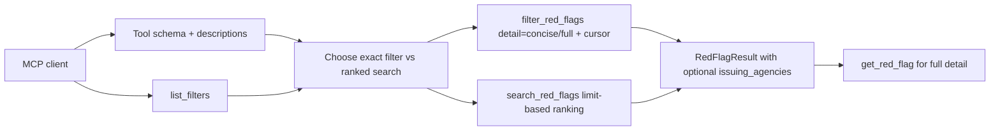

# fix: Improve MCP Filter Discovery and Attribution

## Overview

Make the filter-first MCP retrieval path as dependable as ranked search. This plan closes the remaining product-contract gaps around geographic filter discovery, tool manifest guidance, taxonomy semantics, concise enumeration, interagency attribution, and provenance noise (see origin: `docs/brainstorms/2026-06-04-mcp-filter-discoverability-attribution-requirements.md`).

The implementation should audit current behavior before adding code because some requirements are partially satisfied already: `GEOGRAPHIC_FOOTPRINTS` exists in `src/redflag_mcp/config.py`, `list_filters` already returns store-derived geography values, `subjects` and `industry_groups` are public facets, `filter_red_flags` already has cursor pagination, and `LexicalStore.open()` already downgrades verified placeholder SQLite hashes to `unverified`.

## Problem Frame

Agents can retrieve useful red flags through natural-language search, but exact filtering still exposes too much internal corpus structure. A model may guess a geography token, choose `category` instead of `subjects`, or trust a single `regulator` value for a joint advisory and return an incomplete or misleading answer. The retrieval surface needs to make valid values, taxonomy semantics, enumeration strategy, and source attribution discoverable from the active MCP contract itself.

## Requirements Trace

- R1-R4. Geography must be a first-class discoverable and validated facet, with clear distinction from issuer jurisdiction.
- R5-R7. Tool descriptions and manifests must be internally consistent, and `list_filters` must cover every exact-filter facet agents are expected to use.
- R8-R12. Tool guidance must explain `category`, `subjects`, and `typology_family`, including the cross-category human trafficking example.
- R13-R16. Exact enumeration needs a concise response shape and explicit cursor-vs-limit guidance.
- R17-R19. Interagency source issuance must be represented without collapsing joint advisories into a sole regulator.
- R20. Corpus integrity metadata should be actionable or quiet, not placeholder noise.
- R21-R22. Classifier and prompt guidance should explain when to call the classifier and avoid stale semantic route language.

## Scope Boundaries

- Do not remove or rename existing public tool names.
- Do not replace ranked relevance retrieval; `search_red_flags` remains the ranked path.
- Do not add a general boolean query language.
- Do not require a full corpus rebuild for documentation-only or active-store discovery fixes.
- Do not make source YAML ingestion globally strict for extensible metadata values; query-time validation may be stricter than ingestion.

### Deferred to Separate Tasks

- Broad source-corpus correction beyond the known DPRK-style joint advisory examples: this plan adds the field and pipeline support, but broad historical enrichment can land as a separate corpus maintenance pass.
- General OR/combinator filtering: deferred unless subject and geography discovery still leave common analyst workflows uncovered.

## Context & Research

### Relevant Code and Patterns

- `src/redflag_mcp/tools.py` owns tool registration, enum annotations, validation, response envelopes, classifier routing, and result serialization.
- `src/redflag_mcp/config.py` already defines `GEOGRAPHIC_FOOTPRINTS`, `SUBJECTS`, `INDUSTRY_GROUPS`, regulator vocabularies, and taxonomy mappings.
- `src/redflag_mcp/models.py` defines `RedFlagSource`, `RedFlagRecord`, `RedFlagResult`, `CorpusMetadata`, and source-summary models.
- `src/redflag_mcp/lexicalstore.py` is the hosted corpus path. It stores a fixed SQLite schema, converts rows through `RedFlagRecord`, supports cursor-backed metadata filtering, and derives `list_distinct_values()`.
- `src/redflag_mcp/vectorstore.py` mirrors metadata filter behavior for local LanceDB mode.
- `scripts/build_corpus.py` builds the packaged SQLite corpus and manifest. It currently writes placeholder SQLite hashes into embedded corpus metadata before the final manifest hash is known.
- `scripts/ingest.py` and `scripts/extract.py` populate source and vector metadata. They already treat controlled vocabularies as advisory and log warnings for some unknown values.
- `src/redflag_mcp/prompts.py` and `README.md` carry hosted-client routing guidance and currently still include semantic route language in places.
- `tests/test_tools.py`, `tests/test_lexicalstore.py`, `tests/test_vectorstore.py`, `tests/test_models.py`, `tests/test_corpus.py`, `tests/test_prompts.py`, `tests/test_extract.py`, and `tests/test_ingest.py` contain the relevant coverage patterns.

### Institutional Learnings

- `docs/plans/2026-06-01-001-fix-mcp-retrieval-tool-contract-plan.md` already planned route language cleanup, completeness metadata, schema guidance, and source-locus filter cleanup.
- `docs/plans/2026-06-02-001-fix-subject-facet-retrieval-plan.md` already established `subjects` as the product abstraction for cross-field investigative topics.
- No `docs/solutions/` learning documents were present during local research.

## Key Technical Decisions

- **Use enum-backed geography in tool schemas:** `geographic_footprints` already has a code vocabulary, so expose it like other list-valued bounded facets rather than leaving it as plain `list[str]`.
- **Validate known list facets consistently:** Query tools should validate `geographic_footprints` alongside product, industry, customer, typology, transaction, subject, and industry-group values. Source ingestion can remain advisory.
- **Prefer a concise `detail`/`mode` parameter over arbitrary field projection:** A small enum such as full vs concise is simpler for agents and easier to keep backward compatible than free-form `fields` selection.
- **Keep `fit_signals` search-only by default:** Ranked search may return fit explanations. Exact filter enumeration should omit empty semantic explanation fields unless the caller explicitly requests full detail and the fields are meaningful.
- **Add `issuing_agencies` without removing `regulator`:** `regulator` remains a primary/legacy issuer facet; `issuing_agencies` carries all known issuing agencies and can include the primary regulator.
- **Treat corpus integrity as two sources of truth:** Package manifests verify artifacts; embedded SQLite metadata should not pretend to hold the final SQLite hash unless the build process rewrites or syncs it after hashing.

## Open Questions

### Resolved During Planning

- **Which controlled facets should reject unknown values before store access?** Validate the bounded query-tool facets that already have public vocabularies in `config.py`: product types, industry types/groups, customer profiles, geographic footprints, typology families, transaction patterns, subjects, category, risk level, regulator, and regulator jurisdiction. Keep ingestion advisory.
- **Should concise enumeration be a mode, field projection, or separate tool?** Use a response `detail` or `mode` enum on `filter_red_flags` first. It keeps the enumeration path on one tool and avoids a second near-duplicate listing API.
- **Should `issuing_agencies` live on source metadata, each record, or both?** Store it on red flag source/record/result models so every returned record is self-contained. Source-summary views can aggregate it.
- **What likely produced the missing `list_filters` manifest?** Local code currently registers `list_filters`; planning should treat this as deployment or registration drift to be verified through manifest tests and hosted deployment docs rather than a missing local function.

### Deferred to Implementation

- **Exact mode parameter name and default:** Choose `detail`, `mode`, or similar after checking FastMCP schema clarity. Default must preserve current full responses.
- **Exact source of agency enrichment:** Known joint advisories can be represented in source YAML or source metadata. Implementation should choose the lowest-churn source that keeps packaged and vector modes consistent.
- **SQLite schema version bump:** Adding `issuing_agencies` to the lexical corpus likely requires a schema bump; confirm during implementation when touching `LEXICAL_SCHEMA_VERSION`.
- **Corpus hash repair strategy:** Decide whether to rewrite embedded SQLite metadata with the final hash, omit placeholder hashes from response metadata, or keep downgrade behavior with clearer documentation.

## High-Level Technical Design

> *This illustrates the intended approach and is directional guidance for review, not implementation specification. The implementing agent should treat it as context, not code to reproduce.*

## Implementation Units

- [x] **Unit 1: Expose and Validate Geographic Vocabulary**

**Goal:** Make `geographic_footprints` discoverable and safe to use as a controlled query facet.

**Requirements:** R1, R2, R3, R4, R7

**Dependencies:** None

**Files:**
- Modify: `src/redflag_mcp/tools.py`
- Modify: `src/redflag_mcp/config.py`
- Test: `tests/test_tools.py`

**Approach:**
- Add a `GeographicFootprintsValue` annotation using `GEOGRAPHIC_FOOTPRINTS`, matching existing list enum helpers.
- Use the enum annotation on `search_red_flags`, `filter_red_flags`, and `classify_red_flag_request`.
- Include `geographic_footprints` in `_validate_known_filter_values()` for both search and filter paths.
- Update tool descriptions so agents understand `regulator_jurisdiction` as issuer jurisdiction and `geographic_footprints` as affected geography.
- Keep `list_filters` store-derived for active corpus values, but ensure the description says it covers geography and that schema enums show the broader canonical vocabulary.

**Execution note:** Implement test-first. Start with failing FastMCP schema and unknown-geography validation tests.

**Patterns to follow:**
- Existing `ProductTypesValue`, `SubjectsValue`, and `_list_enum_schema()` in `src/redflag_mcp/tools.py`.
- Existing unknown-value tests for subjects and industry groups in `tests/test_tools.py`.

**Test scenarios:**
- Integration: `filter_red_flags` input schema exposes `north_korea`, `sanctioned_jurisdiction`, `east_asia`, and `uk_eu` as `geographic_footprints` item enum values.
- Error path: `filter_red_flags(geographic_footprints=["North Korea"])` returns a clear unknown-value message that points to `list_filters`.
- Error path: `search_red_flags(query="DPRK", geographic_footprints=["dprk"])` rejects the unknown geography before store access.
- Happy path: existing `list_filters()` response still returns active store geography values such as `domestic_us` and `southwest_border`.
- Integration: search/filter/classifier descriptions distinguish geography from regulator jurisdiction.

**Verification:**
- Agents can discover the canonical geography vocabulary from schema and `list_filters`, and invalid guesses no longer look like true zero-result findings.

- [x] **Unit 2: Align Tool Guidance and Taxonomy Semantics**

**Goal:** Remove stale semantic route language and make taxonomy choice obvious from tool descriptions, prompt text, and README guidance.

**Requirements:** R5, R6, R8, R9, R10, R11, R12, R16, R21, R22

**Dependencies:** Unit 1 is useful but not required.

**Files:**
- Modify: `src/redflag_mcp/tools.py`
- Modify: `src/redflag_mcp/prompts.py`
- Modify: `README.md`
- Test: `tests/test_tools.py`
- Test: `tests/test_prompts.py`

**Approach:**
- Rename canonical classifier route constants and public guidance from `filtered_semantic_search` and `direct_semantic_search` to relevance-oriented names such as `filtered_relevance_search` and `direct_relevance_search`.
- Update classifier reasons and prompt copy so `classify_red_flag_request` is optional for specific scenarios and valuable for ambiguous "what applies" requests.
- Add compact taxonomy guidance to `search_red_flags`, `filter_red_flags`, `list_filters`, and the consultation prompt:
  - `category` is primary record classification.
  - `subjects` is the broad investigative eligibility layer.
  - `typology_family` is broader proceeds/typology grouping.
- Include the concrete human trafficking/virtual currency example from the origin document.
- Verify the local FastMCP manifest includes every tool referenced by descriptions, especially `list_filters`.
- Document that `filter_red_flags` paginates with `next_cursor`, while ranked `search_red_flags` is limit-based and has no cursor.

**Execution note:** Implement test-first with manifest-description assertions before editing guidance.

**Patterns to follow:**
- Tool metadata assertions in `tests/test_tools.py`.
- Prompt assertions in `tests/test_prompts.py`.
- Prior route cleanup direction in `docs/plans/2026-06-01-001-fix-mcp-retrieval-tool-contract-plan.md`.

**Test scenarios:**
- Happy path: classifier with rich narrative and filters returns `filtered_relevance_search`, recommends `search_red_flags`, and does not emit old semantic route strings.
- Happy path: classifier with a rich narrative and insufficient metadata returns `direct_relevance_search`.
- Integration: `create_server().list_tools()` returns descriptions that reference only registered tool names.
- Integration: `search_red_flags`, `filter_red_flags`, and `list_filters` descriptions include taxonomy guidance for `category`, `subjects`, and `typology_family`.
- Integration: prompt text contains the human trafficking/virtual currency example and cursor-vs-limit guidance.
- Regression: vague-query classification still returns `needs_more_context`; metadata-only requests still route to `filter_red_flags`.

**Verification:**
- Hosted clients inspecting the manifest are not told to call missing tools or stale semantic route names, and they have enough taxonomy guidance to choose `subjects` for broad topics.

- [x] **Unit 3: Add Concise Exact Enumeration Mode**

**Goal:** Let agents page through large exact-filter result sets cheaply and then call `get_red_flag` for detail.

**Requirements:** R13, R14, R15, R16

**Dependencies:** Unit 2 for description wording.

**Files:**
- Modify: `src/redflag_mcp/tools.py`
- Modify: `src/redflag_mcp/models.py`
- Test: `tests/test_tools.py`
- Test: `tests/test_models.py`

**Approach:**
- Add a small response detail option to `filter_red_flags`, defaulting to existing full behavior for compatibility.
- In concise mode, serialize a bounded subset: `id`, `description`, `regulatory_source`, `source_url`, `risk_level`, and other fields needed to preserve source trust such as `regulator`, `regulator_jurisdiction`, and `issuing_agencies` after Unit 4.
- Ensure exact filter results do not include empty `fit_signals` or absent `fit_explanation` noise in concise mode.
- Keep `get_red_flag` as the full-detail follow-up path and mention that in tool guidance.
- Do not add cursor pagination to ranked search.

**Execution note:** Implement test-first with a token-budget-oriented response-shape test.

**Patterns to follow:**
- Current response envelope construction in `RedFlagService.filter_red_flags()`.
- `RedFlagResult.model_dump(exclude_none=True)` behavior in `src/redflag_mcp/models.py`.

**Test scenarios:**
- Happy path: `filter_red_flags(product_types=["depository"], detail="concise")` returns `id`, `description`, `regulatory_source`, `source_url`, and `risk_level` for each result.
- Edge case: concise results omit verbose list facets such as `product_types`, `industry_types`, `customer_profiles`, `typology_family`, `transaction_patterns`, and `key_terms` unless implementation deliberately keeps a specific field for source trust and documents that choice.
- Edge case: concise exact results omit empty `fit_signals` and missing `fit_explanation`.
- Regression: default `filter_red_flags()` response remains full-detail and backward compatible.
- Integration: concise mode still returns `requested_limit`, `applied_limit`, `returned`, `total_matched`, `truncated`, and `next_cursor`.
- Error path: unknown detail/mode value returns a clear validation message rather than falling back silently.

**Verification:**
- Agents can enumerate many exact matches with a smaller payload and retrieve selected full records through `get_red_flag`.

- [x] **Unit 4: Represent Interagency Issuing Agencies**

**Goal:** Preserve source attribution accuracy for joint advisories while keeping `regulator` compatible.

**Requirements:** R17, R18, R19

**Dependencies:** None, though Unit 3 should include the new field in concise output once available.

**Files:**
- Modify: `src/redflag_mcp/models.py`
- Modify: `src/redflag_mcp/lexicalstore.py`
- Modify: `src/redflag_mcp/vectorstore.py`
- Modify: `scripts/ingest.py`
- Modify: `scripts/extract.py`
- Modify: `scripts/build_corpus.py`
- Modify: `data/lexicon/source_metadata.yaml`
- Modify: selected `data/source/*.yaml`
- Test: `tests/test_models.py`
- Test: `tests/test_lexicalstore.py`
- Test: `tests/test_vectorstore.py`
- Test: `tests/test_ingest.py`
- Test: `tests/test_extract.py`
- Test: `tests/test_corpus.py`
- Test: `tests/test_tools.py`

**Approach:**
- Add optional `issuing_agencies` to source, storage, and response models. Default to an empty list on records/results.
- Preserve `regulator` as the primary issuer facet for backward compatibility. When only `regulator` is present, `issuing_agencies` may be empty or normalized to include `regulator`; choose one behavior and test it consistently.
- Extend vector schema and lexical SQLite schema to store the new list field; bump lexical schema version if the SQLite table changes.
- Include `issuing_agencies` in record conversion, source summaries/details where useful, and result serialization.
- Extend extraction/ingestion prompts and deterministic URL handling so a URL-inferred primary regulator does not erase other issuing agencies.
- Add or update source metadata/YAML for known DPRK cyber and IT worker joint advisories as focused regression fixtures.
- Keep filtering by `regulator` and `regulator_jurisdiction` unchanged unless implementation chooses to add a separate `issuing_agencies` filter later; this plan only requires response attribution.

**Execution note:** Implement model and store behavior test-first before touching corpus data.

**Patterns to follow:**
- Existing `regulator`, `regulator_jurisdiction`, and `issued_date` propagation tests in `tests/test_models.py`, `tests/test_ingest.py`, and `tests/test_extract.py`.
- Existing list-field JSON storage in `src/redflag_mcp/lexicalstore.py` and LanceDB list schema in `src/redflag_mcp/vectorstore.py`.

**Test scenarios:**
- Happy path: `RedFlagSource(issuing_agencies=["FinCEN", "State", "FBI"])` produces a `RedFlagRecord` and `RedFlagResult` with the same agencies.
- Happy path: lexical corpus records persist and return `issuing_agencies` through `search_red_flags`, `filter_red_flags`, and `get_red_flag`.
- Happy path: vector-mode records persist and return `issuing_agencies` through search, filter, and get.
- Integration: source summaries/details aggregate joint agencies without dropping `regulator`.
- Regression: filtering by `regulator="OFAC"` still works for records whose `issuing_agencies` contain additional agencies.
- Regression: extraction with an OFAC URL and LLM-provided agencies keeps `regulator="OFAC"` and preserves all issuing agencies.
- Error path: invalid agency list values such as empty strings are normalized or rejected according to existing metadata normalization conventions.

**Verification:**
- DPRK-style joint advisories can be attributed to all issuing agencies in MCP responses without breaking existing `regulator` consumers.

- [x] **Unit 5: Clean Provenance and Deployment Contract Drift**

**Goal:** Make corpus integrity metadata and hosted tool manifests trustworthy rather than alarming or stale.

**Requirements:** R5, R6, R20

**Dependencies:** Units 1 and 2 for final manifest expectations.

**Files:**
- Modify: `src/redflag_mcp/lexicalstore.py`
- Modify: `src/redflag_mcp/corpus_install.py`
- Modify: `scripts/build_corpus.py`
- Modify: `docs/hosted-deployment.md`
- Modify: `README.md`
- Test: `tests/test_lexicalstore.py`
- Test: `tests/test_corpus.py`
- Test: `tests/test_corpus_install.py`
- Test: `tests/test_tools.py`
- Test: `tests/test_deployment_config.py`

**Approach:**
- Audit the current package build and activation flow to determine where placeholder SQLite hashes surface.
- Prefer either syncing embedded SQLite metadata with final manifest hashes or omitting placeholder hash details from client-visible corpus metadata. Keep existing downgrade behavior as a safety fallback.
- Add tests that installed hosted corpus metadata does not expose `integrity_status="unverified"` with a zero hash for a verified package.
- Add a manifest smoke test that the active server tool list includes all tools referenced by descriptions and hosted docs.
- Update deployment docs to include a hosted manifest verification step and explain the distinction between package-level verification and embedded corpus metadata if both remain visible.

**Execution note:** Add characterization tests around the current package install path before changing packaging behavior.

**Patterns to follow:**
- Existing placeholder-hash test in `tests/test_lexicalstore.py`.
- Package manifest tests in `tests/test_corpus.py`.
- Hosted runtime activation tests in `tests/test_runtime_config.py` and `tests/test_corpus_install.py`.

**Test scenarios:**
- Happy path: building and installing a package yields client-visible corpus metadata that is verified or clearly documented, with no zero hash presented as a verified file hash.
- Error path: a corrupt package still fails closed through `CorpusInstaller`.
- Integration: hosted-mode server activation exposes the same tool names referenced in `README.md` and `docs/hosted-deployment.md`.
- Regression: `LexicalStore.open()` still downgrades legacy verified-zero-hash corpora to `unverified` rather than trusting them.
- Regression: local corpus and hosted corpus modes still avoid embedding calls during query handling.

**Verification:**
- Agents no longer see placeholder integrity metadata as unexplained warning noise, and hosted deployment documentation includes a concrete manifest contract check.

## System-Wide Impact

- **Interaction graph:** Clients may call `list_filters`, then either `filter_red_flags` for cursor-backed exact enumeration or `search_red_flags` for ranked relevance. `get_red_flag` remains the full-detail follow-up path.
- **Error propagation:** Unknown controlled query values should return structured MCP tool messages, not exceptions or misleading empty match sets.
- **State lifecycle risks:** Adding `issuing_agencies` affects both vector and SQLite storage. Lexical schema changes must be versioned so old corpus packages fail clearly.
- **API surface parity:** Vector mode, local corpus mode, hosted corpus mode, source tools, prompts, and README examples should describe the same public contract.
- **Integration coverage:** Tool manifest tests must cover schema enums, registered tool names, and descriptions. Store tests must cover both LanceDB and SQLite behavior for new fields.
- **Unchanged invariants:** Query-time tools remain read-only and offline in corpus mode. Existing `regulator`, `category`, `typology_family`, `search_red_flags`, `filter_red_flags`, `get_red_flag`, and source-tool names remain compatible.

## Risks & Dependencies

| Risk | Mitigation |
|------|------------|
| Strict geography validation rejects values present in older corpora but missing from `GEOGRAPHIC_FOOTPRINTS` | Use tests against active fixtures and keep ingestion advisory; if corpus values exceed config, promote real values to config before enforcing query validation. |
| Tool descriptions become too verbose for hosted clients | Put full vocabularies in schema and `list_filters`; keep descriptions focused on decision rules and examples. |
| `issuing_agencies` schema changes break old packaged corpora | Bump lexical schema version and keep clear activation errors for unsupported schema versions. |
| Corpus attribution updates require broad data cleanup | Land field support first with focused regression records; defer broader enrichment. |
| Concise mode hides a field an agent needs for citation trust | Keep source and issuer fields in concise mode, and preserve full mode as the default. |

## Documentation / Operational Notes

- Update README MCP tool guidance to reflect geography discovery, subject/category/typology semantics, cursor-vs-limit behavior, and interagency attribution.
- Update hosted deployment docs with a manifest/tool-list smoke check so deployed manifests cannot drift from descriptions.
- If `issuing_agencies` requires a corpus rebuild, document the rebuild requirement and schema-version implication.

## Sources & References

- **Origin document:** [docs/brainstorms/2026-06-04-mcp-filter-discoverability-attribution-requirements.md](docs/brainstorms/2026-06-04-mcp-filter-discoverability-attribution-requirements.md)
- Related plan: [docs/plans/2026-06-01-001-fix-mcp-retrieval-tool-contract-plan.md](docs/plans/2026-06-01-001-fix-mcp-retrieval-tool-contract-plan.md)
- Related plan: [docs/plans/2026-06-02-001-fix-subject-facet-retrieval-plan.md](docs/plans/2026-06-02-001-fix-subject-facet-retrieval-plan.md)
- Related code: `src/redflag_mcp/tools.py`
- Related code: `src/redflag_mcp/models.py`
- Related code: `src/redflag_mcp/lexicalstore.py`
- Related code: `src/redflag_mcp/vectorstore.py`
- Related code: `scripts/build_corpus.py`
