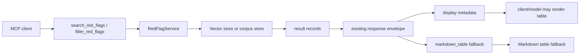

# feat: Add Display Table Hints

## Overview

Add a portable presentation layer to retrieval responses so ChatGPT, Claude, and other MCP clients receive both machine-readable table hints and a Markdown table fallback. The server should continue returning the existing `results` records, while `search_red_flags` and `filter_red_flags` gain additive `display` metadata and `markdown_table` text that help clients or models render clean tabular answers.

## Problem Frame

The current retrieval tools return structured result dictionaries, but clients decide how to present them. The desired user experience is a clean in-chat table with columns such as red flag, risk, pattern, regulator, and source. MCP can carry structured tool output, but the protocol does not mandate a native table widget. The best cross-client path is to provide explicit display hints plus a fallback table that any Markdown-capable chat client can show.

## Requirements Trace

- R1. Preserve existing `results` payloads and retrieval metadata so existing clients remain compatible.
- R2. Add a `display` object to successful `search_red_flags` and `filter_red_flags` responses, including zero-result successes, describing table intent, title, columns, and row count.
- R3. Add a `markdown_table` string to successful retrieval responses, including zero-result successes, so clients without custom rendering can still show a clean table header and any returned rows.
- R4. Use stable, analyst-friendly table columns: `description`, `risk_level`, `transaction_patterns`, `regulator`, and `source_url`, with labels `Red flag`, `Risk`, `Pattern`, `Regulator`, and `Source`.
- R5. Ensure both vector-backed and corpus-backed search/filter paths produce the same display contract.
- R6. Do not add ChatGPT-only widgets or Claude-only artifact behavior in this iteration.
- R7. Keep invalid-input and pre-ingestion responses simple and backward-compatible; display helpers should not obscure error messages or setup guidance. Zero-result successful retrievals should still receive the display contract with `row_count == 0`.
- R8. Implement behavior test-first per `AGENTS.md`.

## Scope Boundaries

- No native ChatGPT Apps SDK widget, iframe resource, or `_meta["openai/outputTemplate"]` integration in this iteration.
- No Claude artifact generation contract; Claude may choose to render Markdown or create an artifact, but the MCP server should not depend on that behavior.
- No new MCP tool names or changes to retrieval semantics.
- No changes to ingestion, storage schemas, embeddings, or corpus package format.
- No removal or renaming of existing response fields.

### Deferred to Separate Tasks

- ChatGPT-specific table widget: separate feature after the portable MCP response contract proves useful.
- Formal MCP `outputSchema` declarations: separate hardening task if the local FastMCP version supports explicit output schemas cleanly without disrupting existing tests.

## Context & Research

### Relevant Code and Patterns

- `src/redflag_mcp/tools.py` owns `RedFlagService`, public tool registration, retrieval envelopes, corpus metadata injection, and concise/full filter result shaping.
- `RedFlagService.search_red_flags` currently has separate corpus and vector branches that return the same envelope shape: query/limit metadata plus `results`.
- `RedFlagService.filter_red_flags` already centralizes exact-match response metadata and uses `_dump_filter_result` to support `detail="full"` and `detail="concise"`.
- `tests/test_tools.py` already contains response-shape coverage for vector-backed search, corpus-backed search, metadata filtering, concise filtering, pagination metadata, and FastMCP tool schema descriptions.
- `README.md` documents the public retrieval tools and should mention the new display hints where retrieval response metadata is described.

### Institutional Learnings

- No `docs/solutions/` entries were found in this repo during planning.
- Recent plans, especially `docs/plans/2026-06-01-001-fix-mcp-retrieval-tool-contract-plan.md` and `docs/plans/2026-06-02-001-fix-subject-facet-retrieval-plan.md`, treat retrieval response shape as a public contract and prefer additive metadata over tool churn.

### External References

- MCP tools spec: tool results can include structured content, and tools with structured content should also return serialized text content for backwards compatibility. The protocol does not require a particular UI rendering behavior. https://modelcontextprotocol.io/specification/2025-06-18/server/tools
- OpenAI Apps SDK reference: ChatGPT widgets require app/tool metadata such as `_meta.ui.resourceUri` or the compatibility alias `_meta["openai/outputTemplate"]`, and tool callbacks can return `structuredContent` plus text content. https://developers.openai.com/apps-sdk/reference/
- OpenAI MCP server guide: MCP tools can return `structuredContent` and text fallback; security guidance says `structuredContent`, `content`, `_meta`, and widget state should be treated as user-visible. https://developers.openai.com/apps-sdk/build/mcp-server/

## Key Technical Decisions

- Add display hints to existing retrieval responses rather than creating a new presentation-only tool: this keeps current client workflows stable and makes table rendering an additive enhancement.
- Include both `display` and `markdown_table`: `display` gives clients structured rendering hints, while Markdown gives Claude, ChatGPT, and generic MCP clients an immediate fallback.
- Keep the display payload small and deterministic: expose column keys/labels, title, row count, and suggested format; avoid duplicating full row data under `display` because `results` remains the source of truth.
- Build Markdown from the final response records, not directly from `RedFlagResult` objects, so `detail="concise"` and pagination responses reflect what the client actually received.
- Treat URLs as Markdown links when possible, but keep cell escaping conservative so descriptions, pipes, and newlines cannot break the table.

## Open Questions

### Resolved During Planning

- Should the server rely on clients auto-rendering a native table from `display.suggested_format`? No. The server should provide hints, but the fallback Markdown table is required because MCP host rendering is not guaranteed.
- Should this be ChatGPT-specific? No. ChatGPT-specific widget work is deferred so Claude and other MCP clients benefit immediately.
- Should `display` include rows? No for this iteration. Rows would duplicate `results`; clients can map `display.columns` over `results`.

### Deferred to Implementation

- Exact title derivation: implementation should choose a simple deterministic title from query/filter context, falling back to `AML Red Flags`; do not overfit natural-language title generation.
- Exact Markdown formatting for missing values: implementation should settle on compact placeholders such as empty string or `-` while keeping tests clear.
- FastMCP `outputSchema` support: if implementation discovers a low-risk way to add schemas, leave it for the deferred hardening task unless it is trivial and fully covered.

## High-Level Technical Design

> *This illustrates the intended approach and is directional guidance for review, not implementation specification. The implementing agent should treat it as context, not code to reproduce.*



Suggested response shape:

```json
{
  "results": [],
  "display": {
    "suggested_format": "table",
    "title": "TBML Red Flags",
    "columns": [
      {"key": "description", "label": "Red flag"},
      {"key": "risk_level", "label": "Risk"},
      {"key": "transaction_patterns", "label": "Pattern"},
      {"key": "regulator", "label": "Regulator"},
      {"key": "source_url", "label": "Source"}
    ],
    "row_count": 12
  },
  "markdown_table": "| Red flag | Risk | Pattern | Regulator | Source |\n|---|---|---|---|---|\n..."
}
```

## Implementation Units

- [x] **Unit 1: Define the Display Contract**

**Goal:** Establish one reusable internal display contract for retrieval responses.

**Requirements:** R1, R2, R3, R4, R8

**Dependencies:** None

**Files:**
- Modify: `src/redflag_mcp/tools.py`
- Test: `tests/test_tools.py`

**Approach:**
- Add focused helper behavior in `tools.py` that accepts a response title and a list of result dictionaries, then returns `display` and `markdown_table`.
- Keep table columns centralized so `search_red_flags` and `filter_red_flags` cannot drift.
- Use keys matching result payload fields and labels matching analyst-facing table headers.
- Escape Markdown table cells for pipes, newlines, and repeated whitespace.
- Format list-valued fields such as `transaction_patterns` as a compact comma-separated string.

**Execution note:** Start with failing tests that assert the exact `display` structure and Markdown table header before adding the helper.

**Patterns to follow:**
- Existing response-shaping helpers in `src/redflag_mcp/tools.py`, especially `_dump_filter_result` and `_with_corpus`.
- Existing response contract tests in `tests/test_tools.py`.

**Test scenarios:**
- Happy path: helper-backed search response with two results includes `display.suggested_format == "table"`, five expected columns, `row_count == 2`, and a Markdown header with `Red flag`, `Risk`, `Pattern`, `Regulator`, and `Source`.
- Happy path: list-valued `transaction_patterns` renders as readable text in `markdown_table`.
- Edge case: descriptions containing `|` or newlines do not break the Markdown table.
- Edge case: missing `regulator`, missing `risk_level`, or missing `source_url` still produce a table row with stable column count.

**Verification:**
- Retrieval responses can be decorated with display metadata without changing existing `results` records.

- [x] **Unit 2: Add Display Hints to Search Responses**

**Goal:** Make ranked relevance search responses table-ready in both vector and corpus modes.

**Requirements:** R1, R2, R3, R4, R5, R8

**Dependencies:** Unit 1

**Files:**
- Modify: `src/redflag_mcp/tools.py`
- Test: `tests/test_tools.py`

**Approach:**
- Apply the display helper in both branches of `RedFlagService.search_red_flags` after `results` are converted to dictionaries.
- Preserve all existing fields: `query`, `limit`, `requested_limit`, `applied_limit`, `returned`, `truncated`, `results`, and corpus metadata when present.
- Derive a simple title from the query, such as `Results for: <query>` or a bounded query-based title; keep it deterministic and avoid LLM-style rewriting.
- Do not add display metadata to validation failures or pre-ingestion responses. Error/setup payloads should remain easy for models to read.
- Add display metadata to zero-result successful searches with `row_count == 0` and a header-only Markdown table.

**Execution note:** Add failing tests for vector search and corpus search before modifying the service branches.

**Patterns to follow:**
- Current duplicated envelope construction in `RedFlagService.search_red_flags`.
- `test_search_returns_clamped_sourced_results` and `test_corpus_search_uses_lexical_store_without_embeddings`.

**Test scenarios:**
- Happy path: vector-backed `search_red_flags(query="oil smuggling")` returns existing result data plus `display` and `markdown_table`.
- Happy path: corpus-backed `search_red_flags(query="TBML invoices")` returns `display`, `markdown_table`, and existing `corpus` metadata.
- Regression: `search_red_flags` still omits `vector` from result records.
- Regression: overlong or invalid search requests still return the existing validation message and empty `results`.
- Edge case: empty successful search results return a coherent display contract with `row_count == 0` and a header-only Markdown table.

**Verification:**
- Search result payloads are backward-compatible and can be rendered directly as Markdown tables.

- [x] **Unit 3: Add Display Hints to Filter Responses**

**Goal:** Make exact metadata filter responses table-ready without weakening pagination, concise detail mode, or metadata-match semantics.

**Requirements:** R1, R2, R3, R4, R5, R7, R8

**Dependencies:** Unit 1

**Files:**
- Modify: `src/redflag_mcp/tools.py`
- Test: `tests/test_tools.py`

**Approach:**
- Apply the display helper to the successful `filter_red_flags` response after `_dump_filter_result` has produced final result dictionaries.
- Preserve `match_type`, `limit`, `requested_limit`, `applied_limit`, `returned`, `total_matched`, `truncated`, `next_cursor`, `results`, and corpus metadata.
- Ensure `detail="concise"` still returns the concise result shape; the Markdown table should reflect missing columns gracefully when concise results omit `transaction_patterns` or `regulator`.
- Keep malformed cursor, invalid detail, unknown filters, missing filters, and pre-ingestion responses focused on their existing messages.
- Add display metadata to zero-match successful filter responses with `row_count == 0`, while preserving `total_matched == 0`.

**Execution note:** Add failing tests for full detail, concise detail, and paginated filter responses before changing the service response construction.

**Patterns to follow:**
- `_dump_filter_result` for final record shape.
- `test_filter_red_flags_returns_direct_metadata_matches_without_embeddings`, `test_filter_red_flags_concise_detail_returns_small_enumeration_shape`, and pagination tests in `tests/test_tools.py`.

**Test scenarios:**
- Happy path: full-detail `filter_red_flags(product_types=["trade_finance"])` returns display hints and a Markdown row for the matching red flag.
- Happy path: concise-detail filter response includes display hints and a Markdown table even when some display columns are unavailable.
- Integration: paginated `filter_red_flags` response has `display.row_count == returned`, not `total_matched`.
- Edge case: zero-match successful `filter_red_flags` response includes `display.row_count == 0`, `total_matched == 0`, and a header-only Markdown table.
- Regression: malformed cursor responses keep `returned == 0`, `truncated == false`, existing `message`, and do not present misleading table content.
- Regression: exact metadata filtering still does not call embeddings.

**Verification:**
- Filter responses remain deterministic, paginated, and table-ready.

- [x] **Unit 4: Document Client Rendering Semantics**

**Goal:** Explain the portable display contract and set accurate expectations for ChatGPT and Claude.

**Requirements:** R1, R2, R3, R6, R7

**Dependencies:** Units 2 and 3

**Files:**
- Modify: `README.md`
- Modify: `src/redflag_mcp/tools.py`
- Test: `tests/test_tools.py`

**Approach:**
- Update retrieval tool descriptions or nearby guidance to say responses include `display` hints and `markdown_table` for table presentation, while clients decide final rendering.
- Update README retrieval documentation to show the new additive fields and clarify that native widgets are not guaranteed by MCP.
- Keep wording concise so tool descriptions do not distract from routing/filter guidance.

**Execution note:** Add or update failing schema/description tests before modifying public descriptions.

**Patterns to follow:**
- Existing FastMCP tool schema tests near `test_fastmcp_tool_schema_exposes_guidance`.
- README section documenting `search_red_flags` and `filter_red_flags`.

**Test scenarios:**
- Integration: `create_server().list_tools()` descriptions for retrieval tools mention table-ready display metadata or Markdown fallback.
- Documentation consistency: README states that `display` is a rendering hint and `markdown_table` is the portable fallback.
- Regression: existing routing guidance for `search_red_flags`, `filter_red_flags`, `subjects`, and `industry_groups` remains present in tool descriptions.

**Verification:**
- Developers and clients understand the new response contract without assuming host-specific widgets.

## System-Wide Impact

- **Interaction graph:** MCP clients call existing retrieval tools, receive the existing response envelope plus display metadata, then either render from `display.columns` and `results` or show `markdown_table`.
- **Error propagation:** Validation and setup errors should remain message-first and should not be masked by presentation metadata.
- **State lifecycle risks:** None; this is read-only response shaping.
- **API surface parity:** Both `search_red_flags` and `filter_red_flags` need the same display contract across vector and corpus modes. `get_red_flag`, `list_filters`, `list_sources`, and `get_source` remain unchanged.
- **Integration coverage:** Tests should cover vector search, corpus search, full filter, concise filter, and FastMCP tool description/schema inspection.
- **Unchanged invariants:** No vectors in responses, no embeddings during corpus/filter paths, no cursor for ranked search, no changed filter semantics, no stdout output.

## Risks & Dependencies

| Risk | Mitigation |
|------|------------|
| Clients interpret `display` as a guaranteed widget contract | Document `display` as a hint and keep `markdown_table` as the guaranteed fallback. |
| Markdown table becomes too large for high-limit responses | The existing `MAX_SEARCH_LIMIT` of 20 bounds response size; table generation should use returned rows only. |
| Presentation helper duplicates or mutates result records | Build `display` and Markdown from result dictionaries without altering `results`. |
| Table output hides important source/citation data | Keep `source_url` in both `results` and the display columns; use links in Markdown when practical. |
| Tool descriptions become too verbose | Add a short presentation sentence only; keep routing guidance intact. |

## Documentation / Operational Notes

- README should show a small response snippet with `display` and `markdown_table`.
- Documentation should explicitly state that ChatGPT/Claude may choose different rendering, but both can consume Markdown.
- No deployment, corpus rebuild, or migration steps are required.

## Sources & References

- Related code: `src/redflag_mcp/tools.py`
- Related tests: `tests/test_tools.py`
- Related docs: `README.md`
- Related plan: `docs/plans/2026-06-01-001-fix-mcp-retrieval-tool-contract-plan.md`
- Related plan: `docs/plans/2026-06-02-001-fix-subject-facet-retrieval-plan.md`
- MCP tools specification: https://modelcontextprotocol.io/specification/2025-06-18/server/tools
- OpenAI Apps SDK reference: https://developers.openai.com/apps-sdk/reference/
- OpenAI MCP server guide: https://developers.openai.com/apps-sdk/build/mcp-server/
