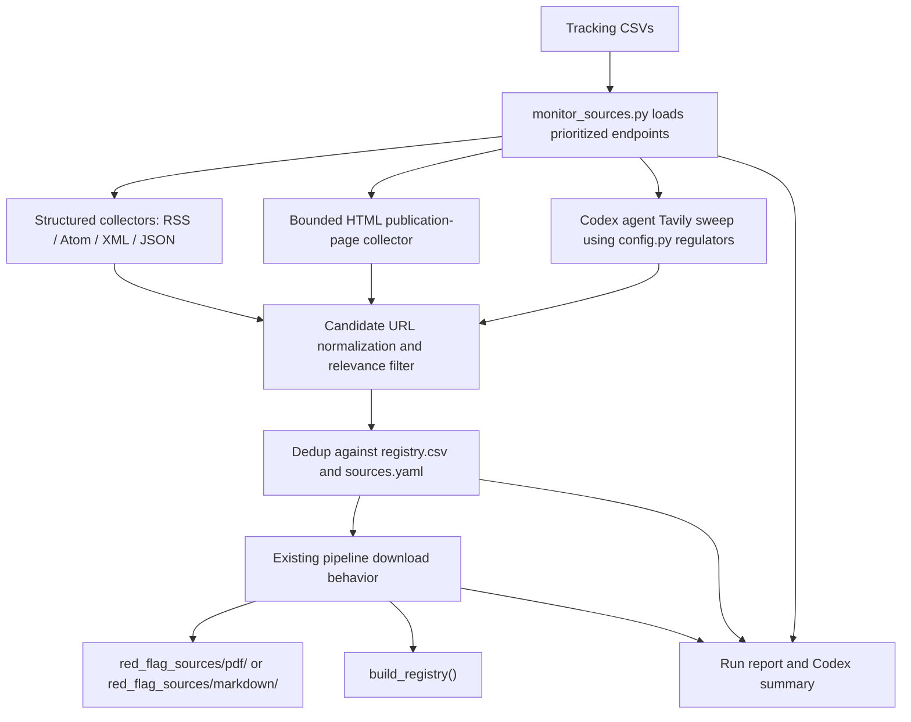

# feat: Add regulatory source monitoring automation

## Overview

Add a download-only source monitoring workflow that checks tracked primary regulatory sources for newly published documents, downloads new PDFs or web pages through the existing source pipeline, updates the source registry, and produces a concise automation summary. The weekly Codex automation should run the workflow every Saturday at 9:00 AM local time, but extraction, LanceDB ingestion, and corpus publication stay outside the automated run.

## Problem Frame

The project has source catalogs, a URL download pipeline, and a unified `red_flag_sources/registry.csv`, but it still relies on manual review of official publication pages to find new AML, sanctions, fraud, terrorist-financing, proliferation-financing, and cyber-enabled financial crime materials. This plan turns the curated source inventory into a recurring discovery-and-download workflow without changing the downstream extraction and ingestion boundary (see origin: `docs/brainstorms/2026-06-06-regulatory-source-monitoring-automation-requirements.md`).

## Requirements Trace

- R1. Use `red_flag_sources/regulatory_souce_automation.md` and corresponding CSV files as the tracking baseline.
- R2. Prioritize Tier 1, then Tier 2, then Tier 3 sources from `red_flag_sources/prioritization_ranking.csv`.
- R3. Monitor official primary-source publication endpoints only.
- R4. Report empty or incomplete tracking CSVs instead of silently ignoring them.
- R5. Check tracked publication endpoints for newly published relevant official documents or pages.
- R6. Treat URLs already present in `red_flag_sources/registry.csv` or `red_flag_sources/sources.yaml` as known.
- R7. Download new PDFs into `red_flag_sources/pdf/` and new web pages into `red_flag_sources/markdown/`.
- R8. Do not overwrite existing files in the normal Saturday run.
- R9. Report endpoints checked, new URLs found, downloads, duplicates, and failures.
- R10. Keep the Saturday run download-only: no extraction, ingestion, corpus rebuild, or hosted publication.
- R11. Produce a concise Codex automation summary.
- R12. Continue checking other endpoints when one endpoint fails.
- R13. Update or regenerate the source registry after successful downloads.
- R14. Run every Saturday at 9:00 AM local time unless changed.
- R15. Support safe manual re-runs without duplicate files or registry rows.
- R16. Use respectful, bounded polling rather than exhaustive scraping.

## Scope Boundaries

- No automatic red flag extraction.
- No LanceDB ingestion or hosted corpus publication.
- No email subscription ingestion, authenticated portals, CAPTCHA bypass, or paywalled sources.
- No third-party news or commentary monitoring.
- No broad web crawling beyond configured official endpoints.
- No replacement of the existing URL download pipeline; the monitor should feed it.
- No treating Tavily search results as authoritative by themselves; they are candidate discovery leads that must resolve to official regulator domains before download.

### Deferred to Separate Tasks

- Extracting downloaded sources into `data/source/*.yaml`: use the existing extraction workflow after review.
- Ingesting extracted YAML into vectors: remains a separate `scripts/ingest.py` step.
- Expanding source coverage beyond the current official inventory: future curation work.

## Context & Research

### Relevant Code and Patterns

- `scripts/harvest_sources.py` already provides `download_single_url()`, `classify_url()`, `fetch_pdf()`, `fetch_web()`, `load_registry()`, `write_registry()`, `next_serial()`, and `USER_AGENT`.
- `fetch_web()` in `scripts/harvest_sources.py` captures non-PDF pages through Jina Reader by prepending `https://r.jina.ai/` to the target URL and writing the returned clean markdown into `red_flag_sources/markdown/`.
- `scripts/pipeline.py` already wraps download behavior, deduplicates against `red_flag_sources/registry.csv`, and calls `build_registry()` after downloads.
- `scripts/build_registry.py` normalizes URLs with `normalize_url()` and regenerates `red_flag_sources/registry.csv` from catalogs, `red_flag_sources/sources.yaml`, and extraction manifests.
- `src/redflag_mcp/config.py` defines the bounded `REGULATORS` vocabulary, `REGULATOR_JURISDICTIONS`, `URL_DOMAIN_TO_REGULATOR`, and `regulator_from_url()`. These give the sweep a controlled regulator list and official-domain validation source.
- `tests/test_harvest_sources.py` and `tests/test_pipeline.py` already cover idempotent downloads, URL classification, failed downloads, and registry updates.
- `AGENTS.md` requires red-green TDD for implementation work.

### Institutional Learnings

- No `docs/solutions/` directory exists in this repo, so there are no local learning documents to carry forward.

### External References

- Official pages confirm that some high-priority endpoints are web pages without obvious public feeds, such as FinCEN's advisories and notices page.
- Official pages also confirm that some high-priority sources expose feed or structured formats, such as Bank of England RSS feeds, Canadian Cyber Centre RSS feeds, CISA KEV CSV/JSON, and OFAC's Sanctions List Service.
- External endpoint details should be verified during implementation because official source pages and feed URLs change over time.

## Key Technical Decisions

- **Normalize CSV inputs before monitoring**: Populate and validate the empty tracking CSVs from `red_flag_sources/regulatory_souce_automation.md` before using them as machine inputs. Reading prose/code fences directly in every run would make the automation brittle.
- **Verify official endpoints while implementing**: Treat endpoint URLs from the markdown note as seeded candidates, not guaranteed-current contracts. The implementation should validate official endpoint availability before enabling scheduled runs.
- **Create a dedicated monitor script**: Add `scripts/monitor_sources.py` for discovery and reporting, while delegating actual downloads to `scripts/pipeline.py` or its importable functions.
- **Prefer structured feeds first**: Use RSS, Atom, XML, JSON, and open-data endpoints when available; fall back to bounded HTML publication-page parsing only for sources without stable feeds.
- **Use Jina Reader for web-page capture**: Non-PDF candidate URLs should be handed to the existing download pipeline so `fetch_web()` captures them through Jina Reader. The monitor should not add a separate HTML-to-markdown capture path.
- **No new dependency by default**: Use existing dependencies (`httpx`, `beautifulsoup4`, `pyyaml`) and Python standard-library XML/CSV/JSON parsing unless implementation proves a feed library is materially simpler.
- **Deduplicate before download**: Compare normalized candidate URLs against both `red_flag_sources/registry.csv` and `red_flag_sources/sources.yaml` before handing candidates to the downloader.
- **Tavily as a backstop, not the source of truth**: Use the available Tavily MCP server to sweep for missed official regulator publications after configured endpoint checks. Accept only results whose domains map to known official regulators through `URL_DOMAIN_TO_REGULATOR` or explicit source-inventory domains.
- **Run artifact plus automation summary**: Produce a concise stdout/log summary for Codex and a durable local run report for auditability.

## Open Questions

### Resolved During Planning

- **Should implementation populate CSVs or read markdown directly?** Populate/normalize the CSV files first, then treat CSVs as machine-readable inputs.
- **Should discovery call the existing pipeline directly?** Yes. The monitor should produce candidate URLs and hand them to existing download behavior rather than reimplementing file naming, PDF/web classification, and registry updates.
- **What should supplement the Codex automation summary?** A small structured run report under `red_flag_sources/monitoring_runs/`, with enough data to audit checked endpoints, candidates, downloads, duplicates, and failures.
- **How should Tavily fit?** The Codex automation should call the Tavily MCP tools as an agent-side discovery sweep, save/hand candidate official URLs to the repo monitor, and let the same dedup/download path process them.

### Deferred to Implementation

- **Exact endpoint parser rules per agency**: Decide per source while adding fixtures, because each official site exposes dates and document links differently.
- **Final run report shape**: Keep the first version compact; adjust fields only as tests and real endpoint responses require.
- **Whether to add a CLI repair mode**: Requirements allow force/repair outside normal automation, but the first implementation can defer it if normal idempotent runs are complete.
- **Exact Tavily query templates**: Tune query wording during implementation against real results, but keep queries bounded to regulator names, official domains, and recent advisory/red-flag terms.

## High-Level Technical Design

> *This illustrates the intended approach and is directional guidance for review, not implementation specification. The implementing agent should treat it as context, not code to reproduce.*

## Implementation Units

- [ ] **Unit 1: Normalize the monitoring source CSVs**

**Goal:** Turn the source automation markdown's CSV blocks into complete machine-readable CSV inputs and add validation that catches empty or malformed files.

**Requirements:** R1, R2, R4

**Dependencies:** None

**Files:**
- Modify: `red_flag_sources/source_inventory.csv`
- Modify: `red_flag_sources/subscription_automation.csv`
- Modify: `red_flag_sources/hidden_sources.csv`
- Create: `tests/test_monitor_sources.py`
- Create: `scripts/monitor_sources.py`

**Approach:**
- Populate `source_inventory.csv` from the `CSV A Source Inventory` block in `red_flag_sources/regulatory_souce_automation.md`.
- Populate `subscription_automation.csv` from the `CSV B Subscription and Automation Endpoints` block, adapting the documented `subscription_automation_endpoints.csv` deliverable name to the existing repo file name.
- Confirm `prioritization_ranking.csv` and `hidden_sources.csv` are non-empty and have the expected headers.
- Add loader/validator behavior in `scripts/monitor_sources.py` that returns setup-gap findings for missing, empty, or malformed files instead of treating them as no-op source lists.
- Mark unverified or `Unspecified` collection endpoints as setup gaps until a planner/implementer confirms an official feed, API, structured file, or bounded publication page.

**Execution note:** Implement the loader validation test-first before editing monitoring behavior.

**Patterns to follow:**
- `scripts/build_registry.py` CSV loading style.
- `tests/test_pipeline.py` fixture pattern for temporary CSV files.

**Test scenarios:**
- Happy path: valid source inventory, subscription automation, and prioritization CSVs load into endpoint records with rank/tier metadata.
- Edge case: empty `source_inventory.csv` produces a setup-gap finding and no silent success.
- Edge case: missing expected headers in `subscription_automation.csv` produces a setup-gap finding.
- Edge case: an organization in `prioritization_ranking.csv` without a matching inventory/subscription row is reported as a setup gap.

**Verification:**
- The monitoring loader can build a prioritized list of endpoint records from the real repo CSV files.
- Empty tracking files cannot pass as a successful no-change run.

---

- [ ] **Unit 2: Add source discovery collectors**

**Goal:** Discover candidate official publication URLs from structured feeds and bounded HTML publication pages.

**Requirements:** R3, R5, R12, R16

**Dependencies:** Unit 1

**Files:**
- Modify: `scripts/monitor_sources.py`
- Modify: `tests/test_monitor_sources.py`

**Approach:**
- Represent collector results with enough fields for downstream filtering and reporting: organization, endpoint URL, candidate URL, title, published date when available, collection method, and source tier.
- Implement a structured collector for RSS/Atom/XML/JSON/open-data endpoints using `httpx` and standard parsers.
- Implement a bounded HTML collector for official publication pages using `beautifulsoup4`, limited to same-domain or explicitly configured official links.
- Treat `Unspecified` endpoints as setup gaps unless the inventory's publication page can be checked by bounded HTML parsing.
- Add lightweight endpoint verification behavior that records whether the configured official endpoint responded successfully before candidate parsing.
- Continue after per-endpoint HTTP errors, timeouts, parse failures, or unsupported feed formats.

**Execution note:** Start with fixture-driven tests for one structured feed, one JSON/open-data response, one HTML publication page, and one failure.

**Patterns to follow:**
- `harvest_sources.head_is_pdf()` failure behavior: return/report failure without crashing the whole run.
- Existing `httpx.Client(headers={"User-Agent": USER_AGENT})` pattern from `harvest_sources.py`.

**Test scenarios:**
- Happy path: RSS feed with two item links returns two candidate URLs with titles and dates.
- Happy path: JSON/open-data response with a document/download URL returns candidate URLs.
- Happy path: HTML page with official PDF and article links returns bounded same-domain candidates.
- Edge case: HTML page with third-party links excludes those links unless explicitly configured as official.
- Error path: one endpoint times out and is recorded as failed while the next endpoint still runs.
- Error path: an endpoint URL that no longer resolves is reported as a verification failure, not as a no-change source.
- Error path: malformed XML/JSON records a parse failure without raising out of the whole job.

**Verification:**
- Discovery can run against fixtures without network access.
- Collector failures are visible in results but do not prevent other endpoints from being checked.

---

- [ ] **Unit 3: Add Tavily candidate-sweep support**

**Goal:** Add a backstop path for the Codex automation to use Tavily MCP search results to catch official regulator publications missed by configured endpoints.

**Requirements:** R3, R5, R6, R9, R12, R16

**Dependencies:** Unit 2

**Files:**
- Modify: `scripts/monitor_sources.py`
- Modify: `tests/test_monitor_sources.py`
- Modify: `docs/plans/2026-06-06-002-feat-source-monitoring-automation-plan.md` only if implementation discovers a planning correction

**Approach:**
- Add a candidate-import path that accepts Tavily-produced results as data, not as trusted downloads.
- Generate or document query inputs from `src/redflag_mcp/config.py` `REGULATORS`, with jurisdiction/context from `REGULATOR_JURISDICTIONS` when useful.
- Validate every Tavily candidate URL against known official domains from `URL_DOMAIN_TO_REGULATOR` and domains present in the source inventory before it can enter the dedup/download queue.
- Treat Tavily results from non-official domains as rejected leads and include rejection counts in the run report.
- Keep Tavily usage in the Codex automation prompt or agent workflow. The repo script should not depend on direct MCP tool access at runtime.
- Prefer recent-result sweeps for weekly automation, while allowing manual broader sweeps when a maintainer is backfilling missed sources.

**Execution note:** Start with tests for official-domain acceptance and third-party-domain rejection before adding automation prompt details.

**Patterns to follow:**
- `src/redflag_mcp/config.py` regulator and URL-domain mapping helpers.
- Existing candidate deduplication from the monitor and `pipeline.load_registry_source_urls()`.

**Test scenarios:**
- Happy path: Tavily result from a domain in `URL_DOMAIN_TO_REGULATOR` becomes a candidate URL.
- Happy path: Tavily result from a configured source-inventory publication domain becomes a candidate URL even if it is not yet in `URL_DOMAIN_TO_REGULATOR`.
- Edge case: Tavily result from a news, blog, law-firm, vendor, or repost domain is rejected.
- Edge case: Tavily returns the same official URL as an endpoint collector and the URL is deduplicated.
- Error path: malformed Tavily result data is recorded as rejected without failing the whole monitor run.
- Integration: accepted Tavily candidates flow through the same dedup/download path as RSS/HTML candidates.

**Verification:**
- Tavily sweep output cannot bypass official-domain validation.
- Accepted Tavily candidates are visible in the run report as a distinct discovery method.

---

- [ ] **Unit 4: Filter, deduplicate, and download candidates**

**Goal:** Convert discovered candidates into a deduplicated URL set and download only new sources through the existing pipeline.

**Requirements:** R6, R7, R8, R10, R13, R15

**Dependencies:** Unit 3

**Files:**
- Modify: `scripts/monitor_sources.py`
- Modify: `tests/test_monitor_sources.py`
- Modify: `tests/test_pipeline.py` if small pipeline API adjustments are needed for reuse

**Approach:**
- Normalize candidate URLs with the same normalization strategy used by `scripts/build_registry.py`.
- Load known URLs from `red_flag_sources/registry.csv` and `red_flag_sources/sources.yaml`.
- Apply a conservative relevance filter using source metadata and candidate title/link text. When uncertain, prefer downloading official publication pages from tracked high-priority endpoints rather than using LLM classification.
- Pass new URLs to existing `pipeline.download_sources()` through a temporary URL file or a small importable helper, choosing the least invasive reuse path during implementation.
- Rely on existing `harvest_sources.fetch_web()` behavior for non-PDF URLs so regulator web pages are captured as Jina Reader markdown in `red_flag_sources/markdown/`.
- Preserve normal no-overwrite behavior by avoiding `force` in the scheduled path.
- Regenerate `registry.csv` after successful downloads through existing pipeline behavior.

**Execution note:** Add failing tests for deduplication before wiring downloads.

**Patterns to follow:**
- `pipeline.load_registry_source_urls()` for registry deduplication.
- `pipeline.download_sources()` for download behavior and registry rebuilds.
- `harvest_sources.download_single_url()` for file placement and PDF/web classification.

**Test scenarios:**
- Happy path: one new PDF candidate is downloaded through the pipeline and appears in the downloaded result.
- Happy path: one new web-page candidate is saved as markdown through the pipeline.
- Edge case: candidate URL already in `registry.csv` is skipped before any download call.
- Edge case: candidate URL already in `sources.yaml` but not yet in `registry.csv` is skipped before any download call.
- Edge case: two discovered candidates normalize to the same URL and only one download is attempted.
- Error path: one candidate download fails and a later candidate still downloads.
- Error path: Jina Reader returns empty or incorrect markdown; the failed/low-quality capture is surfaced for maintainer inspection rather than sent to extraction.
- Integration: after successful downloads, `build_registry()` is invoked through the existing pipeline path.

**Verification:**
- Running the monitor twice against the same fixture set produces downloads only on the first run.
- New files land in `red_flag_sources/pdf/` or `red_flag_sources/markdown/` through existing pipeline logic.

---

- [ ] **Unit 5: Add CLI, summary, and run reports**

**Goal:** Provide a maintainer-friendly command for scheduled and manual runs with concise output plus durable audit details.

**Requirements:** R9, R11, R12, R14, R15, R16

**Dependencies:** Unit 4

**Files:**
- Modify: `scripts/monitor_sources.py`
- Modify: `tests/test_monitor_sources.py`
- Create: `red_flag_sources/monitoring_runs/.gitkeep`
- Modify: `.gitignore` if run reports should be ignored rather than tracked

**Approach:**
- Add a CLI entry point that runs discovery and download by default.
- Support practical bounded-run options such as tier selection and dry-run mode if they keep the scheduled path simple.
- Print a concise summary with endpoints checked, setup gaps, candidates found, duplicates skipped, downloads completed, and failures.
- Include Tavily candidate counts in the summary when a Tavily sweep was provided: accepted official leads, rejected non-official leads, duplicates, and downloaded leads.
- Write a structured run report under `red_flag_sources/monitoring_runs/` for auditability.
- Ensure stdout/stderr behavior is safe for normal script execution. This script is not the MCP stdio server, but it should still use logging consistently rather than ad hoc `print()` calls.

**Execution note:** Test summary/report behavior before adding CLI polish.

**Patterns to follow:**
- `scripts/pipeline.py` argparse style.
- Logging-only constraint from `AGENTS.md`.

**Test scenarios:**
- Happy path: CLI run with fixture endpoints logs a summary containing checked, candidate, duplicate, download, and failure counts.
- Happy path: dry run discovers and deduplicates candidates without calling the downloader.
- Edge case: setup gaps are included in the summary and run report.
- Edge case: Tavily accepted/rejected candidate counts are included when the sweep runs.
- Error path: failed endpoints and failed downloads are recorded separately.
- Integration: run report contains enough endpoint and candidate detail to audit what happened without reading logs.

**Verification:**
- A maintainer can run one command and see whether the monitoring pass downloaded anything or needs attention.
- The run report captures the same facts summarized in the automation result.

---

- [ ] **Unit 6: Configure the Codex Saturday automation**

**Goal:** Create the recurring Codex automation that runs the download-only monitor every Saturday at 9:00 AM local time.

**Requirements:** R10, R11, R14, R15

**Dependencies:** Unit 5

**Files:**
- Test expectation: none -- this is app-level automation configuration, not repo code.

**Approach:**
- Configure a Codex automation named for regulatory source monitoring.
- Set the automation prompt to run the monitor in download-only mode, use the available Tavily MCP server for a bounded sweep across regulators listed in `src/redflag_mcp/config.py`, summarize results, and avoid extraction or ingestion.
- Instruct the automation to pass only official-domain Tavily candidates into the monitor's candidate-import path.
- Use the repo workspace as the automation target.
- Keep the automation active only after the monitor command is verified locally.

**Patterns to follow:**
- Codex app automation semantics: recurring workspace job with the task prompt self-contained and schedule configured outside repo code.

**Test scenarios:**
- Test expectation: none -- verify through automation configuration review and one manual/local command run before enabling.

**Verification:**
- The automation exists, is active, targets this repo, and is scheduled for Saturday 9:00 AM local time.
- The automation prompt clearly states download-only behavior, excludes extraction/ingestion, and constrains Tavily results to official regulator domains.

## System-Wide Impact

- **Interaction graph:** New monitor script reads source tracking CSVs, fetches official endpoints, optionally imports Tavily candidate leads from the Codex automation, passes candidate URLs to existing pipeline download behavior, and relies on `build_registry()` to refresh `registry.csv`.
- **Error propagation:** Endpoint and candidate failures should be collected into the run result; only unrecoverable setup failures should make the run fail.
- **State lifecycle risks:** Partial runs may download some files and fail later. This is acceptable because existing registry/source deduplication makes re-runs safe.
- **API surface parity:** Existing MCP tools and extraction/ingestion scripts should not change.
- **Integration coverage:** Tests should prove monitor-to-pipeline handoff without live network calls by patching collectors and downloader boundaries.
- **Unchanged invariants:** `scripts/pipeline.py run` remains the full download+extract flow; the new scheduled monitor uses download-only behavior.

## Risks & Dependencies

| Risk | Mitigation |
|------|------------|
| Official endpoints change HTML or feed structure | Keep collector logic fixture-driven, report parse failures, and isolate per-source parser assumptions. |
| Empty or stale source CSVs make the job appear successful while checking nothing | Validate CSV inputs and surface setup gaps as first-class run results. |
| Automation accidentally extracts or ingests | Keep scheduled prompt and monitor command download-only; do not call extraction or ingestion functions from the monitor. |
| Duplicate local files after partial failures | Deduplicate against both `registry.csv` and `sources.yaml`, and reuse existing pipeline idempotency. |
| Broad HTML scraping causes noisy or disrespectful polling | Restrict HTML parsing to configured official publication pages and bounded same-domain links. |
| Tavily returns secondary-source or SEO results | Validate candidate domains against `URL_DOMAIN_TO_REGULATOR` and source-inventory official domains before download. |
| New dependency adds maintenance cost | Prefer existing dependencies and stdlib parsers unless implementation demonstrates a clear need. |

## Documentation / Operational Notes

- Update `red_flag_sources/regulatory_souce_automation.md` only if CSV file names or source-maintenance instructions need correction.
- Add a short README or section in an existing repo doc only if the monitor command is not self-explanatory from CLI help.
- Document or preserve the existing Jina Reader convention: non-PDF URLs are captured through `https://r.jina.ai/<url>` by `fetch_web()`, unauthenticated by default, and should be inspected before extraction if the markdown looks empty, blocked, paywalled, or client-side rendered.
- Document the Tavily sweep as a Codex automation backstop: it searches for missed official regulator publications but does not authorize downloads from unofficial domains.
- The run report directory should be treated as operational output; implementation should decide whether reports are tracked or ignored.
- The scheduled automation should not be enabled until the monitor passes tests and one manual fixture/local run.

## Sources & References

- **Origin document:** [docs/brainstorms/2026-06-06-regulatory-source-monitoring-automation-requirements.md](../brainstorms/2026-06-06-regulatory-source-monitoring-automation-requirements.md)
- Related plan: [docs/plans/2026-05-17-002-feat-url-pipeline-plan.md](2026-05-17-002-feat-url-pipeline-plan.md)
- Related code: `scripts/harvest_sources.py`
- Related code: `scripts/pipeline.py`
- Related code: `scripts/build_registry.py`
- Related tests: `tests/test_harvest_sources.py`
- Related tests: `tests/test_pipeline.py`
- Official source reference: `red_flag_sources/regulatory_souce_automation.md`
- Official source reference: `red_flag_sources/prioritization_ranking.csv`
- External official reference: FinCEN advisories and notices page, `https://www.fincen.gov/resources/advisoriesbulletinsfact-sheets`
- External official reference: OFAC Sanctions List Service, `https://ofac.treasury.gov/sanctions-list-service`
- External official reference: Bank of England RSS feeds, `https://www.bankofengland.co.uk/rss`
- External official reference: Canadian Cyber Centre alerts and advisories, `https://www.cyber.gc.ca/en/alerts-advisories`
- External official reference: CISA Known Exploited Vulnerabilities Catalog, `https://www.cisa.gov/known-exploited-vulnerabilities-catalog`
