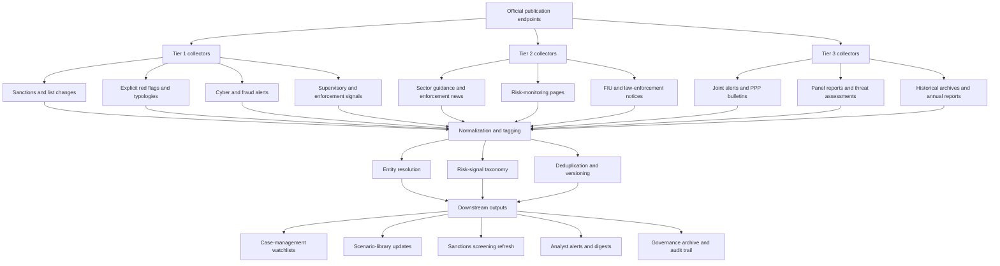

# Global Monitoring Catalog for Financial Crime Red Flags and Regulatory Signals

## Executive Summary

A practical monitoring system for regulatory red flags should be built around **publication endpoints**, not only institutions. The highest-signal endpoints are exact advisory libraries, sanctions update hubs, warning lists, supervisory-letter repositories, cyber alert centers, sanctions data files, and FIU notice pages. In the materials reviewed, the most operationally useful pages were those that publish explicit indicators or near-real-time updates: the FCA Warning List and alert sign-ups, OFSI sanctions pages, NCA SAR resources and NECC Red/Amber alerts, PRA supervisory letters, MAS news and enforcement pages, AUSTRAC and FINTRAC typology-style resources, SEC Risk Alerts, DOJ Fraud and money-laundering releases, IC3 and major national cyber centers, EBA AML/CFT guidance, the EU financial sanctions dataset, the UN consolidated sanctions list, Europol publications, JFIU Hong Kong notices, and FIU-IND notices. citeturn40search2turn40search10turn40search3turn40search1turn40search8turn31search15turn31search4turn30search0turn30search8turn5search0turn5search1turn11view3turn29search8turn29search6turn21view1turn34search14turn35search0turn36view1turn16search5turn16search0turn17search0turn18search16turn39search22turn34search9turn42view2turn42view0

The strongest Tier 1 sources do one of three things exceptionally well. They either publish **explicit red flags and typologies** for AML, fraud, TF, corruption, sanctions evasion, and cyber-enabled crime; they publish **sanctions/list changes** that must be operationalized quickly; or they translate examinations, intelligence, or public-private operations into **control expectations** that compliance teams can map into monitoring rules. Examples include FCA’s Warning List and newsletter hub, the PRA’s trade-finance and ML/TF letters, SEC AML examination observations, NCA/NECC sector alerts, EBA risk-factor guidance, IC3 alerts, and cyber-center advisories and feeds in the UK, Canada, and Australia. citeturn40search2turn40search10turn31search15turn31search4turn12view2turn40search8turn40search12turn16search0turn21view1turn20view3turn34search14turn35search0turn36view1

Machine-readable collection is uneven. Confirmed RSS or subscription endpoints were found for sources such as FCA, Bank of England, OCC, Federal Reserve, SEC, DOJ, NCSC, the Canadian Cyber Centre, and AUSTRAC media releases. Confirmed email subscriptions were found for OFSI, FCA, Bank of England, MAS, SEC, FDIC, DOJ, ACSC, and CISA. Open-data or machine-readable sanctions/data assets were confirmed for OFAC’s sanctions list service and the EU financial sanctions dataset. Many other high-value sources still require HTML change detection or email ingestion rather than true APIs. citeturn3view1turn40search10turn33view1turn32view2turn9view0turn9view1turn9view2turn9view3turn12view0turn12view1turn28view0turn28view1turn37view0turn37view1turn38view0turn38view1turn3view0turn37view4turn20view0turn30search0turn17search0

The CSVs below are normalized for production use. In the source inventory, **No** means a public RSS/email/API endpoint was not located in this review. In the automation table, **Unspecified** means the organization likely offers an update mechanism or machine-readable access, but a stable public endpoint was not clearly listed on the reviewed official page.

## Monitoring Architecture

In practice, the strongest “hidden” red-flag sources are often **not** generic newsrooms. They are supervisory letters, public-private partnership bulletins, sectoral alerts, committee list changes, and expert reports. The PRA trade-finance letter explicitly states that certain conduct can indicate “fraudulent activity, collusion or money laundering.” The PRA’s 2019 ML/TF letter links AML risk to prudential supervision. The SEC’s broker-dealer AML risk alert turns examination findings into concrete control weaknesses. NCA/NECC Amber and Red Alerts publish sector-specific sanctions-evasion and laundering typologies. NCSC and peer cyber advisories translate threat activity into operational indicators. UN sanctions committee press releases and panel reports often surface evasion techniques before domestic agencies repackage them. citeturn31search15turn31search4turn12view2turn40search8turn40search12turn34search14turn18search3turn18search2

The architecture below is designed for a compliance-grade collection pipeline. Tier 1 should be treated as mandatory, near-real-time monitoring. Tier 2 should be polled daily and diffed aggressively. Tier 3 should be maintained as a specialist layer for typologies, sectoral red flags, and emerging-risk intelligence that often drives rule updates, scenario design, analyst training, and periodic horizon scans. This tiering is reflected in the ranking CSV. citeturn40search2turn40search3turn11view3turn29search8turn21view1turn35search0turn16search0turn17search0turn18search16



## CSV A Source Inventory

The primary dataset below is the operational inventory. It is CSV-ready UTF-8 text. Save it as `source_inventory.csv`.

```csv
"Organization","Jurisdiction","Link","Publication Page","Publication Types","Update Frequency","RSS Available (Yes/No)","Email Subscription Available (Yes/No)","API Available (Yes/No)","Historical Archive (Yes/No)","Relevant Categories","Monitoring Priority"
"FinCEN","United States","https://www.fincen.gov","https://www.fincen.gov/resources/advisoriesbulletinsfact-sheets","Advisory; Bulletin; Fact Sheet","Ad hoc","No","No","No","Yes","AML; Terrorist Financing; Human Trafficking; Corruption; Trade-Based Money Laundering; Virtual Assets","High"
"FinCEN","United States","https://www.fincen.gov","https://www.fincen.gov/resources/financial-trend-analysis","Financial Trend Analysis; Typology; Emerging Risk Report","Ad hoc","No","No","No","Yes","AML; Fraud; Terrorist Financing; Cyber-enabled Financial Crime; Typologies","High"
"OFAC","United States","https://ofac.treasury.gov","https://ofac.treasury.gov/recent-actions","Sanctions Action Notice; List Update; General License Notice","Daily / Ad hoc","No","No","No","Yes","Sanctions; Sanctions Evasion; Proliferation Financing; National Security","High"
"OFAC","United States","https://ofac.treasury.gov","https://ofac.treasury.gov/sanctions-list-service","Sanctions Data Service; Structured List Files","Daily","No","No","Yes","Yes","Sanctions; Screening; Sanctions Evasion; Proliferation Financing","High"
"FATF","Global","https://www.fatf-gafi.org","https://www.fatf-gafi.org/en/publications.html","Report; Guidance; Typology; Best Practice; Threat Assessment","Ad hoc","No","No","No","Yes","AML; Terrorist Financing; Proliferation Financing; Virtual Assets; Beneficial Ownership","High"
"FATF","Global","https://www.fatf-gafi.org","https://www.fatf-gafi.org/en/publications/High-risk-and-other-monitored-jurisdictions.html","Jurisdiction Notice; Strategic Deficiency Update","Triannual / Ad hoc","No","No","No","Yes","AML; Terrorist Financing; Sanctions; Country Risk","High"
"FATF","Global","https://www.fatf-gafi.org","https://www.fatf-gafi.org/en/publications/Mutualevaluations.html","Mutual Evaluation; Follow-up Report","Ad hoc","No","No","No","Yes","AML; Terrorist Financing; Country Risk; Supervisory Effectiveness","Medium"
"NCA","United Kingdom","https://www.nationalcrimeagency.gov.uk","https://www.nationalcrimeagency.gov.uk/what-we-do/crime-threats/money-laundering-and-illicit-finance/suspicious-activity-reports","SAR Guidance; Annual Reporting; Operational Resource","Ad hoc / Annual","No","No","No","Yes","AML; Terrorist Financing; UKFIU; Operational Intelligence","High"
"NCA / NECC","United Kingdom","https://www.nationalcrimeagency.gov.uk","https://www.nationalcrimeagency.gov.uk/who-we-are/publications/679-necc-red-alert-gold-sanctions-circumvention/file","Red Alert; Joint Advisory; Typology","Ad hoc","No","No","No","Yes","Sanctions Evasion; Money Laundering; Trade-Based Risk; Precious Metals","High"
"NCA / NECC","United Kingdom","https://www.nationalcrimeagency.gov.uk","https://www.nationalcrimeagency.gov.uk/who-we-are/publications/692-0735-necc-amber-alert-sanctions-evasion-money-laundering-in-the-art-sec/file","Amber Alert; Joint Advisory; Typology","Ad hoc","No","No","No","Yes","Sanctions Evasion; Money Laundering; Art Market; High-Value Goods","High"
"OFSI","United Kingdom","https://www.gov.uk/government/organisations/office-of-financial-sanctions-implementation","https://www.gov.uk/government/organisations/office-of-financial-sanctions-implementation","Sanctions Guidance; Enforcement Notice; Policy Paper; Collection","Ad hoc","No","Yes","No","Yes","Sanctions; Sanctions Evasion; Enforcement","High"
"FCA","United Kingdom","https://www.fca.org.uk","https://www.fca.org.uk/news","News; Press Release; Warning; Market Advisory","Daily / Ad hoc","Yes","Yes","No","Yes","Fraud; Consumer Protection; AML; Crypto; Enforcement","High"
"FCA","United Kingdom","https://www.fca.org.uk","https://www.fca.org.uk/consumers/warning-list-unauthorised-firms","Warning Notice; Scam Alert; Unauthorized Firm Listing","Daily","No","Yes","No","Yes","Fraud; Clone Firms; Unauthorized Activity; Consumer Harm","High"
"PRA","United Kingdom","https://www.bankofengland.co.uk/prudential-regulation","https://www.bankofengland.co.uk/news/prudential-regulation","Prudential Publication; Letter; Statement; Supervisory Update","Ad hoc","Yes","Yes","No","Yes","AML; Prudential Risk; Governance; Crypto; Financial Crime Controls","Medium"
"PRA / FCA","United Kingdom","https://www.bankofengland.co.uk/prudential-regulation","https://www.bankofengland.co.uk/-/media/boe/files/prudential-regulation/letter/2021/september/trade-finance-activity-letter.pdf","Dear CEO Letter; Supervisory Letter; Red Flags","Ad hoc","Yes","Yes","No","Yes","Trade-Based Money Laundering; Fraud; Sanctions Evasion; Trade Finance","High"
"PRA","United Kingdom","https://www.bankofengland.co.uk/prudential-regulation","https://www.bankofengland.co.uk/-/media/boe/files/letter/2019/money-laundering-terrorist-financing-risks-in-prudential-supervision.pdf","Dear CEO Letter; Supervisory Expectation","Ad hoc","Yes","Yes","No","Yes","AML; Terrorist Financing; Prudential Risk","Medium"
"MAS","Singapore","https://www.mas.gov.sg","https://www.mas.gov.sg/news","News; Media Release; Regulatory Update","Ad hoc","No","Yes","No","Yes","AML; Fraud; Crypto; Enforcement; Conduct Risk","High"
"MAS","Singapore","https://www.mas.gov.sg","https://www.mas.gov.sg/regulation/enforcement/enforcement-actions","Enforcement Action; Prohibition Order; Regulatory Sanction","Ad hoc","No","Yes","No","Yes","AML; Fraud; Corruption; Market Abuse; Crypto","High"
"MAS","Singapore","https://www.mas.gov.sg","https://www.mas.gov.sg/regulation/regulations-and-guidance?content_type=Notifications","Notification; Regulation; Guidance","Ad hoc","No","Yes","No","Yes","AML; Sanctions; Fraud; Virtual Assets; Payment Services","High"
"AUSTRAC","Australia","https://www.austrac.gov.au","https://www.austrac.gov.au/news-and-media/media-release","Media Release; Enforcement and Risk Update","Ad hoc","Yes","No","No","Yes","AML; Terrorist Financing; Fraud; Crypto; Enforcement","Medium"
"AUSTRAC","Australia","https://www.austrac.gov.au","https://www.austrac.gov.au/business/core-guidance-and-resources","Guidance; Core Resource; Financial Crime Guidance","Ad hoc","No","No","No","Yes","AML; Terrorist Financing; Proliferation Financing; Crypto; Risk-Based Approach","High"
"FINTRAC","Canada","https://fintrac-canafe.canada.ca","https://fintrac-canafe.canada.ca/intel/operation/operation-eng","Operational Alert; Strategic Alert","Ad hoc","No","No","No","Yes","AML; Terrorist Financing; Human Trafficking; Fentanyl; Sanctions Evasion","High"
"FINTRAC","Canada","https://fintrac-canafe.canada.ca","https://fintrac-canafe.canada.ca/intel/sb-rs-eng","Special Bulletin; Emerging Risk Notice","Ad hoc","No","No","No","Yes","AML; Terrorist Financing; Human Trafficking; Virtual Assets; Sanctions Evasion","High"
"FINTRAC","Canada","https://fintrac-canafe.canada.ca","https://fintrac-canafe.canada.ca/intel/strategic-eng","Strategic Intelligence; Assessment; Trend Report","Ad hoc","No","No","No","Yes","AML; Terrorist Financing; Fraud; Typologies","Medium"
"OCC","United States","https://www.occ.treas.gov","https://www.occ.treas.gov/news-issuances/bulletins/index-bulletins.html","Bulletin; Supervisory Issuance","Ad hoc","Yes","No","No","Yes","AML; Fraud; Operational Risk; Third-Party Risk; Crypto","Medium"
"OCC","United States","https://www.occ.treas.gov","https://www.occ.treas.gov/publications-and-resources/publications/semiannual-risk-perspective/index-semiannual-risk-perspective.html","Risk Perspective; Trend Report","Semiannual","Yes","No","No","Yes","AML; Fraud; Operational Risk; Payments Risk; Cyber-enabled Financial Crime","Medium"
"Federal Reserve","United States","https://www.federalreserve.gov","https://www.federalreserve.gov/supervisionreg/srletters/srletters.htm","SR Letter; Supervisory Guidance","Ad hoc","Yes","Yes","No","Yes","AML; Sanctions; Fraud; Operational Risk; Governance","Medium"
"FDIC","United States","https://www.fdic.gov","https://www.fdic.gov/news/financial-institution-letters","Financial Institution Letter; Supervisory Guidance","Ad hoc","No","Yes","No","Yes","AML; Fraud; Cyber; Third-Party Risk; Consumer Harm","Medium"
"SEC","United States","https://www.sec.gov","https://www.sec.gov/newsroom/press-releases","Press Release; Enforcement Highlight","Daily / Ad hoc","Yes","Yes","No","Yes","Fraud; Market Abuse; Crypto; Corruption; Insider Trading","Medium"
"SEC","United States","https://www.sec.gov","https://www.sec.gov/compliance/risk-alerts","Risk Alert; Exam Observation; Control Weakness Notice","Ad hoc","No","Yes","No","Yes","AML; Fraud; Crypto; Market Abuse; Compliance Controls","High"
"CFTC","United States","https://www.cftc.gov","https://www.cftc.gov/LearnAndProtect/AdvisoriesAndArticles/CFTCFraudAdvisories/index.htm","Customer Advisory; Fraud Warning; Educational Alert","Ad hoc","No","No","No","Yes","Fraud; Crypto Abuse; Romance Scam; Commodity Fraud","High"
"CFTC","United States","https://www.cftc.gov","https://www.cftc.gov/PressRoom/PressReleases","Press Release; Enforcement Update","Daily / Ad hoc","Yes","Yes","No","Yes","Fraud; Market Abuse; Crypto; Insider Trading","Medium"
"DOJ Criminal Division","United States","https://www.justice.gov/criminal","https://www.justice.gov/criminal/press-room","Press Release; Policy Update","Daily / Ad hoc","Yes","Yes","No","Yes","Fraud; Corruption; AML; Sanctions; National Security","High"
"DOJ Fraud Section","United States","https://www.justice.gov/criminal","https://www.justice.gov/criminal/fraud-section-news","Press Release; Fraud Section News","Daily / Ad hoc","Yes","Yes","No","Yes","Fraud; Corruption; FCPA; Market Manipulation; Investment Fraud","High"
"DOJ MNF","United States","https://www.justice.gov/criminal","https://www.justice.gov/criminal/money-laundering-narcotics-and-forfeiture-section-mnf-news","Press Release; Money Laundering News","Daily / Ad hoc","Yes","Yes","No","Yes","AML; Sanctions; Asset Forfeiture; Cartel Laundering; Shell Companies","High"
"DOJ NSD","United States","https://www.justice.gov/nsd","https://www.justice.gov/nsd/nsd-news","Press Release; National Security News","Daily / Ad hoc","Yes","Yes","No","Yes","Sanctions Evasion; Export Controls; Terrorist Financing; Proliferation Financing","High"
"FBI","United States","https://www.fbi.gov","https://www.fbi.gov/how-we-can-help-you/scams-and-safety","Guidance; Scam Warning; Public Safety Alert","Ad hoc","No","No","No","Yes","Fraud; Business Email Compromise; Romance Scam; Elder Fraud; Crypto Abuse","High"
"FBI","United States","https://www.fbi.gov","https://www.fbi.gov/investigate/white-collar-crime/news","Press Release; White-Collar Crime News","Daily / Ad hoc","Yes","Yes","No","Yes","Fraud; Money Laundering; Public Corruption; Securities Fraud","Medium"
"IC3","United States","https://www.ic3.gov","https://www.ic3.gov/PSA","Public Service Announcement; Scam Alert","Ad hoc","No","No","No","Yes","Fraud; Cyber-enabled Financial Crime; Cryptocurrency Fraud; Cargo Theft","High"
"IC3","United States","https://www.ic3.gov","https://www.ic3.gov/CSA/2025","Industry Alert; Joint Cyber Alert","Ad hoc","No","No","No","Yes","Cybercrime; Fraud; Ransomware; Credential Theft; Crypto Fraud Infrastructure","High"
"IC3","United States","https://www.ic3.gov","https://www.ic3.gov/annualreport/reports","Annual Report; Trend Report","Annual","No","No","No","Yes","Cybercrime; Fraud; Cryptocurrency Abuse; BEC; Romance Scam","Medium"
"CISA","United States","https://www.cisa.gov","https://www.cisa.gov/news-events/cybersecurity-advisories","Cybersecurity Advisory; Joint Alert","Daily / Ad hoc","No","Yes","No","Yes","Cyber-enabled Financial Crime; Ransomware; Credential Theft; Critical Infrastructure","High"
"CISA","United States","https://www.cisa.gov","https://www.cisa.gov/news-events/ics-advisories","ICS Advisory; Vulnerability Alert","Daily / Ad hoc","No","Yes","No","Yes","Cyber; Operational Technology; Ransomware; Supply Chain","Medium"
"CISA","United States","https://www.cisa.gov","https://www.cisa.gov/known-exploited-vulnerabilities-catalog","Vulnerability Catalog; Structured Threat Feed","Daily","No","Yes","Yes","Yes","Cyber-enabled Financial Crime; Ransomware; Intrusion Risk","High"
"NCSC","United Kingdom","https://www.ncsc.gov.uk","https://www.ncsc.gov.uk/section/keep-up-to-date/reports-advisories","Advisory; Report; Response Note","Ad hoc","Yes","No","No","Yes","Cyber-enabled Financial Crime; Ransomware; Phishing; National Security","High"
"NCSC","United Kingdom","https://www.ncsc.gov.uk","https://www.ncsc.gov.uk/section/keep-up-to-date/threat-reports","Threat Report; Assessment","Ad hoc","Yes","No","No","Yes","Cyber-enabled Financial Crime; State Threat; Supply Chain Risk","Medium"
"Canadian Centre for Cyber Security","Canada","https://www.cyber.gc.ca/en","https://www.cyber.gc.ca/en/alerts-advisories","Alert; Advisory; Control System Advisory","Daily / Ad hoc","Yes","No","No","Yes","Cyber-enabled Financial Crime; Ransomware; Critical Infrastructure; Fraud Enablement","High"
"ACSC","Australia","https://www.cyber.gov.au","https://www.cyber.gov.au/about-us/view-all-content/alerts-and-advisories","Alert; Advisory","Daily / Ad hoc","No","Yes","No","Yes","Cyber-enabled Financial Crime; Info Stealers; Ransomware; BEC","High"
"ESMA","European Union","https://www.esma.europa.eu","https://www.esma.europa.eu/esmas-activities/risk-analysis/risk-monitoring","Risk Monitoring; Market Risk Analysis","Monthly / Quarterly / Ad hoc","No","No","No","Yes","Market Abuse; Crypto; Securities Risk; Systemic Risk","Medium"
"EBA","European Union","https://www.eba.europa.eu","https://www.eba.europa.eu/regulation-and-policy/anti-money-laundering-and-countering-financing-terrorism","Newsletter; Factsheet; AML/CFT Publication","Ad hoc","No","No","No","Yes","AML; Terrorist Financing; EU Regulatory Risk; Supervisory Convergence","High"
"EBA","European Union","https://www.eba.europa.eu","https://www.eba.europa.eu/legacy/regulation-and-policy/regulatory-activities/anti-money-laundering-and-countering-financing-1","Guideline; Risk Factor Guidance","Ad hoc","No","No","No","Yes","AML; Terrorist Financing; Beneficial Ownership; NPO Risk","High"
"EEAS / European Union","European Union","https://www.eeas.europa.eu","https://www.eeas.europa.eu/eeas/european-union-sanctions_en","Sanctions Guidance; Regime Update; Reference Page","Ad hoc","No","No","No","Yes","Sanctions; Sanctions Evasion; Country Risk","High"
"European Union Open Data","European Union","https://data.europa.eu","https://data.europa.eu/data/datasets/consolidated-list-of-persons-groups-and-entities-subject-to-eu-financial-sanctions?locale=en","Open Data; XML / Data Catalog","Daily / Ad hoc","No","No","Yes","Yes","Sanctions; Screening; Sanctions Evasion","High"
"United Nations Security Council","Global","https://main.un.org/securitycouncil/en","https://main.un.org/securitycouncil/en/content/un-sc-consolidated-list","Consolidated Sanctions List; List Update","Ad hoc","No","No","No","Yes","Sanctions; Terrorist Financing; Proliferation Financing","High"
"Europol","European Union","https://www.europol.europa.eu","https://www.europol.europa.eu/publications-events/publications","Publication; Report; Early Warning Notification","Ad hoc","No","Yes","No","Yes","Fraud; Money Laundering; Corruption; Crypto; Cyber-enabled Financial Crime","Medium"
"Europol EFECC","European Union","https://www.europol.europa.eu","https://www.europol.europa.eu/about-europol/european-financial-and-economic-crime-centre-efecc","Center Page; Operational / Strategic Resource","Ad hoc","No","Yes","No","Yes","Fraud; AML; Crypto; Corruption; Asset Recovery","Medium"
"JFIU","Hong Kong","https://www.jfiu.gov.hk","https://www.jfiu.gov.hk/en/index.html","Notice; Fraud Warning; STR System Update","Ad hoc","No","No","No","No","AML; Fraud; Structured Reporting; Hong Kong FIU Signals","Medium"
"Securities and Futures Commission","Hong Kong","https://www.sfc.hk","https://www.sfc.hk/en/alert-list","Alert List; Warning Notice","Ad hoc","No","No","No","Yes","Fraud; Unauthorized Firms; Investor Protection","Medium"
"FIU-IND","India","https://fiuindia.gov.in","https://fiuindia.gov.in/","What's New; Notice; Compliance Order; Sanctions Reference","Ad hoc","No","No","No","Yes","AML; Terrorist Financing; Virtual Assets; Reporting-Entity Compliance","Medium"
```

## CSV B Subscription and Automation Endpoints

This supporting dataset is for collection engineering. Save it as `subscription_automation_endpoints.csv`.

```csv
"Organization","Feed Type (RSS/Email/API/XML/Open data)","Exact Subscription URL","Authentication Required (Yes/No)","Update Frequency","Notes"
"FinCEN","Email","Unspecified","No","Ad hoc","No public subscription URL was clearly listed during this review"
"OFAC","API","https://ofac.treasury.gov/sanctions-list-service","No","Daily","Machine-readable sanctions list service"
"FATF","Email","Unspecified","No","Ad hoc","No public English subscription endpoint clearly listed during this review"
"OFSI","Email / Atom","https://ofsi.blog.gov.uk/subscribe/","No","Ad hoc","Subscription hub for UK sanctions-related updates"
"FCA","RSS","https://www.fca.org.uk/news/rss.xml","No","Ad hoc","Primary FCA news feed"
"FCA","Email","https://www.fca.org.uk/newsletters-emails-sign-up","No","Daily / Ad hoc","Includes Warning List alerts and other newsletters"
"Bank of England","RSS","https://www.bankofengland.co.uk/rss/news","No","Ad hoc","General Bank of England news and publications"
"Bank of England","RSS","https://www.bankofengland.co.uk/rss/prudential-regulation-publications","No","Ad hoc","PRA-focused feed"
"Bank of England","Email","https://www.bankofengland.co.uk/subscribe-to-emails","No","Ad hoc","Supports topical email subscriptions including PRA-related items"
"MAS","Email","https://www.mas.gov.sg/news","No","Ad hoc","Subscription form is embedded on MAS site pages"
"AUSTRAC","RSS","https://austrac2.govcms.gov.au/media-release/rss.xml","No","Ad hoc","Media release feed"
"FINTRAC","RSS","Unspecified","No","Ad hoc","No public RSS endpoint clearly listed during this review"
"OCC","RSS","https://www.occ.treas.gov/rss/occ_bulletins.xml","No","Ad hoc","OCC bulletin feed"
"OCC","RSS","https://www.occ.treas.gov/rss/occ-publications.xml","No","Ad hoc","OCC publications feed"
"Federal Reserve","RSS","https://www.federalreserve.gov/feeds/bankinginfo-rss.xml","No","Ad hoc","Supervision and banking information feed"
"Federal Reserve","RSS","https://www.federalreserve.gov/feeds/press_enforcement.xml","No","Ad hoc","Enforcement actions feed"
"Federal Reserve","Email","https://www.federalreserve.gov/subscribe.htm","No","Ad hoc","Email subscriptions available"
"FDIC","Email","https://service.govdelivery.com/accounts/USFDIC/subscriber/new","No","Ad hoc","Includes FIL and news topics"
"SEC","RSS","https://www.sec.gov/news/pressreleases.rss","No","Daily / Ad hoc","SEC press release feed"
"SEC","Email","https://public.govdelivery.com/accounts/USSEC/subscriber/new","No","Ad hoc","GovDelivery-based SEC subscriptions"
"CFTC","RSS","https://www.cftc.gov/RSS/index.htm","No","Daily / Ad hoc","Directory of available CFTC feeds"
"DOJ","RSS","https://www.justice.gov/news/rss","No","Daily / Ad hoc","Base DOJ RSS endpoint"
"DOJ","Email","https://public.govdelivery.com/accounts/USDOJ/subscriber/new","No","Ad hoc","Department-wide email updates"
"DOJ NSD","RSS","https://www.justice.gov/news/rss?field_component=361&field_topic%5B0%5D=25321&field_topic%5B1%5D=44971&field_topic%5B2%5D=44956&field_topic%5B3%5D=7881&field_topic%5B4%5D=44951&field_topic%5B5%5D=45186&require_all=0&search_api_language=en&show_public_archived=0&type%5B0%5D=press_release&type%5B1%5D=speech&type%5B2%5D=youtube_video","No","Ad hoc","NSD-focused RSS query"
"FBI","RSS","https://www.fbi.gov/feeds","No","Daily / Ad hoc","FBI feed directory"
"IC3","RSS","Unspecified","No","Ad hoc","RSS icons appear on some pages but a stable public feed URL was not clearly exposed"
"CISA","Email","https://www.cisa.gov/about/contact-us/subscribe-updates-cisa","No","Daily / Ad hoc","CISA updates subscription page"
"Canadian Centre for Cyber Security","RSS","https://www.cyber.gc.ca/api/cccs/rss/v1/get?feed=alerts_advisories&lang=en","No","Daily / Ad hoc","Alerts and advisories feed"
"Canadian Centre for Cyber Security","RSS","https://www.cyber.gc.ca/api/cccs/rss/v1/get?feed=news_events_guidance&lang=en","No","Ad hoc","Guidance, news and events feed"
"ACSC","Email","https://www.cyber.gov.au/about-us/register","No","Daily / Ad hoc","Australian cyber alert signup page"
"NCSC","RSS","https://www.ncsc.gov.uk/api/1/services/v1/all-rss-feed.xml","No","Ad hoc","All-content feed"
"NCSC","RSS","https://www.ncsc.gov.uk/api/1/services/v1/news-rss-feed.xml","No","Ad hoc","News feed"
"NCSC","RSS","https://www.ncsc.gov.uk/api/1/services/v1/report-rss-feed.xml","No","Ad hoc","Threat reports feed"
"EBA","Email","Unspecified","No","Ad hoc","AML/CFT newsletters are published, but no public signup URL was clearly listed"
"European Union Open Data","Open data","https://data.europa.eu/data/datasets/consolidated-list-of-persons-groups-and-entities-subject-to-eu-financial-sanctions?locale=en","No","Daily / Ad hoc","Open-data landing page for EU financial sanctions dataset"
"United Nations Security Council","XML / API","Unspecified","No","Ad hoc","Public list is downloadable, but a stable machine endpoint was not confirmed in this review"
"Europol","Email","Unspecified","No","Ad hoc","Some article pages expose email-alert widgets; a general subscription endpoint was not clearly listed"
"FIU-IND","Email","Unspecified","No","Ad hoc","No public subscription endpoint clearly listed"
"JFIU","XML","Unspecified","Yes","Ad hoc","XML submission exists for reporters; this is not a public content feed"
```

## CSV C Prioritization Ranking

This prioritization ranks the most useful **monitoring endpoints** for actionable red flags. Save it as `prioritization_ranking.csv`.

```csv
"Rank","Organization","Jurisdiction","Primary Risk Signals (list)","Rationale","Tier (1/2/3)"
"1","FinCEN Advisories","United States","Human trafficking; TBML; TF; corruption; virtual assets","Best U.S. source for explicit AML indicators","1"
"2","OFAC Recent Actions","United States","Designation changes; licenses; sanctions updates","Fastest operational sanctions-change signal","1"
"3","OFAC Sanctions List Service","United States","Machine-readable sanctions list changes; screening data","Critical for automated sanctions controls","1"
"4","FATF High-Risk and Other Monitored Jurisdictions","Global","Country risk; enhanced due diligence; strategic deficiencies","Direct country-risk trigger for controls","1"
"5","FATF Publications","Global","Typologies; virtual assets; BO; PF; TF","Global standard-setter for typology design","1"
"6","FCA Warning List","United Kingdom","Clone firms; unauthorized firms; scam entities","Highly actionable fraud and onboarding signal","1"
"7","OFSI","United Kingdom","UK sanctions updates; guidance; enforcement","Core UK sanctions-monitoring source","1"
"8","FinCEN Financial Trend Analysis","United States","Emerging patterns; SAR-derived signals; cybercrime","Excellent for scenario and rule refresh","1"
"9","NCA / NECC Red and Amber Alerts","United Kingdom","Sanctions evasion; art market; gold trade; laundering typologies","High-signal public-private sector alerts","1"
"10","AUSTRAC Core Guidance and Resources","Australia","AML controls; TF; PF; virtual assets; typologies","Strong FIU/supervisor practical guidance","1"
"11","FINTRAC Operational Alerts","Canada","Human trafficking; fentanyl; sanctions evasion; laundering indicators","High-signal operational intelligence notices","1"
"12","SEC Risk Alerts","United States","AML failures; exam observations; crypto; control weaknesses","Turns examinations into control requirements","1"
"13","DOJ MNF News","United States","Money laundering; shell companies; asset forfeiture; sanctions","Very strong illicit-finance enforcement signal","1"
"14","DOJ Fraud Section News","United States","Fraud schemes; FCPA; market manipulation; healthcare fraud","Rich source of scheme typologies","1"
"15","IC3 Public Service Announcements","United States","Crypto fraud; cargo theft; phishing; impersonation","Timely public fraud-scheme indicators","1"
"16","CISA Known Exploited Vulnerabilities Catalog","United States","Known exploited CVEs; intrusion risk","Best machine-readable cyber trigger list","1"
"17","NCSC Reports & Advisories","United Kingdom","State threats; phishing; ransomware; cyber fraud enablement","High-value cyber-financial risk input","1"
"18","Canadian Cyber Centre Alerts & Advisories","Canada","Critical infrastructure threats; ransomware; exploitation alerts","Good peer source for cyber signals","1"
"19","ACSC Alerts & Advisories","Australia","Info stealers; ransomware; BEC; nation-state activity","Actionable APAC cyber-financial indicators","1"
"20","EBA ML/TF Risk Factors","European Union","CDD; BO; NPO risk; sector risk factors","Directly useful for monitoring design","1"
"21","EU Financial Sanctions Dataset","European Union","EU list changes; screening data; sanctions data","Core EU sanctions automation source","1"
"22","UN Consolidated Sanctions List","Global","UN sanctions changes; TF; PF","Global baseline sanctions control source","1"
"23","MAS Enforcement Actions","Singapore","AML breaches; market abuse; misconduct","High-signal APAC enforcement source","2"
"24","MAS Regulations and Guidance","Singapore","AML/CFT notices; payment services; virtual assets","Good supervisory change signal","2"
"25","MAS News","Singapore","Scams; enforcement summaries; policy updates","Useful APAC risk context source","2"
"26","PRA Trade Finance Activity Letter","United Kingdom","TBML; fraud; sanctions evasion; trade-finance misuse","Rare regulator red-flag letter","2"
"27","PRA Prudential Regulation Publications","United Kingdom","Financial crime controls; crypto risk; governance","Broader prudential-letter monitoring value","2"
"28","OCC Bulletins","United States","Bank controls; third-party risk; crypto; operational risk","Useful supervisory implementation signal","2"
"29","OCC Semiannual Risk Perspective","United States","Fraud trends; payments risk; cyber risk","Strong horizon-scanning report","2"
"30","Federal Reserve SR Letters","United States","Supervisory expectations; sanctions; governance","Important for bank control environment","2"
"31","FDIC Financial Institution Letters","United States","Supervisory expectations; cyber; fraud; bank controls","Useful for implementation monitoring","2"
"32","CFTC Fraud Advisories","United States","Romance scams; crypto fraud; investment grooming","Useful retail-fraud typology source","2"
"33","CFTC Press Releases","United States","Manipulation; insider trading; crypto misconduct","Good enforcement trend input","2"
"34","FBI Scams and Safety","United States","BEC; romance scams; elder fraud; phishing","Strong public-fraud control content","2"
"35","IC3 Industry Alerts","United States","Phishing infrastructure; ransomware; fraud infrastructure","Useful when joint alerts appear","2"
"36","CISA Cybersecurity Advisories","United States","Joint cyber advisories; actor TTPs; ransomware","Useful cyber-financial threat bridge","2"
"37","CISA ICS Advisories","United States","OT vulnerabilities; exploitation alerts","Sector-specific but operationally useful","2"
"38","NCSC Threat Reports","United Kingdom","Strategic cyber trends; sector threat reports","Good specialized threat context","2"
"39","DOJ Criminal Division Press Room","United States","Cross-cutting fraud; corruption; sanctions; AML","Broad but very high signal density","2"
"40","DOJ NSD News","United States","Export control; sanctions evasion; terror support","Important for national-security finance risk","2"
"41","AUSTRAC Media Releases","Australia","Enforcement cases; sector warnings; crypto compliance","Timely but less typology-rich","2"
"42","FINTRAC Special Bulletins","Canada","Emerging ML/TF threats; typologies","Important periodic FIU signal","2"
"43","NCA Suspicious Activity Reports","United Kingdom","SAR trends; DAML signal; money-laundering reporting insights","Useful FIU operations and trends","2"
"44","ESMA Risk Monitoring","European Union","Market integrity; crypto risks; systemic risk","More market-risk than AML, still useful","3"
"45","EBA AML/CFT","European Union","AML/CFT newsletters; factsheets; supervisory developments","Good legislative and supervisory context","3"
"46","Europol Publications","European Union","Financial/economic crime analysis; fraud; laundering","Strong strategic typology source","3"
"47","Europol EFECC","European Union","Financial/economic crime; crypto; asset recovery","Good specialist EU financial-crime source","3"
"48","JFIU Hong Kong","Hong Kong","Fraud warnings; STR process changes; XML submission","Useful APAC FIU operational signal","3"
"49","SFC Hong Kong Alert List","Hong Kong","Unauthorized firms; investment fraud warnings","Useful for APAC fraud screening","3"
"50","FIU-IND Home / What's New","India","RE compliance notices; VDA registration; sanctions references","Useful emerging-market FIU signal","3"
```

## CSV D Hidden Sources

These are the “less obvious but high-value” sources that frequently generate better red flags than a generic newsroom. Save this as `hidden_sources.csv`.

```csv
"Organization/Consortium","Jurisdiction","Link","Publication Types","Relevance","Notes"
"FinCEN","United States","https://www.fincen.gov/resources/financial-trend-analysis","Financial Trend Analysis; Typology","Very high","Converts SAR intelligence into emerging-risk patterns"
"NCA / NECC","United Kingdom","https://www.nationalcrimeagency.gov.uk/who-we-are/publications/679-necc-red-alert-gold-sanctions-circumvention/file","Joint Alert; Typology","Very high","Excellent sanctions-evasion and laundering indicators for precious-metals activity"
"NCA / JMLIT","United Kingdom","https://www.nationalcrimeagency.gov.uk/who-we-are/publications/692-0735-necc-amber-alert-sanctions-evasion-money-laundering-in-the-art-sec/file","Joint Alert; Typology","Very high","Strong art-storage and high-value-goods laundering red flags"
"PRA / FCA","United Kingdom","https://www.bankofengland.co.uk/-/media/boe/files/prudential-regulation/letter/2021/september/trade-finance-activity-letter.pdf","Dear CEO Letter; Supervisory Letter","Very high","Explicit trade-finance indicators tied to fraud and money laundering"
"PRA","United Kingdom","https://www.bankofengland.co.uk/-/media/boe/files/letter/2019/money-laundering-terrorist-financing-risks-in-prudential-supervision.pdf","Dear CEO Letter","High","Useful bridge between AML risk and prudential supervision"
"SEC Division of Examinations","United States","https://www.sec.gov/compliance/risk-alerts/observations-anti-money-laundering-compliance-examinations-broker-dealers","Risk Alert","Very high","Rare regulator document with concrete AML exam findings"
"CFTC Office of Customer Education","United States","https://www.cftc.gov/LearnAndProtect/AdvisoriesAndArticles/RomanceScam.html","Customer Advisory","High","Strong signals for grooming and relationship-investment fraud"
"CISA","United States","https://www.cisa.gov/known-exploited-vulnerabilities-catalog","Structured Catalog","Very high","Critical cyber trigger list for fraud/ransomware exposure monitoring"
"United Nations Security Council","Global","https://main.un.org/securitycouncil/en/sanctions/1718/panel_experts/reports","Panel of Experts Report","High","Often surfaces sanctions-evasion methods before domestic summaries do"
"Europol / EFIPPP","European Union","https://www.europol.europa.eu/publications-events/publications/efippp-practical-guide-for-operational-cooperation-between-investigative-authorities-and-financial-institutions","Practical Guide; PPP Bulletin","High","Useful for public-private operational cooperation models"
"JFIU","Hong Kong","https://www.jfiu.gov.hk/en/index.html","Operational Notice; XML Submission Notice","Medium","Not a classic alert feed, but highly relevant for structured reporting and FIU process changes"
"FIU-IND","India","https://fiuindia.gov.in/","Notice; Compliance Update","High","Produces reporting-entity and VDA-related compliance notices that can drive onboarding and reporting rule changes"
```

## Implementation Guidance and Limitations

The file-to-deliverable mapping is straightforward:

| CSV file | Deliverable |
|---|---|
| `source_inventory.csv` | Source inventory with endpoint-level monitoring metadata |
| `subscription_automation_endpoints.csv` | RSS, email, API, XML, and open-data collection endpoints |
| `prioritization_ranking.csv` | Ranked monitoring order and tiering |
| `hidden_sources.csv` | Less obvious but high-value red-flag sources |

For automation, the optimal order is **RSS first**, then **open data / API**, then **email ingestion**, then **HTML diffing**. RSS is the cleanest option for FCA, Bank of England, OCC, the Federal Reserve, SEC, DOJ, NCSC, the Canadian Cyber Centre, and AUSTRAC media releases. Structured data is strongest for OFAC sanctions list service and the EU sanctions dataset. Email subscriptions are necessary or useful for OFSI, FCA, MAS, SEC, FDIC, DOJ, ACSC, and CISA. Several high-value pages still require page-diff monitoring because no stable public feed was clearly exposed during review. citeturn3view1turn33view1turn32view2turn9view0turn9view1turn9view2turn9view3turn12view0turn12view1turn28view0turn28view1turn37view0turn38view0turn38view1turn3view0turn20view0turn30search0turn37view4turn17search0

Historical archives are strong enough to support backfills for many endpoints, including SEC press releases, IC3 archive pages by year, NCA SAR annual reporting, FIU-IND archived notices, and UN sanctions materials. That matters because a useful catalog is not only a live alert system; it is also a **training corpus** for scenario design, model tuning, typology labeling, and audit evidence. citeturn11view1turn21view1turn20view3turn40search5turn42view0turn18search16

### PostgreSQL import templates

If you save the text blocks above as local CSV files, the following DDL and import commands will work as a starting point.

```sql
CREATE TABLE source_inventory (
    organization text,
    jurisdiction text,
    link text,
    publication_page text,
    publication_types text,
    update_frequency text,
    rss_available text,
    email_subscription_available text,
    api_available text,
    historical_archive text,
    relevant_categories text,
    monitoring_priority text
);

CREATE TABLE subscription_automation_endpoints (
    organization text,
    feed_type text,
    exact_subscription_url text,
    authentication_required text,
    update_frequency text,
    notes text
);

CREATE TABLE prioritization_ranking (
    rank integer,
    organization text,
    jurisdiction text,
    primary_risk_signals text,
    rationale text,
    tier integer
);

CREATE TABLE hidden_sources (
    organization_or_consortium text,
    jurisdiction text,
    link text,
    publication_types text,
    relevance text,
    notes text
);
```

```sql
COPY source_inventory
FROM '/path/to/source_inventory.csv'
WITH (FORMAT csv, HEADER true, ENCODING 'UTF8');

COPY subscription_automation_endpoints
FROM '/path/to/subscription_automation_endpoints.csv'
WITH (FORMAT csv, HEADER true, ENCODING 'UTF8');

COPY prioritization_ranking
FROM '/path/to/prioritization_ranking.csv'
WITH (FORMAT csv, HEADER true, ENCODING 'UTF8');

COPY hidden_sources
FROM '/path/to/hidden_sources.csv'
WITH (FORMAT csv, HEADER true, ENCODING 'UTF8');
```

If you want to paste directly into `psql`, use `\copy` instead of `COPY`.

### Sample Python ingestion snippets

RSS collection:

```python
import csv
import hashlib
import time
from datetime import datetime, timezone

import feedparser
import requests

FEEDS = [
    "https://www.fca.org.uk/news/rss.xml",
    "https://www.bankofengland.co.uk/rss/prudential-regulation-publications",
    "https://www.ncsc.gov.uk/api/1/services/v1/report-rss-feed.xml",
    "https://www.cyber.gc.ca/api/cccs/rss/v1/get?feed=alerts_advisories&lang=en",
]

def normalize_text(value: str) -> str:
    return " ".join((value or "").split())

def stable_id(*parts: str) -> str:
    return hashlib.sha256("||".join(parts).encode("utf-8")).hexdigest()

def fetch_rss(feed_url: str) -> list[dict]:
    parsed = feedparser.parse(feed_url)
    items = []
    for entry in parsed.entries:
        title = normalize_text(getattr(entry, "title", ""))
        link = getattr(entry, "link", "")
        summary = normalize_text(getattr(entry, "summary", ""))
        published = getattr(entry, "published", "") or getattr(entry, "updated", "")
        items.append({
            "source_feed": feed_url,
            "item_id": stable_id(feed_url, link, title),
            "title": title,
            "link": link,
            "published_text": published,
            "summary": summary,
            "collected_at_utc": datetime.now(timezone.utc).isoformat(),
        })
    return items

def write_csv(path: str, rows: list[dict]) -> None:
    if not rows:
        return
    fieldnames = list(rows[0].keys())
    with open(path, "w", newline="", encoding="utf-8") as f:
        writer = csv.DictWriter(f, fieldnames=fieldnames)
        writer.writeheader()
        writer.writerows(rows)

if __name__ == "__main__":
    output = []
    for feed in FEEDS:
        try:
            output.extend(fetch_rss(feed))
            time.sleep(1)
        except Exception as exc:
            print(f"RSS fetch failed for {feed}: {exc}")
    write_csv("rss_items.csv", output)
```

API / open-data collection:

```python
import json
import requests
from datetime import datetime, timezone

ENDPOINTS = {
    "ofac_sanctions_list_service": "https://ofac.treasury.gov/sanctions-list-service",
    "eu_financial_sanctions_dataset": "https://data.europa.eu/data/datasets/consolidated-list-of-persons-groups-and-entities-subject-to-eu-financial-sanctions?locale=en",
    "cisa_kev_catalog_page": "https://www.cisa.gov/known-exploited-vulnerabilities-catalog",
}

def fetch(url: str) -> dict:
    resp = requests.get(url, timeout=30)
    resp.raise_for_status()
    return {
        "url": url,
        "status_code": resp.status_code,
        "content_type": resp.headers.get("content-type", ""),
        "collected_at_utc": datetime.now(timezone.utc).isoformat(),
        "text_sample": resp.text[:5000],
    }

def main() -> None:
    out = {}
    for name, url in ENDPOINTS.items():
        try:
            out[name] = fetch(url)
        except Exception as exc:
            out[name] = {"url": url, "error": str(exc)}
    with open("api_open_data_snapshot.json", "w", encoding="utf-8") as f:
        json.dump(out, f, ensure_ascii=False, indent=2)

if __name__ == "__main__":
    main()
```

Email ingestion:

```python
import email
import imaplib
from email.header import decode_header
from datetime import datetime, timezone

IMAP_HOST = "imap.yourmailhost.com"
IMAP_USER = "alerts@yourdomain.com"
IMAP_PASS = "app_password"
MAILBOX = "INBOX"

def decode_value(value: str | None) -> str:
    if not value:
        return ""
    parts = decode_header(value)
    out = []
    for part, enc in parts:
        if isinstance(part, bytes):
            out.append(part.decode(enc or "utf-8", errors="replace"))
        else:
            out.append(part)
    return "".join(out)

def main() -> None:
    conn = imaplib.IMAP4_SSL(IMAP_HOST)
    conn.login(IMAP_USER, IMAP_PASS)
    conn.select(MAILBOX)

    status, data = conn.search(None, 'UNSEEN')
    if status != "OK":
        raise RuntimeError("IMAP search failed")

    for msg_id in data[0].split():
        status, msg_data = conn.fetch(msg_id, "(RFC822)")
        if status != "OK":
            continue
        raw = msg_data[0][1]
        msg = email.message_from_bytes(raw)

        record = {
            "message_id": decode_value(msg.get("Message-Id")),
            "from": decode_value(msg.get("From")),
            "subject": decode_value(msg.get("Subject")),
            "date": decode_value(msg.get("Date")),
            "collected_at_utc": datetime.now(timezone.utc).isoformat(),
        }
        print(record)

    conn.close()
    conn.logout()

if __name__ == "__main__":
    main()
```

HTML-diff fallback for non-feed pages:

```python
import hashlib
import json
import requests
from bs4 import BeautifulSoup

URLS = [
    "https://www.fincen.gov/resources/advisoriesbulletinsfact-sheets",
    "https://www.fincen.gov/resources/financial-trend-analysis",
    "https://www.ic3.gov/PSA",
    "https://fiuindia.gov.in/",
]

def content_hash(url: str) -> dict:
    resp = requests.get(url, timeout=30)
    resp.raise_for_status()
    soup = BeautifulSoup(resp.text, "html.parser")

    for tag in soup(["script", "style", "noscript"]):
        tag.decompose()

    text = " ".join(soup.get_text(" ").split())
    return {
        "url": url,
        "sha256": hashlib.sha256(text.encode("utf-8")).hexdigest(),
        "text_sample": text[:2000],
    }

results = [content_hash(u) for u in URLS]
with open("html_diff_baseline.json", "w", encoding="utf-8") as f:
    json.dump(results, f, ensure_ascii=False, indent=2)
```

The main limitations of this version are deliberate. It prioritizes **high-confidence, official, English-accessible, and operationally useful** sources. Some requested jurisdictions and agencies, especially certain EU member-state FIUs and UAE-related endpoints, either lack stable public machine-readable publication pages, have fragmented language-specific repositories, or did not expose a clearly confirmable public subscription endpoint in the reviewed material. Those are the right candidates for a second-pass expansion after the Tier 1 and Tier 2 pipeline is live. citeturn17search1turn16search5turn42view0turn42view2